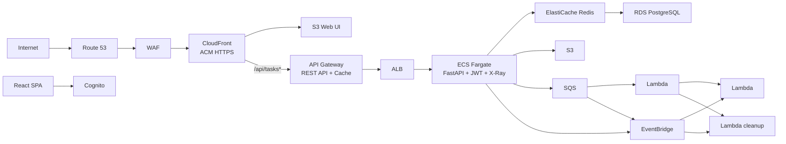

# CLAUDE.md

This file provides guidance to Claude Code (claude.ai/code) when working with code in this repository.

## Project Overview

CI/CD学習を目的としたサーバーレスコンテナアプリケーション。GitHub Actions + ECS(Fargate) による CI/CD パイプライン構築がメインテーマ。

| Version | Theme | Status |
|---------|-------|--------|
| v1 | Hello World API + CI/CD 基盤 (ECS, Fargate, ALB, ECR, GitHub Actions) | 完了 |
| v2 | タスク管理 CRUD API + RDS PostgreSQL (Secrets Manager, SQLAlchemy, Alembic) | 完了 |
| v3 | ECS Auto Scaling + RDS Multi-AZ + HTTPS 準備 (Target Tracking, CloudWatch) | 完了 |
| v4 | イベント駆動アーキテクチャ (SQS, Lambda, EventBridge, DLQ, VPC Endpoints) | 完了 |
| v5 | ストレージ + マルチ環境 (S3, CloudFront, OAC, Presigned URL, Terraform Workspace) | 完了 |
| v6 | オブザーバビリティ + Web UI (CloudWatch Dashboard/Alarms, X-Ray, SNS, 構造化ログ, React SPA) | 完了 |
| v7 | セキュリティ強化 + 認証 (Cognito, JWT, WAF) | 完了 |
| v8 | HTTPS + カスタムドメイン + Remote State (Route 53, ACM, S3 Backend, DynamoDB Lock) | 完了 |
| v9 | CI/CD 完全自動化 + セキュリティスキャン (CodeDeploy B/G, OIDC, Trivy, tfsec, Infracost, Terraform CI/CD) | 完了 |
| v10 | API Gateway + ElastiCache Redis + レート制限 (REST API, Usage Plans, Cache-aside, Graceful degradation) | 完了 |
| v11 | 組織レベル Claude Code ベストプラクティス (Hooks, .claudeignore, Team Settings, Skills, Guide) | 完了 |
| v12 | 災害復旧 + データ保護 (AWS Backup, RDS Read Replica, S3 CRR, S3 Versioning/Lifecycle, 読み書き分離) | 進行中 |

## Common Commands

```bash
# Lint & Test
ruff check app/ tests/ lambda/
DATABASE_URL=sqlite:// pytest tests/ -v

# Local Dev
cd app && python -m uvicorn main:app --host 0.0.0.0 --port 8000 --reload

# Docker
docker build -t sample-cicd:test -f app/Dockerfile .

# Terraform
cd infra && terraform workspace select dev && terraform plan -var-file=dev.tfvars
```

> **`DATABASE_URL` は必須**。未設定だと `DB_*` 環境変数を要求してエラーになる。

## Architecture

### Request Flow


### Key Design Decisions

- **Graceful degradation**: `SQS_QUEUE_URL`、`COGNITO_USER_POOL_ID` 等が未設定の場合、対応機能をスキップ。ローカル開発時に AWS リソース不要
- **JWT authentication**: `app/auth.py` で Cognito JWKS 検証。`Depends()` でルーター単位適用。JWKS 1時間キャッシュ
- **Migration auto-run**: lifespan で `alembic upgrade head` 自動実行
- **HTTPS termination**: CloudFront で TLS 終端。ALB は HTTP のみ（v8）
- **Remote State**: S3 + DynamoDB Lock。bootstrap/ で基盤を独立管理（v8）
- **Lambda deployment**: コード更新は CI/CD で `aws lambda update-function-code` により実行
- **API Gateway**: REST API (REGIONAL) で `/tasks*` を管理。Usage Plan + API キーでアクセス制御。ステージキャッシュで HTTP レスポンスをキャッシュ（v10）
- **2-layer cache**: L1 = API Gateway ステージキャッシュ (HTTP)、L2 = ElastiCache Redis (DB クエリ)。Cache-aside パターン + 書き込み時即時無効化（v10）
- **Rate limiting**: WAF (IP制限) + API Gateway (スロットリング + Usage Plan クォータ) の多層設計（v10）

### App Structure

| File | Description |
|------|-------------|
| `app/main.py` | エントリポイント。X-Ray/CORS/構造化ログ。`/`, `/health` は認証不要 |
| `app/auth.py` | JWT 認証。Cognito JWKS 検証、Graceful degradation |
| `app/database.py` | DB URL 解決（`DATABASE_URL` → `DB_*`） |
| `app/routers/tasks.py` | Task CRUD + SQS/EventBridge イベント発行 + Redis キャッシュ統合 |
| `app/routers/attachments.py` | 添付ファイル CRUD + S3 Presigned URL |
| `app/services/events.py` | SQS/EventBridge 送信 |
| `app/services/cache.py` | Redis キャッシュ (Cache-aside, Graceful degradation) |
| `app/services/storage.py` | S3 操作 |
| `app/models.py` | SQLAlchemy: Task + Attachment |
| `app/schemas.py` | Pydantic v2 + ファイル名サニタイズ |
| `lambda/` | 3 Lambda（cleanup は VPC 内 RDS 接続） |
| `frontend/` | React + Vite SPA。Cognito 認証 + PrivateRoute |

### Infra Structure

| File | Description |
|------|-------------|
| `infra/main.tf` | VPC, サブネット, backend "s3" (Remote State) |
| `infra/bootstrap/` | Remote State 基盤（S3 + DynamoDB） |
| `infra/custom_domain.tf` | ACM 証明書 (us-east-1) + Route 53 ALIAS |
| `infra/ecs.tf` | クラスター, タスク定義, サービス |
| `infra/cognito.tf` | Cognito User Pool + App Client |
| `infra/waf.tf` | WAF v2 WebACL (us-east-1) |
| `infra/webui.tf` | Web UI S3 + CloudFront（カスタムドメイン + WAF） |
| `infra/apigateway.tf` | REST API, Usage Plan, API Key, ステージキャッシュ |
| `infra/elasticache.tf` | ElastiCache Redis クラスタ + サブネットグループ |
| `infra/monitoring.tf` | Dashboard (1) + Alarms (16) |
| `infra/sqs.tf` / `eventbridge.tf` / `lambda.tf` | イベント駆動 |
| `infra/s3.tf` / `cloudfront.tf` | 添付ファイルストレージ + CDN |

### CI/CD Pipeline

**CI** (PR のみ): `ruff` → `pytest` (84 tests) → `docker build` + Trivy → `tfsec` → `terraform plan` → Infracost → `npm build`
**CD** (main push で直接実行): Terraform apply → ECR push → CodeDeploy B/G → Lambda update → Frontend S3 sync (config.js にカスタムドメイン + Cognito 注入) + CloudFront invalidation

### Test Structure

84 テスト: test_main (6) + test_tasks (17) + test_attachments (23) + test_observability (8) + test_auth (8) + test_cache (22)
SQLite in-memory + moto `@mock_aws` + fakeredis。`conftest.py` で DB + AWS fixture。

## Environment Variables

| Variable | Where | Required | Description |
|----------|-------|----------|-------------|
| `DATABASE_URL` | Local/Test | Yes (local) | DB URL。`DB_*` より優先 |
| `DB_*` (5変数) | ECS | Yes (ECS) | Secrets Manager から注入 |
| `SQS_QUEUE_URL` | ECS | Optional | 未設定→スキップ |
| `EVENTBRIDGE_BUS_NAME` | ECS | Optional | 未設定→スキップ |
| `S3_BUCKET_NAME` | ECS | Optional | 未設定→503 |
| `CLOUDFRONT_DOMAIN_NAME` | ECS | Optional | 未設定→URL空 |
| `ENABLE_XRAY` | ECS | Optional | `true` で有効 |
| `COGNITO_USER_POOL_ID` | ECS | Optional | 未設定→認証スキップ |
| `COGNITO_APP_CLIENT_ID` | ECS | Optional | 未設定→認証スキップ |
| `CORS_ALLOWED_ORIGINS` | ECS | Optional | 未設定→`*` |
| `REDIS_URL` | ECS | Optional | Redis 接続 URL。未設定→キャッシュスキップ |
| `CACHE_TTL_LIST` | ECS | Optional | タスク一覧キャッシュ TTL (秒)。デフォルト 300 |
| `CACHE_TTL_DETAIL` | ECS | Optional | 個別タスクキャッシュ TTL (秒)。デフォルト 600 |

## Development Process

ウォーターフォール型: Requirements → Design → Implementation → Test → Deploy
フェーズ完了時は `/phase-gate` で完了チェック。ドキュメントは `_vN` サフィックスで管理。

## User Context

- AWS アカウントあり、CLI 設定済み
- GitLab Runner 経験あり、GitHub Actions は v1 から学習
- Terraform は v1 から学習、v8 で Remote State まで到達

## Language

All communication with the user must be in **Japanese**.
Source code, code comments, and technical identifiers remain in English.

## Coding Conventions

- Python: PEP 8, type hints, Google-style docstrings
- Terraform: snake_case, tag all resources `Project + Environment`
- Docker: multi-stage build, non-root user
- GitHub Actions: pin action versions with commit SHA

## Security

- Never hardcode credentials. Use IAM roles for ECS, Secrets Manager for DB
- S3 buckets: block public access, use OAC for CloudFront
- **コミット時の機密情報マスク**: コミット前に必ずダミー値に置換
  - AWS アカウント ID → `123456789012`
  - CloudFront ドメイン → `dXXXXXXXXXXXXX.cloudfront.net`
  - Hosted Zone ID → `Z0XXXXXXXXXXXXXXXXXX`
  - `git diff --staged` で確認してからコミット

## Team Conventions (v11)

### Hooks（自動チェック）
`.claude/settings.json` で以下のフックが有効:
- **PreToolUse**: `block-dangerous-git.sh`（`git push --force` 等をブロック）、`security-check.sh`（コミット時の機密スキャン）
- **PostToolUse**: `auto-format.sh`（`.py` ファイル変更後に ruff 自動実行）

### 設定ファイルの使い分け
| ファイル | git 管理 | 用途 |
|---------|:---:|------|
| `.claude/settings.json` | ✅ | チーム共有（hooks, deny ルール） |
| `.claude/settings.local.json` | ✕ | 個人設定（allow リスト） |

### チーム向けスキル
- `/team-onboard` — 新メンバーの環境セットアップチェック
- `/pr-review` — マルチエージェント並列 PR レビュー（review-senior + review-qa + review-team-lead）

### `.claudeignore`
機密ファイル（`.env*`, `*.tfstate*`）、ビルド成果物、バイナリを Claude の読み取り対象から除外
