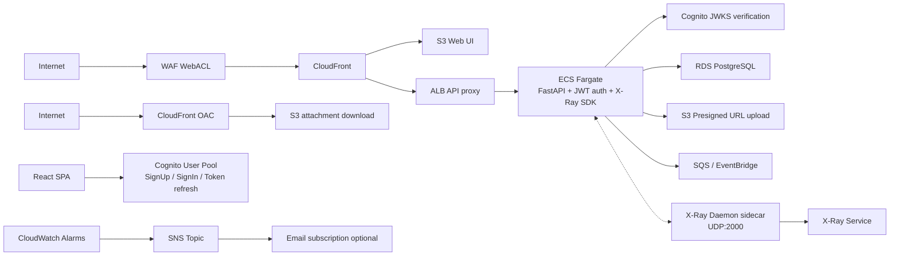
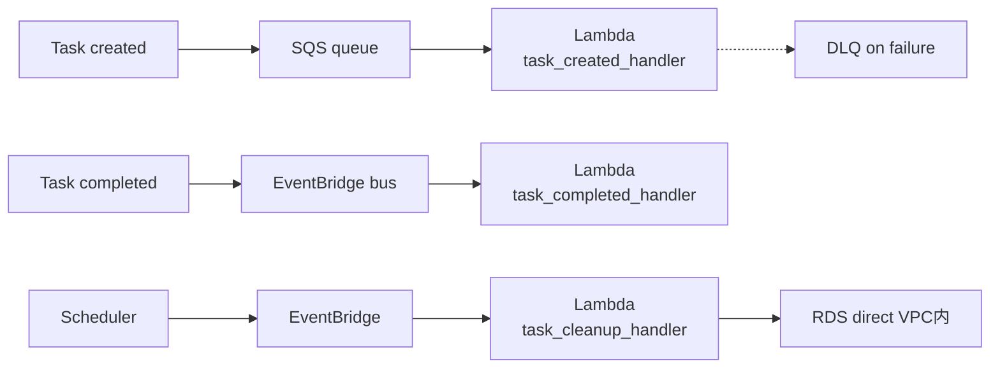

# CLAUDE.md

This file provides guidance to Claude Code (claude.ai/code) when working with code in this repository.

## Project Overview

CI/CD学習を目的としたサーバーレスコンテナアプリケーションプロジェクト。
GitHub Actions + ECS(Fargate) による CI/CD パイプライン構築がメインテーマ。
バージョンを重ねながら本番運用に近いインフラを段階的に構築する（v1〜v6 完了、v7 開発中）。

| Version | Theme |
|---------|-------|
| v1 | Hello World API + CI/CD 基盤 (ECS, Fargate, ALB, ECR, GitHub Actions) |
| v2 | タスク管理 CRUD API + RDS PostgreSQL (Secrets Manager, SQLAlchemy, Alembic) |
| v3 | ECS Auto Scaling + RDS Multi-AZ + HTTPS 準備 (Target Tracking, CloudWatch) |
| v4 | イベント駆動アーキテクチャ (SQS, Lambda, EventBridge, DLQ, VPC Endpoints) |
| v5 | ストレージ + マルチ環境 (S3, CloudFront, OAC, Presigned URL, Terraform Workspace) |
| v6 | オブザーバビリティ + Web UI (CloudWatch Dashboard/Alarms, X-Ray, SNS, 構造化ログ, React SPA on S3+CloudFront, CORS) |
| v7 | セキュリティ強化 + 認証 (Cognito, JWT, WAF, HTTPS/カスタムドメイン) |

## Common Commands

### Lint & Test (CI と同じ手順)
```bash
pip install -r app/requirements.txt && pip install ruff pytest httpx "moto[sqs,events,s3]"
ruff check app/ tests/ lambda/          # lint（lambda/ を含む）
DATABASE_URL=sqlite:// pytest tests/ -v                # run all tests
DATABASE_URL=sqlite:// pytest tests/test_tasks.py::test_create_task -v  # run single test
```

> **`DATABASE_URL` は必須**。未設定だと `database.py` モジュールロード時に `DB_*` 環境変数を要求してエラーになる（`_build_database_url()` が `DATABASE_URL` → `DB_*` の順で解決）。CI では `env: DATABASE_URL: "sqlite://"` で設定済み。

### Local Dev Server
```bash
cd app && python -m uvicorn main:app --host 0.0.0.0 --port 8000 --reload
```

### Docker
```bash
docker build -t sample-cicd:test -f app/Dockerfile .   # repo root から実行
docker run -p 8000:8000 sample-cicd:test
```

### Terraform (from `infra/` directory)
```bash
cd infra
terraform init
terraform workspace select dev    # dev or prod
terraform plan -var-file=dev.tfvars
terraform apply -var-file=dev.tfvars
```

## Architecture

### Request Flow


### Event-Driven Flow (v4)


### Key Design Decisions

- **Graceful degradation**: `SQS_QUEUE_URL`、`EVENTBRIDGE_BUS_NAME`、`S3_BUCKET_NAME`、`CLOUDFRONT_DOMAIN_NAME`、`ENABLE_XRAY`、`COGNITO_USER_POOL_ID`、`COGNITO_APP_CLIENT_ID` が未設定の場合、対応機能はエラーにならず警告ログのみ出力してスキップ。ローカル開発時に AWS リソース不要。
- **JWT authentication (v7)**: `app/auth.py` の `get_current_user()` 依存関数で Cognito JWT を検証。`Depends()` ベースでルーター単位に適用。JWKS はメモリにキャッシュ（1 時間 TTL）。
- **Migration auto-run**: アプリ起動時に `lifespan` ハンドラで `alembic upgrade head` を自動実行。別途マイグレーションステップ不要。
- **Filename sanitization**: Pydantic `field_validator` レベルで特殊文字・パストラバーサルを排除してから S3 key に使用。
- **Lambda deployment**: Terraform は Lambda リソース定義のみ。コード更新は CI/CD で `aws lambda update-function-code --zip-file` により実行。
- **Terraform state**: `infra/terraform.tfstate` がリポジトリにコミットされている。本番では remote state (S3 backend) へ移行推奨。

### App Structure

- **`app/main.py`**: エントリポイント。lifespan でマイグレーション実行。`/`, `/health`, routers を include。X-Ray SDK 初期化、CORSMiddleware、構造化ログ（JSONFormatter）を設定（v6）。`/` と `/health` は認証不要。
- **`app/auth.py`**: JWT 認証モジュール（v7）。`get_current_user()` 依存関数。Cognito JWKS をキャッシュし `python-jose` で検証。`COGNITO_USER_POOL_ID` 未設定時は認証スキップ（Graceful degradation）。
- **`app/database.py`**: DB URL を `DATABASE_URL`（テスト・ローカル）→ `DB_*` 変数（ECS + Secrets Manager）の優先順位で解決。モジュールロード時に `engine` と `SessionLocal` をグローバル生成。
- **`app/routers/tasks.py`**: Task CRUD。作成時に SQS へ、完了遷移時に EventBridge へイベント発行。
- **`app/routers/attachments.py`**: 添付ファイル CRUD。Presigned URL (PUT, 5分有効) 生成 → クライアントが S3 に直接アップロード。CloudFront URL でダウンロード。
- **`app/services/events.py`**: SQS/EventBridge へのイベント発行。環境変数未設定時はスキップ。
- **`app/services/storage.py`**: S3 Presigned URL 生成、オブジェクト削除。
- **`app/models.py`**: SQLAlchemy モデル。Task + Attachment（cascade delete）。
- **`app/schemas.py`**: Pydantic v2 スキーマ。ファイル名バリデーション（パストラバーサル防止）含む。
- **`lambda/`**: 3 Lambda 関数。`task_cleanup_handler` のみ VPC 内で RDS に直接接続（psycopg2 Layer 必要）。全関数に構造化ログ（JSONFormatter）追加（v6）。
- **`frontend/`**: React + Vite SPA。S3 + CloudFront でホスティング。タスク CRUD + 添付ファイル操作の管理画面（v6）。Cognito 認証（ログイン / サインアップ / 確認コード）+ PrivateRoute で保護（v7）。

### Infra Structure

Terraform リソースをファイル単位で分割。Workspace で環境分離（`locals { prefix = "${project_name}-${env}" }`）。

- **`infra/main.tf`**: VPC, パブリック/プライベートサブネット, IGW, ルートテーブル
- **`infra/ecs.tf`**: クラスター, タスク定義 (Secrets Manager `valueFrom` で DB 認証注入), サービス
- **`infra/lambda.tf`**: Lambda 3関数定義（cleanup のみ VPC 配置）
- **`infra/sqs.tf`**: task-events キュー + DLQ (maxReceiveCount: 3)
- **`infra/eventbridge.tf`**: カスタムバス + ルール + Scheduler (毎日 0:00 JST)
- **`infra/s3.tf`**: 添付ファイルバケット (SSE-S3, パブリックアクセスブロック, CORS for presigned PUT)
- **`infra/cloudfront.tf`**: OAC + SigV4, Managed-CachingOptimized ポリシー
- **`infra/vpc_endpoints.tf`**: Interface Endpoints (secretsmanager, logs) — cleanup Lambda 用
- **`infra/monitoring.tf`**: CloudWatch Dashboard (1) + Alarms (12)（v6）
- **`infra/sns.tf`**: SNS Topic（アラーム通知基盤）（v6）
- **`infra/webui.tf`**: Web UI 用 S3 バケット + CloudFront ディストリビューション（v6）+ WAF 関連付け（v7）
- **`infra/cognito.tf`**: Cognito User Pool + App Client（v7）
- **`infra/waf.tf`**: WAF v2 WebACL — マネージドルール 2 つ + レートリミット（v7、us-east-1）
- **`infra/dev.tfvars` / `prod.tfvars`**: 環境別設定値

### CI/CD Pipeline (`.github/workflows/ci-cd.yml`)

**CI** (全 push / PR): `ruff check` → `pytest` (54+ tests) → `docker build` → `npm ci && npm run build` (frontend)
**CD** (main のみ, CI 成功後): ECR push (short-SHA + latest) → ECS rolling deploy → Lambda zip update → Frontend S3 sync (config.js に Cognito 設定注入) + CloudFront invalidation

Actions はすべて commit SHA でピン留め。Lambda コード更新は Terraform ではなく `aws lambda update-function-code` で実行。

### Test Structure

- **`tests/conftest.py`**: SQLite in-memory + StaticPool。`dependency_overrides[get_db]` で差し替え。`autouse` fixture で各テストごとにテーブル作成/破棄。AWS テストは `aws_credentials` fixture + moto `@mock_aws` デコレータ。
- テスト 54+ 件: test_main.py (基本 API) + test_tasks.py (CRUD + イベント発行) + test_attachments.py (添付ファイル + ファイル名サニタイズ) + test_observability.py (CORS + 構造化ログ + X-Ray graceful degradation)（v6）+ test_auth.py (JWT 認証)（v7）

## Environment Variables

| Variable | Where | Required | Description |
|----------|-------|----------|-------------|
| `DATABASE_URL` | Local / Test | Yes (local) | DB 接続 URL。設定時は `DB_*` より優先 |
| `DB_USERNAME`, `DB_PASSWORD`, `DB_HOST`, `DB_PORT`, `DB_NAME` | ECS | Yes (ECS) | Secrets Manager から注入 |
| `SQS_QUEUE_URL` | ECS | Optional | 未設定時はイベント発行スキップ |
| `EVENTBRIDGE_BUS_NAME` | ECS | Optional | 未設定時はイベント発行スキップ |
| `S3_BUCKET_NAME` | ECS | Optional | 未設定時は添付ファイル機能 503 |
| `CLOUDFRONT_DOMAIN_NAME` | ECS | Optional | 未設定時はダウンロード URL 空 |
| `AWS_REGION` | ECS / Lambda | Optional | デフォルト `ap-northeast-1` |
| `DB_SECRET_ARN` | Lambda (cleanup) | Yes | RDS 認証情報の Secrets Manager ARN |
| `CLEANUP_RETENTION_DAYS` | Lambda (cleanup) | Optional | デフォルト 30 日 |
| `ENABLE_XRAY` | ECS | Optional | `true` で X-Ray SDK 有効化。未設定時はスキップ |
| `COGNITO_USER_POOL_ID` | ECS | Optional | Cognito User Pool ID。未設定時は認証スキップ |
| `COGNITO_APP_CLIENT_ID` | ECS | Optional | Cognito App Client ID。未設定時は認証スキップ |
| `CORS_ALLOWED_ORIGINS` | ECS | Optional | CORS 許可オリジン（カンマ区切り）。未設定時は `*` |

## Development Process

ウォーターフォール型で以下のフェーズ順に進行する。
各フェーズの成果物は `docs/` 配下にドキュメントとして残す。

| Phase | Output | Directory |
|-------|--------|-----------|
| 1. Requirements | 要件定義書 | `docs/01_requirements/` |
| 2. Design | 設計書 (アーキテクチャ, API, DB, CI/CD) | `docs/02_design/` |
| 3. Implementation | アプリコード, Terraform, Dockerfile, GitHub Actions | `app/`, `infra/`, `.github/` |
| 4. Test | テスト計画書, テストコード | `docs/04_test/`, `tests/` |
| 5. Deploy | デプロイ手順書, 動作確認記録 | `docs/05_deploy/` |

**Important**: 現在のフェーズが完了するまで次のフェーズに進まないこと。
フェーズ完了時は `/phase-gate` スキルを使って完了チェックを行う。
ドキュメントは `_v2`, `_v3`, `_v4`, `_v5`, `_v6` サフィックスで並行管理。

## User Context

- AWS アカウントあり、CLI 未設定（セットアップから対応が必要）
- GitLab Runner の経験あり、GitHub Actions は初めて
- Docker は docker run レベル（Dockerfile 作成は学習対象）
- Terraform 初学者

## Language

All communication with the user must be in **Japanese**.
Source code, code comments, and technical identifiers remain in English.

## Coding Conventions

- Python: follow PEP 8, type hints required, Google-style docstrings
- Terraform: use snake_case for resource names, tag all resources with `Project = "sample-cicd"` + `Environment = local.env`
- Docker: multi-stage build, non-root user
- GitHub Actions: pin action versions with commit SHA

## Security

- Never hardcode AWS credentials, secrets, or API keys
- Use IAM roles (not access keys) for ECS tasks
- Store secrets in GitHub Actions secrets
- Ensure `.env` and credential files are in `.gitignore`
- ECR images should be scanned for vulnerabilities
- DB credentials must be managed via AWS Secrets Manager
- RDS must be placed in private subnets, accessible only from ECS security group
- S3 buckets must block public access; use OAC for CloudFront distribution
- **コミット時の機密情報マスク**: ローカル開発・学習中は実際の AWS アカウント ID、CloudFront ドメイン名等を使用してよいが、**コミット前に必ずダミー値に置換すること**。置換ルール:
  - AWS アカウント ID → `123456789012`
  - CloudFront ドメイン名 → `dXXXXXXXXXXXXX.cloudfront.net`
  - その他の実リソース識別子 → プレースホルダーに置換
  - `git diff --staged` でコミット対象に実値が含まれていないことを確認してからコミットする
