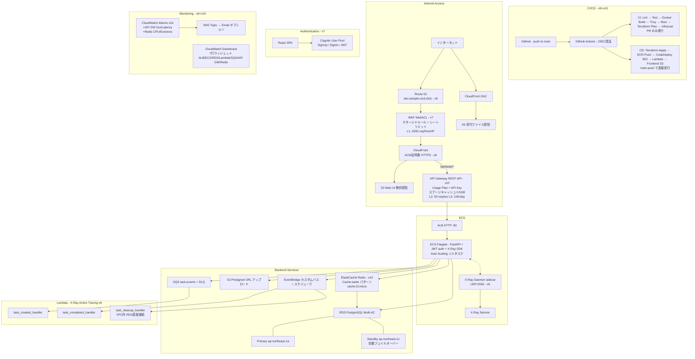
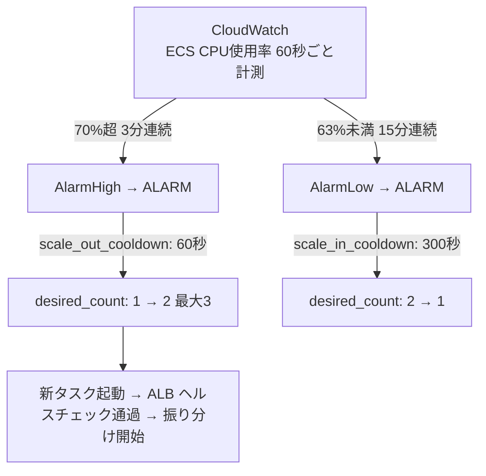
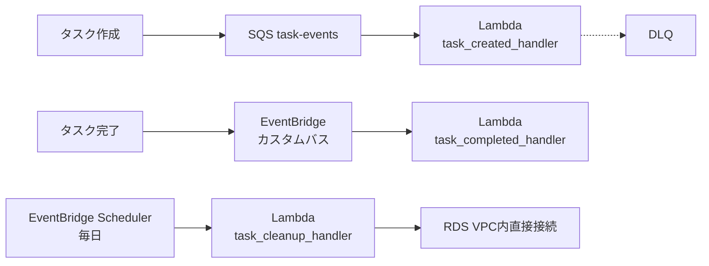
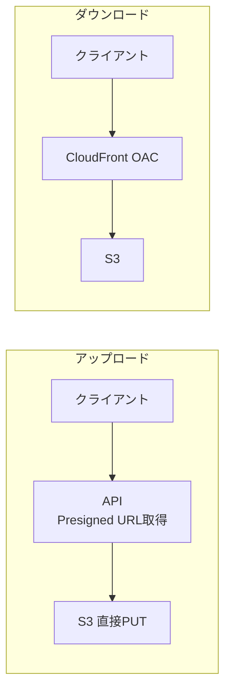

# sample_cicd

GitHub Actions + ECS(Fargate) による CI/CD パイプラインの学習プロジェクト。
FastAPI アプリケーションを AWS 上にコンテナデプロイし、バージョンを重ねながら本番運用に近いインフラを段階的に構築する。

## Web UI デモ (v6+)


> タスクの作成 → 完了切替 → フィルタ を React SPA（S3 + CloudFront）から操作。v7 でログイン / サインアップ画面を追加。

---

## システム概要



- **アプリ**: FastAPI (Python 3.12) によるタスク管理 REST API + ファイル添付機能
- **認証**: Cognito User Pool + JWT 認証（v7）
- **WAF**: CloudFront に WebACL 適用（マネージドルール + レートリミット）（v7）
- **インフラ**: Terraform で AWS リソースをコード管理（Workspace でマルチ環境、CI/CD で plan/apply 自動化）
- **API 管理**: API Gateway REST API でアクセス制御・レート制限・レスポンスキャッシュ（v10）
- **キャッシュ**: 2 層キャッシュ — L1: API Gateway ステージキャッシュ、L2: ElastiCache Redis Cache-aside（v10）
- **CI/CD**: GitHub Actions（OIDC 認証）で自動テスト・CodeDeploy B/G デプロイ・セキュリティスキャン（v9）。PR のみ CI、main push で CD 直接実行（v10）
- **イベント駆動**: SQS + Lambda + EventBridge による非同期処理
- **ストレージ**: S3 + CloudFront で添付ファイル管理・配信
- **オブザーバビリティ**: CloudWatch Dashboard/Alarms、X-Ray 分散トレーシング、構造化ログ（v6）
- **Web UI**: React + Vite SPA を S3 + CloudFront でホスティング、Cognito 認証画面付き（v6+v7）
- **リージョン**: ap-northeast-1 (東京)

---

## バージョン履歴

### v1 — Hello World API + CI/CD 基盤

最小構成の FastAPI アプリと CI/CD パイプラインを構築。

**追加機能**
- `GET /` → `{"message": "Hello, World!"}`
- `GET /health` → `{"status": "healthy"}`
- GitHub Actions CI/CD（Lint・Test・ECR Push・ECS Deploy）
- ECS Fargate + ALB による HTTP サービング

**学習テーマ**: ECS, Fargate, ALB, ECR, GitHub Actions, Dockerfile（マルチステージビルド）

---

### v2 — タスク管理 CRUD API + RDS PostgreSQL

RDS を追加してデータを永続化。本格的な REST API に拡張。

**追加機能**
- `GET /tasks` — タスク一覧取得
- `POST /tasks` — タスク作成
- `GET /tasks/{id}` — タスク取得
- `PUT /tasks/{id}` — タスク更新
- `DELETE /tasks/{id}` — タスク削除
- RDS PostgreSQL（プライベートサブネット配置）
- AWS Secrets Manager によるDB認証情報管理
- Alembic によるマイグレーション（アプリ起動時に自動実行）

**学習テーマ**: RDS, プライベートサブネット, Secrets Manager, SQLAlchemy (ORM), Alembic, Pydantic v2

---

### v3 — ECS Auto Scaling + RDS Multi-AZ

負荷に応じてタスク数を自動調整。DB の高可用性を確保。

**追加機能**
- ECS Auto Scaling（CPU 70% を目標に 1〜3 タスクで自動増減）
- RDS Multi-AZ（スタンバイへの自動フェイルオーバー）

**学習テーマ**: Application Auto Scaling, Target Tracking Policy, CloudWatch Alarm, RDS Multi-AZ, Terraform `count` / `dynamic`

---

### v4 — イベント駆動アーキテクチャ（SQS + Lambda + EventBridge）

非同期処理パターンを導入。タスク操作に連動してイベントを発行。

**追加機能**
- タスク作成時に SQS へイベント発行 → Lambda で非同期処理
- タスク完了時に EventBridge へイベント発行 → Lambda で非同期処理
- EventBridge Scheduler による定期クリーンアップ（VPC 内 Lambda → RDS 直接接続）
- DLQ（デッドレターキュー）による失敗メッセージの退避
- VPC Endpoints（Secrets Manager, CloudWatch Logs）

**学習テーマ**: SQS, Lambda, EventBridge, DLQ, VPC Endpoints, イベント駆動設計

---

### v5 — ストレージ + マルチ環境（S3 + CloudFront + Terraform Workspace）

タスクへのファイル添付機能を追加。マルチ環境管理を導入。

**追加機能**
- `POST /tasks/{id}/attachments` — Presigned URL でファイルアップロード
- `GET /tasks/{id}/attachments` — 添付ファイル一覧
- `GET /tasks/{id}/attachments/{id}` — CloudFront 経由のダウンロード URL 取得
- `DELETE /tasks/{id}/attachments/{id}` — 添付ファイル削除（S3 + DB）
- S3（SSE-S3 暗号化、パブリックアクセスブロック）
- CloudFront（OAC 経由で S3 配信）
- Terraform Workspace で dev/prod 環境分離

**学習テーマ**: S3, CloudFront, OAC, Presigned URL, Terraform Workspace, マルチ環境管理

---

### v6 — Observability + Web UI（完了）

本番運用で必須の監視基盤と、ブラウザから操作できる管理画面を追加。

**追加機能**
- CloudWatch Dashboard（ALB/ECS/RDS/Lambda/SQS の 5 行ウィジェット）
- CloudWatch Alarms × 12（ALB 5xx・遅延、ECS CPU/Memory、RDS CPU/Storage/Connections、Lambda Errors/Throttles/Duration、SQS DLQ）
- SNS Topic（アラーム通知基盤、メールサブスクリプションはオプション）
- AWS X-Ray 分散トレーシング（ECS サイドカー daemon + aws-xray-sdk、Lambda Active Tracing）
- 構造化ログ（JSONFormatter — FastAPI + Lambda 全 3 関数）
- CORS Middleware（React SPA からの API 呼び出し対応）
- React + Vite SPA（タスク CRUD + 添付ファイル操作の管理画面）
- Web UI 用 S3 バケット + CloudFront（SPA ルーティング対応）
- フロントエンド CI/CD（npm build → S3 sync → CloudFront invalidation）

**学習テーマ**: CloudWatch Dashboard/Alarms, SNS, X-Ray, 構造化ログ, CORS, React (Vite), フロントエンド CI/CD

---

### v7 — セキュリティ強化 + 認証（完了）

Cognito 認証と WAF による本番レベルのセキュリティを追加。

**追加機能**
- Cognito User Pool + App Client（email ログイン、SRP 認証）
- JWT 認証ミドルウェア（JWKS キャッシュ、Graceful Degradation）
- API エンドポイント保護（`/tasks*`, `/attachments*` に認証必須）
- WAF v2 WebACL（AWSManagedRulesCommonRuleSet + KnownBadInputsRuleSet + レートリミット）
- React ログイン / サインアップ / 確認コード画面
- PrivateRoute による保護ルーティング
- CI/CD で Cognito 設定を config.js に動的注入

**学習テーマ**: Cognito, JWT, JWKS, WAF v2, SRP 認証, PrivateRoute, amazon-cognito-identity-js

---

### v8 — HTTPS + カスタムドメイン + Remote State（完了）

カスタムドメインによる HTTPS アクセスと Terraform Remote State で本番運用基盤を完成。

**追加機能**
- Route 53 Hosted Zone で DNS 管理（`sample-cicd.click`）
- ACM ワイルドカード証明書（`*.sample-cicd.click` + `sample-cicd.click`、us-east-1）
- CloudFront にカスタムドメイン適用（dev: `dev.sample-cicd.click`）
- Route 53 ALIAS レコード（CloudFront へ）
- Terraform Remote State（S3 + DynamoDB ロック）
- Bootstrap ディレクトリ（state 管理用リソースの独立管理）
- ALB 簡素化（HTTPS リダイレクト削除、CloudFront が TLS 終端）
- CI/CD config.js にカスタムドメイン動的注入（GitHub Actions Variables）

**学習テーマ**: Route 53, ACM, DNS 検証, カスタムドメイン, Terraform Remote State, S3 Backend, DynamoDB Lock, Bootstrap パターン

---

### v9 — CI/CD 完全自動化 + セキュリティスキャン（完了）

エンタープライズレベルの CI/CD パイプラインを完成。

**追加機能**
- CodeDeploy Blue/Green デプロイ（即時ロールバック、自動ロールバック）
- OIDC 認証（GitHub Actions → AWS、Access Key 廃止）
- CI/CD ワークフロー分割（ci.yml + cd.yml、workflow_run 連携）
- Trivy コンテナイメージ脆弱性スキャン + GitHub Security Tab（SARIF）
- tfsec Terraform セキュリティスキャン
- Terraform CI/CD（PR 時 plan コメント、main マージ時 auto apply）
- Infracost PR コスト影響コメント
- GitHub Environments（dev: 自動、prod: 承認ゲート）

**学習テーマ**: CodeDeploy B/G, OIDC, Trivy, tfsec, Infracost, Terraform CI/CD, GitHub Environments, workflow_run, appspec

---

### v10 — API Gateway + ElastiCache Redis + レート制限（完了）

API 管理レイヤーとキャッシュ基盤を追加。多層レート制限でエンタープライズレベルの API 保護を実現。

**追加機能**
- API Gateway REST API（REGIONAL エンドポイント、`/api/tasks*` パスマッチ）
- ステージキャッシュ（0.5 GB、GET レスポンスを 300 秒キャッシュ）
- Usage Plan + API キー（50 req/sec、10,000 req/日）
- ElastiCache Redis（cache.t3.micro、プライベートサブネット配置）
- Cache-aside パターン（タスク一覧 300s / 個別タスク 600s、書き込み時即時無効化）
- Graceful Degradation（Redis 未接続時は DB 直接アクセスにフォールバック）
- CloudFront オリジン変更（ALB → API Gateway、`custom_header` で API キー自動注入）
- 多層レート制限（L1: WAF IP 制限、L2: API GW スロットリング、L3: Usage Plan クォータ）
- モニタリング拡張（Dashboard 7 行 + Alarms 16 件）
- CI/CD パイプライン改善（CD を `push` トリガーに変更、CI は PR のみ実行）

**学習テーマ**: API Gateway REST API, ステージキャッシュ, Usage Plans, ElastiCache Redis, Cache-aside パターン, Graceful degradation, 多層レート制限, CloudFront オリジン変更

---

### v11 — 組織レベル Claude Code ベストプラクティス（完了）

チームで Claude Code を効果的に活用するための設定・自動化・ガイドを整備。

**追加機能**
- Claude Code Hooks（PreToolUse: 機密スキャン + 危険コマンドブロック、PostToolUse: ruff 自動フォーマット）
- `.claudeignore`（機密ファイル・Terraform state・ビルド成果物の読み取り除外）
- チーム共有 `.claude/settings.json`（hooks + permissions.deny を git 管理）
- `/team-onboard` スキル（新メンバー環境セットアップチェックリスト）
- `/pr-review` スキル（review-senior + review-qa + review-team-lead による並列レビュー）
- `review-team-lead` プロジェクト固有レビューエージェント
- 包括的チームガイド文書（CLAUDE.md 設計パターン、ワークフロー、Hooks・スキル・自動化）
- CI 改善: terraform plan 出力をサマリーのみに変更（機密情報の PR コメント漏洩防止）

**学習テーマ**: Claude Code Hooks, .claudeignore, settings.json 共有戦略, カスタムスキル設計, エージェント定義, CLAUDE.md 設計パターン, チームオンボーディング, マルチエージェントレビュー

---

## API エンドポイント

| メソッド | パス | 認証 | 説明 |
|---------|------|------|------|
| GET | `/` | 不要 | Hello World |
| GET | `/health` | 不要 | ヘルスチェック（ALB が死活監視） |
| GET | `/api/tasks` | **必要** | タスク一覧（Redis キャッシュ対応） |
| POST | `/api/tasks` | **必要** | タスク作成（→ SQS イベント発行 + キャッシュ無効化） |
| GET | `/api/tasks/{id}` | **必要** | タスク取得（Redis キャッシュ対応） |
| PUT | `/api/tasks/{id}` | **必要** | タスク更新（完了時 → EventBridge + キャッシュ無効化） |
| DELETE | `/api/tasks/{id}` | **必要** | タスク削除（キャッシュ無効化） |
| POST | `/api/tasks/{id}/attachments` | **必要** | 添付ファイル作成（Presigned URL 返却） |
| GET | `/api/tasks/{id}/attachments` | **必要** | 添付ファイル一覧 |
| GET | `/api/tasks/{id}/attachments/{att_id}` | **必要** | 添付ファイル取得（ダウンロード URL 付き） |
| DELETE | `/api/tasks/{id}/attachments/{att_id}` | **必要** | 添付ファイル削除 |

> v7 で認証が追加。`Authorization: Bearer <JWT>` ヘッダーが必要。`COGNITO_USER_POOL_ID` 未設定時は認証スキップ（Graceful Degradation）。
> v10 で API パスに `/api` プレフィックスを追加（CloudFront → API Gateway ルーティング対応）。API キーは CloudFront が自動注入。

---

## ディレクトリ構成

```
sample_cicd/
├── app/                        # FastAPI アプリケーション
│   ├── main.py                 # エントリポイント（X-Ray/CORS/JSONFormatter v6）
│   ├── auth.py                 # JWT 認証ミドルウェア（Cognito JWKS 検証 v7）
│   ├── routers/
│   │   ├── tasks.py            # タスク CRUD エンドポイント（認証必須 v7）
│   │   └── attachments.py      # 添付ファイル CRUD エンドポイント（認証必須 v7）
│   ├── services/
│   │   ├── cache.py            # Redis キャッシュサービス — Cache-aside + Graceful degradation（v10）
│   │   ├── events.py           # SQS/EventBridge イベント発行（v4）
│   │   └── storage.py          # S3 Presigned URL 生成・オブジェクト操作（v5）
│   ├── models.py               # SQLAlchemy ORM モデル（Task, Attachment）
│   ├── schemas.py              # Pydantic スキーマ（リクエスト/レスポンス）
│   ├── database.py             # DB 接続・セッション管理
│   ├── alembic/                # DB マイグレーション
│   ├── requirements.txt        # 依存ライブラリ（python-jose v7, redis v10）
│   └── Dockerfile              # マルチステージビルド、非rootユーザー
├── lambda/                     # Lambda 関数（v4、JSONFormatter v6）
│   ├── task_created_handler.py   # SQS トリガー：タスク作成イベント処理
│   ├── task_completed_handler.py # EventBridge トリガー：タスク完了イベント処理
│   └── task_cleanup_handler.py   # Scheduler トリガー：定期クリーンアップ
├── frontend/                   # React + Vite SPA（v6+v7）
│   ├── package.json            # amazon-cognito-identity-js 追加（v7）
│   ├── vite.config.js
│   ├── index.html
│   └── src/
│       ├── App.jsx             # ルーティング・レイアウト（PrivateRoute v7）
│       ├── api/client.js       # fetch wrapper（Authorization ヘッダー自動付与 v7）
│       ├── auth/               # 認証画面（Login/Signup/ConfirmSignup/PrivateRoute v7）
│       └── components/         # TaskList, TaskForm, TaskDetail, Attachment 他
├── infra/                      # Terraform（AWS インフラ定義）
│   ├── main.tf                 # VPC・サブネット + backend "s3"（Remote State v8）
│   ├── bootstrap/              # Remote State 基盤（S3 + DynamoDB v8）
│   │   ├── main.tf             # S3 バケット + DynamoDB テーブル
│   │   └── outputs.tf          # バケット名・テーブル名出力
│   ├── custom_domain.tf        # ACM証明書 + Route 53 ALIAS（v8、旧 https.tf）
│   ├── codedeploy.tf           # CodeDeploy App + B/G Deployment Group（v9）
│   ├── oidc.tf                 # OIDC Provider + GitHub Actions IAM Role（v9）
│   ├── ecs.tf                  # ECS（deployment_controller = CODE_DEPLOY v9）
│   ├── alb.tf                  # ALB・Blue/Green ターゲットグループ（v9）
│   ├── rds.tf                  # RDS PostgreSQL（Multi-AZ）
│   ├── autoscaling.tf          # Application Auto Scaling（v3）
│   ├── sqs.tf                  # SQS キュー + DLQ（v4）
│   ├── lambda.tf               # Lambda 定義（Active Tracing 追加 v6）
│   ├── eventbridge.tf          # EventBridge バス + ルール + Scheduler（v4）
│   ├── vpc_endpoints.tf        # VPC Endpoints（v4）
│   ├── s3.tf                   # S3 バケット（添付ファイル v5）
│   ├── cloudfront.tf           # CloudFront（添付ファイル配信 v5）
│   ├── monitoring.tf           # CloudWatch Dashboard + Alarms × 16（v6+v10）
│   ├── sns.tf                  # SNS Topic（アラーム通知基盤 v6）
│   ├── webui.tf                # Web UI 用 S3 + CloudFront（WAF 関連付け v7）
│   ├── apigateway.tf           # REST API, Usage Plan, API Key, ステージキャッシュ（v10）
│   ├── elasticache.tf          # ElastiCache Redis クラスタ + サブネットグループ（v10）
│   ├── cognito.tf              # Cognito User Pool + App Client（v7）
│   ├── waf.tf                  # WAF v2 WebACL — us-east-1（v7）
│   ├── ecr.tf                  # ECR リポジトリ
│   ├── iam.tf                  # IAM ロール・ポリシー（CodeDeploy ロール v9）
│   ├── secrets.tf              # Secrets Manager
│   ├── security_groups.tf      # セキュリティグループ
│   ├── logs.tf                 # CloudWatch Logs（X-Ray daemon ログ v6）
│   ├── variables.tf            # 変数定義（v9: github_repo, codedeploy 設定）
│   ├── outputs.tf              # 出力値（app_url, custom_domain_url）
│   ├── dev.tfvars              # dev 環境設定値
│   └── prod.tfvars             # prod 環境設定値
├── .claude/                    # Claude Code チーム設定（v11）
│   ├── settings.json           # チーム共有設定（hooks + deny ルール、git 管理）
│   ├── hooks/                  # 自動チェックスクリプト
│   │   ├── security-check.sh   # PreToolUse: コミット時機密スキャン
│   │   ├── block-dangerous-git.sh # PreToolUse: 危険コマンドブロック
│   │   └── auto-format.sh     # PostToolUse: ruff 自動フォーマット
│   ├── skills/                 # カスタムスキル（9 スキル）
│   │   ├── team-onboard/       # 新メンバーオンボーディング（v11）
│   │   ├── pr-review/          # マルチエージェント PR レビュー（v11）
│   │   └── ...                 # security-check, deploy, phase-gate, learn, quiz, cost-check, infra-cleanup
│   └── agents/
│       └── review-team-lead.md # プロジェクト固有レビューエージェント（v11）
├── .claudeignore               # Claude Code ファイル除外パターン（v11）
├── .github/workflows/
│   ├── ci.yml                  # CI: lint, test, build, Trivy, tfsec, terraform plan, Infracost（PR のみ実行 v10）
│   └── cd.yml                  # CD: Terraform Apply → ECR → CodeDeploy B/G → Lambda → Frontend（main push で直接実行 v10）
├── tests/
│   ├── conftest.py             # テスト用 DB（SQLite インメモリ）
│   ├── test_main.py            # v1 エンドポイントテスト
│   ├── test_tasks.py           # v2 + v4 タスク CRUD + イベント発行テスト
│   ├── test_attachments.py     # v5 添付ファイルテスト
│   ├── test_observability.py  # v6 CORS・構造化ログ・X-Ray graceful degradation
│   ├── test_auth.py           # v7 JWT 認証テスト
│   ├── test_cache.py          # v10 Redis キャッシュテスト（fakeredis）
│   └── test_hooks.sh          # v11 Claude Code hook テスト（bash、26 テストケース）
└── docs/
    ├── 01_requirements/        # 要件定義書（v1〜v11）
    ├── 02_design/              # 設計書（アーキテクチャ・API・DB・インフラ・CI/CD）
    ├── 04_test/                # テスト計画書（v1〜v11）
    ├── 05_deploy/              # デプロイ手順書・動作確認記録（v1〜v11）
    ├── 06_learning/            # 学習まとめ（v1〜v11）
    └── guides/                 # ガイド文書
        └── claude-code-team-guide_v11.md  # 組織向け Claude Code ベストプラクティスガイド
```

---

## 実装詳細

### アプリケーション（app/）

**FastAPI + SQLAlchemy + Alembic**

```python
# 起動時に自動マイグレーション
@asynccontextmanager
async def lifespan(app):
    _run_migrations()   # alembic upgrade head
    yield

# DB セッションを DI で各エンドポイントに注入
def get_db():
    db = SessionLocal()
    try:
        yield db
    finally:
        db.close()
```

- **DB 接続**: 環境変数 `DATABASE_URL`（優先）または `DB_*` 変数（Secrets Manager 経由）
- **テスト**: SQLite インメモリ DB に差し替え（`dependency_overrides`）
- **コンテナ**: マルチステージビルドで軽量化、非 root ユーザーで実行

### インフラ（infra/）

**Terraform でリソースを分割管理（Workspace でマルチ環境）**

```
VPC (10.0.0.0/16)
  ├── パブリックサブネット × 2  → ALB, ECS タスク
  └── プライベートサブネット × 2 → RDS, ElastiCache Redis, VPC Endpoints, Lambda (cleanup)
```

**Auto Scaling の仕組み（v3）**



**イベント駆動フロー（v4）**



**ファイル添付フロー（v5）**



**マルチ環境管理（v5）**

```bash
# Terraform Workspace で環境切り替え
terraform workspace select dev
terraform plan -var-file=dev.tfvars

terraform workspace select prod
terraform plan -var-file=prod.tfvars
# リソース名は自動で sample-cicd-{env}-* に統一
```

### CI/CD（v10: ci.yml + cd.yml）

```
PR 作成・更新
  └── ci.yml（PR のみ — OIDC 認証）
       ├── lint-test: ruff + pytest (84 テスト)
       ├── build: Docker build + Trivy 脆弱性スキャン + SARIF → GitHub Security Tab
       ├── security-scan: tfsec Terraform セキュリティスキャン
       ├── terraform-plan: plan 実行 → PR コメントにサマリー投稿（v11: 機密情報マスク対応）
       └── infracost: コスト影響 → PR コメント

main マージ（push）
  └── cd.yml（main push で直接実行 — OIDC 認証、CI スキップ）
       ├── terraform-apply: terraform apply -auto-approve（Secrets で実値注入）
       └── deploy (environment: dev, needs: terraform-apply)
            ├── ECR push（SHA タグ + latest）
            ├── CodeDeploy B/G デプロイ（即時ロールバック対応）
            ├── Lambda コード更新（zip → update-function-code）
            └── フロントエンドデプロイ
                 ├── npm build + config.js 生成（カスタムドメイン + Cognito）
                 ├── S3 sync（--delete）
                 └── CloudFront キャッシュ無効化
```

---

## ローカル開発

```bash
# 依存インストール
pip install -r app/requirements.txt
pip install ruff pytest httpx

# Lint
ruff check app/ tests/ lambda/

# テスト
DATABASE_URL=sqlite:// pytest tests/ -v

# ローカルサーバー起動
cd app && python -m uvicorn main:app --host 0.0.0.0 --port 8000 --reload

# Docker ビルド
docker build -t sample-cicd:dev -f app/Dockerfile .
docker run -p 8000:8000 sample-cicd:dev
```

---

## AWS デプロイ

```bash
# インフラ構築（Workspace でマルチ環境）
cd infra
terraform init
terraform workspace select dev    # または prod
terraform plan -var-file=dev.tfvars
terraform apply -var-file=dev.tfvars

# 以降は main ブランチへの push で自動デプロイ（OIDC 認証 + CodeDeploy B/G）
# CI: lint → test → build → Trivy → tfsec → terraform plan
# CD: ECR push → CodeDeploy B/G → Lambda → Frontend → terraform apply
```

**クリーンアップ（学習後）**

```bash
ENV=dev

# S3 / ECR を空にしてから destroy
aws ecr batch-delete-image --repository-name sample-cicd-$ENV \
  --image-ids "$(aws ecr list-images --repository-name sample-cicd-$ENV \
  --query 'imageIds[*]' --output json)" --region ap-northeast-1
aws s3 rm s3://sample-cicd-$ENV-webui --recursive
aws s3 rm s3://sample-cicd-$ENV-attachments --recursive

cd infra
terraform workspace select $ENV
terraform destroy -var-file=$ENV.tfvars
```

> **コスト目安**: 起動中は約 $3.50〜4.50/日（RDS + API GW キャッシュ + ElastiCache Redis が主なコスト）
> Bootstrap リソース（S3 tfstate, DynamoDB tflock）と Route 53 ドメインは削除しない。

---

## ドキュメント

ウォーターフォール型で各フェーズの成果物を `docs/` に保管している。

| フェーズ | ディレクトリ | 内容 |
|---------|------------|------|
| 1. 要件定義 | `docs/01_requirements/` | 機能要件・非機能要件・コスト見積もり |
| 2. 設計 | `docs/02_design/` | アーキテクチャ・API・DB・インフラ・CI/CD 設計書 |
| 3. 実装 | `app/`, `infra/`, `.github/` | ソースコード本体 |
| 4. テスト | `docs/04_test/` | テスト計画書・合格基準 |
| 5. デプロイ | `docs/05_deploy/` | デプロイ手順書・動作確認記録 |
| — | `docs/06_learning/` | バージョンごとの学習まとめ |

各バージョンのドキュメントは `_v2`〜`_v11` サフィックスで並行管理している。

---

## 技術スタック

| カテゴリ | 技術 |
|---------|------|
| 言語 | Python 3.12 |
| Web フレームワーク | FastAPI |
| ORM | SQLAlchemy 2.x |
| マイグレーション | Alembic |
| バリデーション | Pydantic v2 |
| Lint | Ruff |
| テスト | pytest + httpx + fakeredis（v10） |
| コンテナ | Docker（マルチステージビルド） |
| IaC | Terraform (hashicorp/aws) |
| CI/CD | GitHub Actions |
| クラウド | AWS (ap-northeast-1) |
| コンピュート | ECS Fargate (0.5 vCPU / 1024 MB) |
| ロードバランサー | ALB |
| API 管理 | API Gateway REST API（REGIONAL、ステージキャッシュ、Usage Plan v10） |
| キャッシュ | ElastiCache Redis 7.0（cache.t3.micro、Cache-aside パターン v10） |
| データベース | RDS PostgreSQL 15 (db.t3.micro, Multi-AZ) |
| メッセージキュー | SQS (+ DLQ) |
| サーバーレス | AWS Lambda (Python 3.12) |
| イベントバス | Amazon EventBridge (カスタムバス + Scheduler) |
| ストレージ | S3 (SSE-S3 暗号化) |
| CDN | CloudFront (OAC) |
| レジストリ | ECR |
| シークレット管理 | AWS Secrets Manager |
| スケーリング | Application Auto Scaling |
| ログ | CloudWatch Logs |
| 環境管理 | Terraform Workspace (dev / prod) |
| 監視 | CloudWatch Dashboard / Alarms（v6） |
| 通知 | Amazon SNS（v6） |
| 分散トレーシング | AWS X-Ray（v6） |
| 認証 | Amazon Cognito User Pool（v7） |
| JWT ライブラリ | python-jose[cryptography]（v7） |
| WAF | AWS WAF v2（マネージドルール + レートリミット v7） |
| フロントエンド | React 19 + Vite + amazon-cognito-identity-js（v6+v7） |
| DNS 管理 | Route 53 Hosted Zone（v8） |
| SSL/TLS 証明書 | ACM ワイルドカード証明書（v8） |
| Terraform State | S3 + DynamoDB Lock（Remote State v8） |
| フロントエンドホスティング | S3 + CloudFront（カスタムドメイン HTTPS v8、WAF 保護 v7） |
| デプロイ管理 | AWS CodeDeploy（ECS B/G デプロイ v9） |
| OIDC 認証 | IAM OIDC Provider（GitHub Actions キーレス認証 v9） |
| 脆弱性スキャン | Trivy（コンテナイメージ v9） |
| IaC セキュリティ | tfsec（Terraform v9） |
| コスト見積もり | Infracost（PR コメント v9） |
| 環境管理 (GitHub) | GitHub Environments（承認ゲート v9） |
