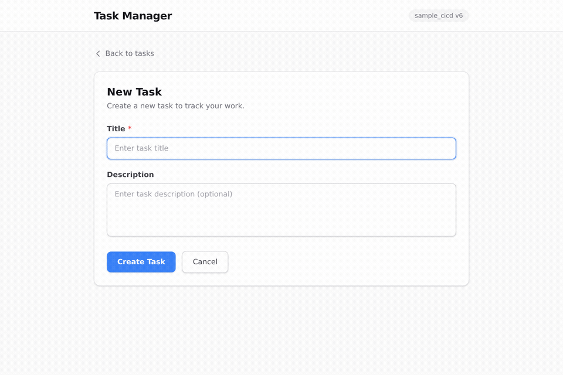

# sample_cicd

GitHub Actions + ECS(Fargate) による CI/CD パイプラインの学習プロジェクト。
FastAPI アプリケーションを AWS 上にコンテナデプロイし、バージョンを重ねながら本番運用に近いインフラを段階的に構築する。

## Web UI デモ (v6)



> タスクの作成 → 完了切替 → フィルタ を React SPA（S3 + CloudFront）から操作。

---

## システム概要

```
GitHub (push to main)
  └── GitHub Actions
        ├── CI: Lint → Test → Docker Build → Frontend Build (npm)
        └── CD: ECR Push → ECS Rolling Deploy → Lambda Deploy
                                              → Frontend S3 Sync + CloudFront Invalidation

インターネット
  ├── CloudFront (OAC) → S3 (添付ファイル配信)
  ├── CloudFront (OAC) → S3 (Web UI 静的配信)          ← v6
  └── ALB (HTTP :80)
        └── ECS Fargate (FastAPI + X-Ray SDK)  ← Auto Scaling: 1〜3 タスク
              │     ↕ X-Ray Daemon sidecar (UDP:2000) → X-Ray Service  ← v6
              ├── RDS PostgreSQL (Multi-AZ)
              │     ├── Primary (ap-northeast-1a)
              │     └── Standby (ap-northeast-1c)  ← 自動フェイルオーバー
              ├── S3 (Presigned URL でアップロード)
              ├── SQS (task-events キュー + DLQ)
              └── EventBridge (カスタムバス + スケジューラ)

Lambda 関数 × 3（X-Ray Active Tracing 有効）          ← v6
  ├── task_created_handler  ← SQS トリガー
  ├── task_completed_handler ← EventBridge トリガー
  └── task_cleanup_handler  ← EventBridge Scheduler (VPC 内、RDS 直接接続)

CloudWatch Alarms (12 個) → SNS Topic → (Email オプション)  ← v6
CloudWatch Dashboard → 5 行ウィジェット (ALB/ECS/RDS/Lambda/SQS)  ← v6
```

- **アプリ**: FastAPI (Python 3.12) によるタスク管理 REST API + ファイル添付機能
- **インフラ**: Terraform で AWS リソースをコード管理（Workspace でマルチ環境）
- **CI/CD**: GitHub Actions で push ごとに自動テスト・自動デプロイ（フロントエンドビルドも含む）
- **イベント駆動**: SQS + Lambda + EventBridge による非同期処理
- **ストレージ**: S3 + CloudFront で添付ファイル管理・配信
- **オブザーバビリティ**: CloudWatch Dashboard/Alarms、X-Ray 分散トレーシング、構造化ログ（v6）
- **Web UI**: React + Vite SPA を S3 + CloudFront でホスティング（v6）
- **リージョン**: ap-northeast-1 (東京)

---

## バージョン履歴

### v1 — Hello World API + CI/CD 基盤

最小構成の FastAPI アプリと CI/CD パイプラインを構築。

**追加機能**
- `GET /` → `{"message": "Hello, World!"}`
- `GET /health` → `{"status": "healthy"}`
- GitHub Actions CI/CD（Lint・Test・ECR Push・ECS Deploy）
- ECS Fargate + ALB による HTTP サービング

**学習テーマ**: ECS, Fargate, ALB, ECR, GitHub Actions, Dockerfile（マルチステージビルド）

---

### v2 — タスク管理 CRUD API + RDS PostgreSQL

RDS を追加してデータを永続化。本格的な REST API に拡張。

**追加機能**
- `GET /tasks` — タスク一覧取得
- `POST /tasks` — タスク作成
- `GET /tasks/{id}` — タスク取得
- `PUT /tasks/{id}` — タスク更新
- `DELETE /tasks/{id}` — タスク削除
- RDS PostgreSQL（プライベートサブネット配置）
- AWS Secrets Manager によるDB認証情報管理
- Alembic によるマイグレーション（アプリ起動時に自動実行）

**学習テーマ**: RDS, プライベートサブネット, Secrets Manager, SQLAlchemy (ORM), Alembic, Pydantic v2

---

### v3 — ECS Auto Scaling + RDS Multi-AZ + HTTPS 準備

負荷に応じてタスク数を自動調整。DB の高可用性を確保。

**追加機能**
- ECS Auto Scaling（CPU 70% を目標に 1〜3 タスクで自動増減）
- RDS Multi-AZ（スタンバイへの自動フェイルオーバー）
- HTTPS 化コード（`enable_https` 変数で ON/OFF、デフォルト無効）

**学習テーマ**: Application Auto Scaling, Target Tracking Policy, CloudWatch Alarm, RDS Multi-AZ, Terraform `count` / `dynamic`

---

### v4 — イベント駆動アーキテクチャ（SQS + Lambda + EventBridge）

非同期処理パターンを導入。タスク操作に連動してイベントを発行。

**追加機能**
- タスク作成時に SQS へイベント発行 → Lambda で非同期処理
- タスク完了時に EventBridge へイベント発行 → Lambda で非同期処理
- EventBridge Scheduler による定期クリーンアップ（VPC 内 Lambda → RDS 直接接続）
- DLQ（デッドレターキュー）による失敗メッセージの退避
- VPC Endpoints（Secrets Manager, CloudWatch Logs）

**学習テーマ**: SQS, Lambda, EventBridge, DLQ, VPC Endpoints, イベント駆動設計

---

### v5 — ストレージ + マルチ環境（S3 + CloudFront + Terraform Workspace）

タスクへのファイル添付機能を追加。マルチ環境管理を導入。

**追加機能**
- `POST /tasks/{id}/attachments` — Presigned URL でファイルアップロード
- `GET /tasks/{id}/attachments` — 添付ファイル一覧
- `GET /tasks/{id}/attachments/{id}` — CloudFront 経由のダウンロード URL 取得
- `DELETE /tasks/{id}/attachments/{id}` — 添付ファイル削除（S3 + DB）
- S3（SSE-S3 暗号化、パブリックアクセスブロック）
- CloudFront（OAC 経由で S3 配信）
- Terraform Workspace で dev/prod 環境分離

**学習テーマ**: S3, CloudFront, OAC, Presigned URL, Terraform Workspace, マルチ環境管理

---

### v6 — Observability + Web UI（開発中）

本番運用で必須の監視基盤と、ブラウザから操作できる管理画面を追加。

**追加機能**
- CloudWatch Dashboard（ALB/ECS/RDS/Lambda/SQS の 5 行ウィジェット）
- CloudWatch Alarms × 12（ALB 5xx・遅延、ECS CPU/Memory、RDS CPU/Storage/Connections、Lambda Errors/Throttles/Duration、SQS DLQ）
- SNS Topic（アラーム通知基盤、メールサブスクリプションはオプション）
- AWS X-Ray 分散トレーシング（ECS サイドカー daemon + aws-xray-sdk、Lambda Active Tracing）
- 構造化ログ（JSONFormatter — FastAPI + Lambda 全 3 関数）
- CORS Middleware（React SPA からの API 呼び出し対応）
- React + Vite SPA（タスク CRUD + 添付ファイル操作の管理画面）
- Web UI 用 S3 バケット + CloudFront（SPA ルーティング対応）
- フロントエンド CI/CD（npm build → S3 sync → CloudFront invalidation）

**学習テーマ**: CloudWatch Dashboard/Alarms, SNS, X-Ray, 構造化ログ, CORS, React (Vite), フロントエンド CI/CD

---

## API エンドポイント

| メソッド | パス | 説明 |
|---------|------|------|
| GET | `/` | Hello World |
| GET | `/health` | ヘルスチェック（ALB が死活監視） |
| GET | `/tasks` | タスク一覧 |
| POST | `/tasks` | タスク作成（→ SQS イベント発行） |
| GET | `/tasks/{id}` | タスク取得 |
| PUT | `/tasks/{id}` | タスク更新（完了時 → EventBridge イベント発行） |
| DELETE | `/tasks/{id}` | タスク削除 |
| POST | `/tasks/{id}/attachments` | 添付ファイル作成（Presigned URL 返却） |
| GET | `/tasks/{id}/attachments` | 添付ファイル一覧 |
| GET | `/tasks/{id}/attachments/{att_id}` | 添付ファイル取得（ダウンロード URL 付き） |
| DELETE | `/tasks/{id}/attachments/{att_id}` | 添付ファイル削除 |

---

## ディレクトリ構成

```
sample_cicd/
├── app/                        # FastAPI アプリケーション
│   ├── main.py                 # エントリポイント（X-Ray/CORS/JSONFormatter v6）
│   ├── routers/
│   │   ├── tasks.py            # タスク CRUD エンドポイント
│   │   └── attachments.py      # 添付ファイル CRUD エンドポイント（v5）
│   ├── services/
│   │   ├── events.py           # SQS/EventBridge イベント発行（v4）
│   │   └── storage.py          # S3 Presigned URL 生成・オブジェクト操作（v5）
│   ├── models.py               # SQLAlchemy ORM モデル（Task, Attachment）
│   ├── schemas.py              # Pydantic スキーマ（リクエスト/レスポンス）
│   ├── database.py             # DB 接続・セッション管理
│   ├── alembic/                # DB マイグレーション
│   ├── requirements.txt        # 依存ライブラリ（aws-xray-sdk v6）
│   └── Dockerfile              # マルチステージビルド、非rootユーザー
├── lambda/                     # Lambda 関数（v4、JSONFormatter v6）
│   ├── task_created_handler.py   # SQS トリガー：タスク作成イベント処理
│   ├── task_completed_handler.py # EventBridge トリガー：タスク完了イベント処理
│   └── task_cleanup_handler.py   # Scheduler トリガー：定期クリーンアップ
├── frontend/                   # React + Vite SPA（v6）
│   ├── package.json
│   ├── vite.config.js
│   ├── index.html
│   └── src/
│       ├── App.jsx             # ルーティング・レイアウト
│       ├── api.js              # fetch wrapper
│       ├── config.js           # API URL（CD 時に生成）
│       └── components/         # TaskList, TaskForm, TaskDetail, Attachment 他
├── infra/                      # Terraform（AWS インフラ定義）
│   ├── main.tf                 # VPC・サブネット・ルーティング
│   ├── ecs.tf                  # ECS（X-Ray サイドカー追加 v6）
│   ├── alb.tf                  # ALB・ターゲットグループ・リスナー
│   ├── rds.tf                  # RDS PostgreSQL（Multi-AZ）
│   ├── autoscaling.tf          # Application Auto Scaling（v3）
│   ├── https.tf                # ACM・Route53・HTTPSリスナー（コードのみ）
│   ├── sqs.tf                  # SQS キュー + DLQ（v4）
│   ├── lambda.tf               # Lambda 定義（Active Tracing 追加 v6）
│   ├── eventbridge.tf          # EventBridge バス + ルール + Scheduler（v4）
│   ├── vpc_endpoints.tf        # VPC Endpoints（v4）
│   ├── s3.tf                   # S3 バケット（添付ファイル v5）
│   ├── cloudfront.tf           # CloudFront（添付ファイル配信 v5）
│   ├── monitoring.tf           # CloudWatch Dashboard + Alarms × 12（v6）
│   ├── sns.tf                  # SNS Topic（アラーム通知基盤 v6）
│   ├── webui.tf                # Web UI 用 S3 + CloudFront（v6）
│   ├── ecr.tf                  # ECR リポジトリ
│   ├── iam.tf                  # IAM ロール・ポリシー（X-Ray 権限 v6）
│   ├── secrets.tf              # Secrets Manager
│   ├── security_groups.tf      # セキュリティグループ
│   ├── logs.tf                 # CloudWatch Logs（X-Ray daemon ログ v6）
│   ├── variables.tf            # 変数定義（アラーム閾値 v6）
│   ├── outputs.tf              # 出力値（Dashboard URL・Web UI URL v6）
│   ├── dev.tfvars              # dev 環境設定値
│   └── prod.tfvars             # prod 環境設定値
├── .github/workflows/
│   └── ci-cd.yml               # CI/CD（フロントエンドビルド・デプロイ追加 v6）
├── tests/
│   ├── conftest.py             # テスト用 DB（SQLite インメモリ）
│   ├── test_main.py            # v1 エンドポイントテスト
│   ├── test_tasks.py           # v2 + v4 タスク CRUD + イベント発行テスト
│   ├── test_attachments.py     # v5 添付ファイルテスト
│   └── test_observability.py  # v6 CORS・構造化ログ・X-Ray graceful degradation
└── docs/
    ├── 01_requirements/        # 要件定義書（v1〜v6）
    ├── 02_design/              # 設計書（アーキテクチャ・API・DB・インフラ・CI/CD）
    ├── 04_test/                # テスト計画書（v1〜v6）
    ├── 05_deploy/              # デプロイ手順書・動作確認記録（v1〜v6）
    └── 06_learning/            # 学習まとめ（v2〜v5）
```

---

## 実装詳細

### アプリケーション（app/）

**FastAPI + SQLAlchemy + Alembic**

```python
# 起動時に自動マイグレーション
@asynccontextmanager
async def lifespan(app):
    _run_migrations()   # alembic upgrade head
    yield

# DB セッションを DI で各エンドポイントに注入
def get_db():
    db = SessionLocal()
    try:
        yield db
    finally:
        db.close()
```

- **DB 接続**: 環境変数 `DATABASE_URL`（優先）または `DB_*` 変数（Secrets Manager 経由）
- **テスト**: SQLite インメモリ DB に差し替え（`dependency_overrides`）
- **コンテナ**: マルチステージビルドで軽量化、非 root ユーザーで実行

### インフラ（infra/）

**Terraform でリソースを分割管理（Workspace でマルチ環境）**

```
VPC (10.0.0.0/16)
  ├── パブリックサブネット × 2  → ALB, ECS タスク
  └── プライベートサブネット × 2 → RDS, VPC Endpoints, Lambda (cleanup)
```

**Auto Scaling の仕組み（v3）**

```
CloudWatch: ECS CPU 使用率を 60 秒ごとに計測
  ↓ 70% 超が 3 分連続
AlarmHigh → ALARM
  ↓ scale_out_cooldown: 60 秒
desired_count: 1 → 2（最大 3）
  ↓
新タスク起動 → ALB ヘルスチェック通過 → 振り分け開始

  ↓ 63% 未満が 15 分連続
AlarmLow → ALARM
  ↓ scale_in_cooldown: 300 秒
desired_count: 2 → 1
```

**イベント駆動フロー（v4）**

```
タスク作成 → SQS (task-events) → Lambda (task_created_handler)
                                     └── 失敗 → DLQ

タスク完了 → EventBridge (カスタムバス) → Lambda (task_completed_handler)

EventBridge Scheduler (毎日) → Lambda (task_cleanup_handler)
                                  └── VPC 内から RDS に直接接続
```

**ファイル添付フロー（v5）**

```
アップロード: クライアント → API (Presigned URL 取得) → S3 に直接 PUT
ダウンロード: クライアント → CloudFront (OAC) → S3
```

**マルチ環境管理（v5）**

```bash
# Terraform Workspace で環境切り替え
terraform workspace select dev
terraform plan -var-file=dev.tfvars

terraform workspace select prod
terraform plan -var-file=prod.tfvars
# リソース名は自動で sample-cicd-{env}-* に統一
```

**HTTPS 有効化（将来）**

```bash
# terraform.tfvars に追記するだけで有効化
enable_https = true
domain_name  = "example.com"
```

### CI/CD（.github/workflows/ci-cd.yml）

```
push to main
  ├── CI ジョブ（全ブランチ・PR）
  │    ├── ruff check app/ tests/ lambda/  # Lint
  │    ├── pytest tests/ -v                # 46+ テスト
  │    ├── docker build                    # ビルド検証
  │    └── npm ci && npm run build         # フロントエンドビルド検証（v6）
  │
  └── CD ジョブ（main ブランチのみ、CI 成功後）
       ├── ECR へ push（タグ: <short-SHA>, latest）
       ├── ECS ローリングデプロイ（minimum_healthy_percent: 100% 無停止）
       ├── Lambda コード更新（zip → update-function-code）
       └── フロントエンドデプロイ（v6）
            ├── npm build
            ├── config.js 生成（ALB DNS 名を注入）
            ├── S3 sync（--delete）
            └── CloudFront キャッシュ無効化
```

---

## ローカル開発

```bash
# 依存インストール
pip install -r app/requirements.txt
pip install ruff pytest httpx

# Lint
ruff check app/ tests/

# テスト
DATABASE_URL=sqlite:// pytest tests/ -v

# ローカルサーバー起動
cd app && python -m uvicorn main:app --host 0.0.0.0 --port 8000 --reload

# Docker ビルド
docker build -t sample-cicd:dev -f app/Dockerfile .
docker run -p 8000:8000 sample-cicd:dev
```

---

## AWS デプロイ

```bash
# インフラ構築（v5: Workspace でマルチ環境）
cd infra
terraform init
terraform workspace select dev    # または prod
terraform plan -var-file=dev.tfvars
terraform apply -var-file=dev.tfvars

# ECR へ手動プッシュ（初回のみ）
aws ecr get-login-password --region ap-northeast-1 | \
  docker login --username AWS --password-stdin <ECR_URL>
docker build -t sample-cicd:latest -f app/Dockerfile .
docker tag sample-cicd:latest <ECR_URL>:latest
docker push <ECR_URL>:latest

# 以降は main ブランチへの push で自動デプロイ
```

**クリーンアップ（学習後）**

```bash
# ECR イメージを先に削除してから destroy
aws ecr batch-delete-image --repository-name sample-cicd \
  --image-ids "$(aws ecr list-images --repository-name sample-cicd \
  --query 'imageIds[*]' --output json)" --region ap-northeast-1

cd infra && terraform destroy
```

> **コスト目安**: 起動中は約 $2.50〜3.00/日（RDS Multi-AZ が主なコスト）

---

## ドキュメント

ウォーターフォール型で各フェーズの成果物を `docs/` に保管している。

| フェーズ | ディレクトリ | 内容 |
|---------|------------|------|
| 1. 要件定義 | `docs/01_requirements/` | 機能要件・非機能要件・コスト見積もり |
| 2. 設計 | `docs/02_design/` | アーキテクチャ・API・DB・インフラ・CI/CD 設計書 |
| 3. 実装 | `app/`, `infra/`, `.github/` | ソースコード本体 |
| 4. テスト | `docs/04_test/` | テスト計画書・合格基準 |
| 5. デプロイ | `docs/05_deploy/` | デプロイ手順書・動作確認記録 |
| — | `docs/06_learning/` | バージョンごとの学習まとめ |

各バージョンのドキュメントは `_v2`, `_v3`, `_v4`, `_v5`, `_v6` サフィックスで並行管理している。

---

## 技術スタック

| カテゴリ | 技術 |
|---------|------|
| 言語 | Python 3.12 |
| Web フレームワーク | FastAPI |
| ORM | SQLAlchemy 2.x |
| マイグレーション | Alembic |
| バリデーション | Pydantic v2 |
| Lint | Ruff |
| テスト | pytest + httpx |
| コンテナ | Docker（マルチステージビルド） |
| IaC | Terraform (hashicorp/aws) |
| CI/CD | GitHub Actions |
| クラウド | AWS (ap-northeast-1) |
| コンピュート | ECS Fargate (0.25 vCPU / 512 MB) |
| ロードバランサー | ALB |
| データベース | RDS PostgreSQL 15 (db.t3.micro, Multi-AZ) |
| メッセージキュー | SQS (+ DLQ) |
| サーバーレス | AWS Lambda (Python 3.12) |
| イベントバス | Amazon EventBridge (カスタムバス + Scheduler) |
| ストレージ | S3 (SSE-S3 暗号化) |
| CDN | CloudFront (OAC) |
| レジストリ | ECR |
| シークレット管理 | AWS Secrets Manager |
| スケーリング | Application Auto Scaling |
| ログ | CloudWatch Logs |
| 環境管理 | Terraform Workspace (dev / prod) |
| 監視 | CloudWatch Dashboard / Alarms（v6） |
| 通知 | Amazon SNS（v6） |
| 分散トレーシング | AWS X-Ray（v6） |
| フロントエンド | React 18 + Vite（v6） |
| フロントエンドホスティング | S3 + CloudFront（SPA ルーティング対応 v6） |
