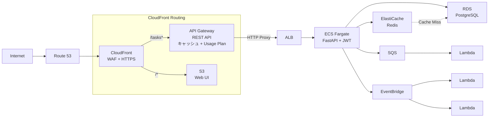
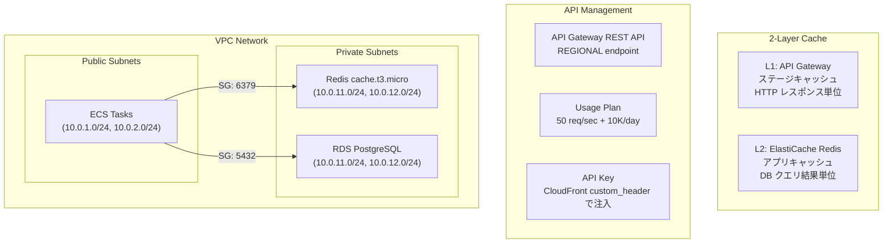
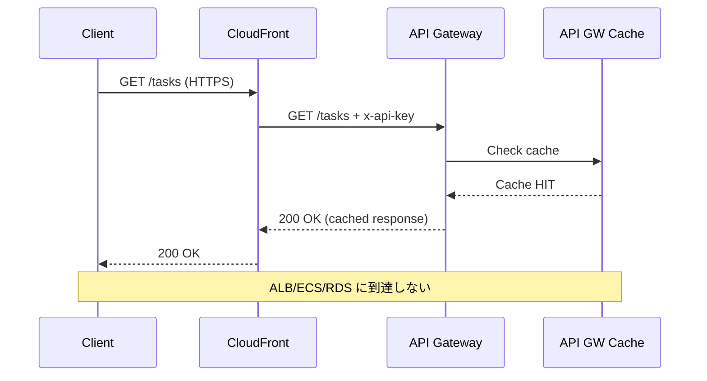
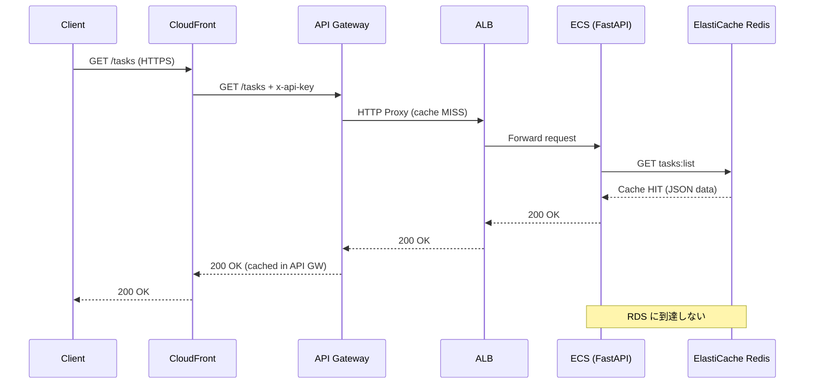
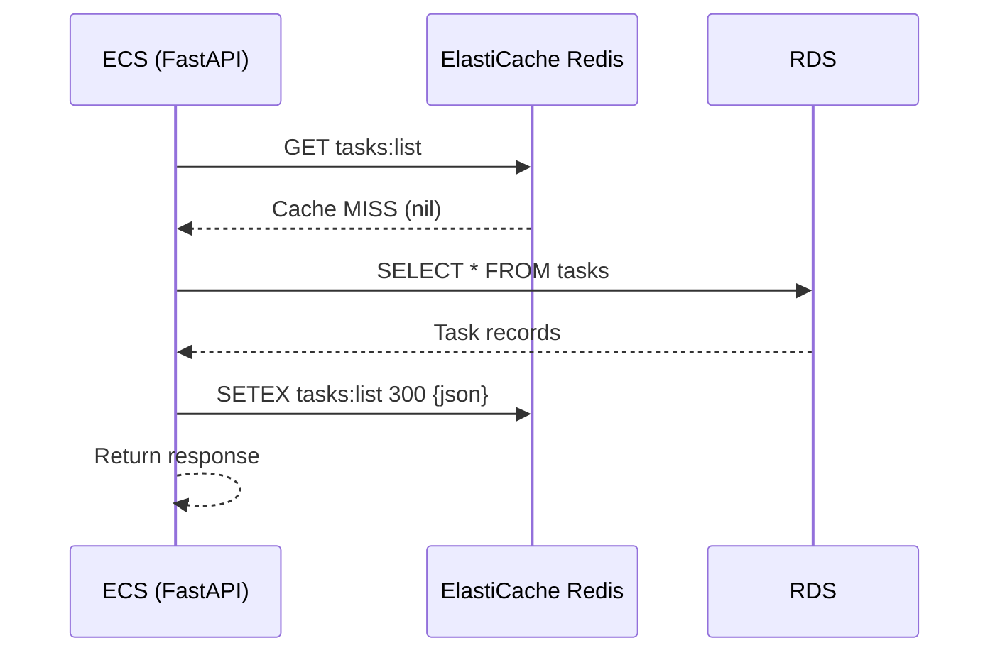
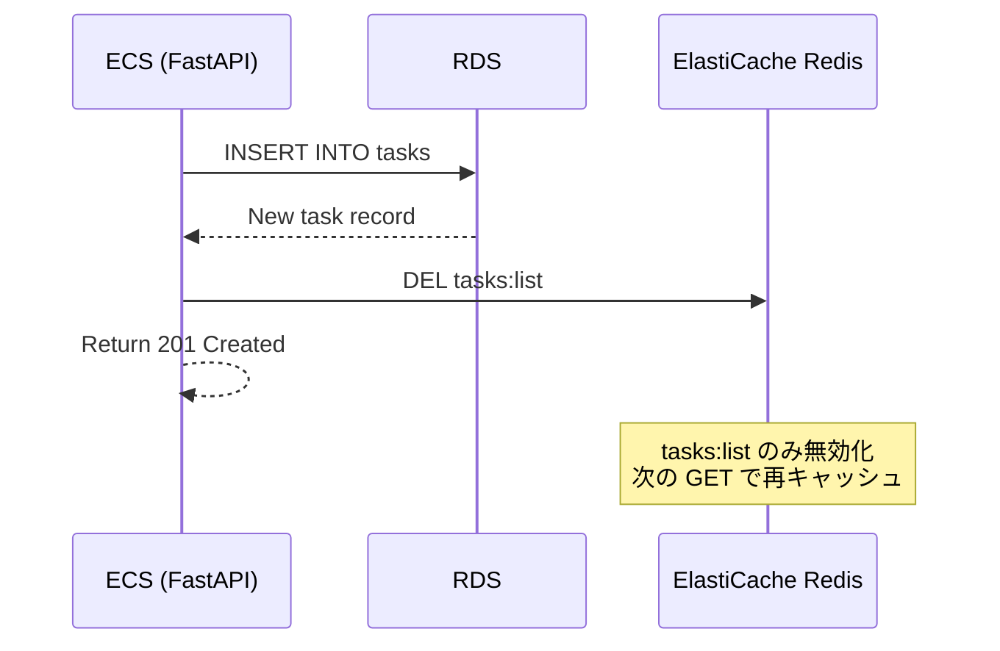
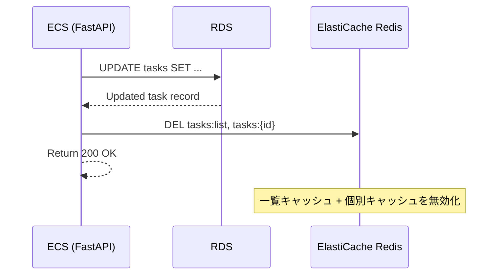

# アーキテクチャ設計書 (v10)

| 項目 | 内容 |
|------|------|
| プロジェクト名 | sample_cicd |
| 作成日 | 2026-04-08 |
| バージョン | 10.0 |
| 前バージョン | [architecture_v9.md](architecture_v9.md) (v9.0) |

## 変更概要

v9 のアーキテクチャに以下を追加する:

- **API Gateway REST API**: CloudFront と ALB の間に API 管理レイヤーを挿入。スロットリング、キャッシュ、Usage Plans を提供
- **ElastiCache Redis**: プライベートサブネットに Redis を配置。アプリレベルの DB クエリキャッシュ
- **CloudFront オリジン変更**: `/tasks*` のオリジンを ALB から API Gateway に変更

> アプリケーションコードは `app/services/cache.py` 新規追加 + `app/routers/tasks.py` のキャッシュ統合のみ。フロントエンド変更なし。

## 1. システム構成図

### v10 全体構成



### v10 追加部分（詳細）



## 2. リクエストフロー

### 2.1 GET /tasks（キャッシュヒット時）



### 2.2 GET /tasks（API GW キャッシュミス、Redis キャッシュヒット時）



### 2.3 GET /tasks（全キャッシュミス時）



### 2.4 POST /tasks（書き込み時のキャッシュ無効化）



### 2.5 PUT /tasks/{id}（更新時のキャッシュ無効化）



## 3. API Gateway 設計

### 3.1 REST API 構成

| 項目 | 設定 |
|------|------|
| API タイプ | REST API (v1) |
| エンドポイント | REGIONAL |
| API 名 | `${prefix}-api` |
| リソース 1 | `/tasks` |
| リソース 2 | `/tasks/{proxy+}` |
| メソッド | ANY (全メソッドをプロキシ) |
| 統合タイプ | HTTP_PROXY |
| 統合先 | `http://${ALB DNS}/tasks` |
| API キー | 必須 (`api_key_required = true`) |

### 3.2 ステージキャッシュ設定

| 項目 | 設定 |
|------|------|
| キャッシュ有効 | `cache_cluster_enabled = true` |
| キャッシュサイズ | 0.5 GB |
| GET /tasks | caching = true, TTL = 300s |
| GET /tasks/{proxy+} | caching = true, TTL = 300s |
| その他メソッド | caching = false |
| キャッシュキー | URL パス + クエリパラメータ |

### 3.3 Usage Plan

| 項目 | dev | prod |
|------|-----|------|
| レート制限 | 50 req/sec | 100 req/sec |
| バースト制限 | 100 req | 200 req |
| クォータ | 10,000 req/日 | 50,000 req/日 |

### 3.4 API キー注入フロー

```
CloudFront → API Gateway の接続で x-api-key を注入:

CloudFront Origin Config:
  custom_header {
    name  = "x-api-key"
    value = aws_api_gateway_api_key.main.value
  }

→ フロントエンド (React SPA) は API キーを知らなくてよい
→ CloudFront を経由しない直接アクセスには API キーが別途必要
```

## 4. ElastiCache Redis 設計

### 4.1 クラスタ構成

| 項目 | 設定 |
|------|------|
| エンジン | Redis 7.0 |
| ノードタイプ | cache.t3.micro (0.5 GB) |
| ノード数 | 1 (単一ノード) |
| サブネット | private_1 + private_2 |
| ポート | 6379 |
| パラメータグループ | default.redis7 |
| 暗号化 | なし (VPC 内通信) |

### 4.2 キャッシュキー設計

| キーパターン | 用途 | TTL | 無効化タイミング |
|-------------|------|-----|----------------|
| `tasks:list` | タスク一覧 | 300s | POST, PUT, DELETE |
| `tasks:{id}` | 個別タスク | 600s | PUT, DELETE (該当 ID) |

### 4.3 Graceful Degradation

```python
# REDIS_URL 未設定 → キャッシュ完全スキップ
# Redis 接続失敗 → Warning ログ出力、DB 直接アクセス
# cache_get エラー → None 返却（キャッシュミス扱い）
# cache_set エラー → サイレント失敗（ログのみ）
# cache_delete エラー → サイレント失敗（ログのみ）
```

## 5. セキュリティグループ設計

### 5.1 新規: Redis SG

| 方向 | ポート | プロトコル | ソース | 説明 |
|------|--------|----------|--------|------|
| Ingress | 6379 | TCP | ECS Tasks SG | Redis from ECS tasks |
| Egress | All | All | 0.0.0.0/0 | Allow all outbound |

> RDS SG と同じパターン。ECS タスク (public subnet) → Redis (private subnet) は VPC 内ルーティングで到達可能。

## 6. CloudFront オリジン変更

### 6.1 変更前 (v9)

```
Origin 2: alb-api
  domain_name = aws_lb.main.dns_name
  protocol    = http-only
```

### 6.2 変更後 (v10)

```
Origin 2: apigw-api
  domain_name = ${api_id}.execute-api.${region}.amazonaws.com
  origin_path = /${env}
  protocol    = https-only
  custom_header: x-api-key = ${api_key_value}
```

### 6.3 キャッシュポリシー

`/tasks*` の `ordered_cache_behavior` は引き続き `CachingDisabled`。CloudFront ではキャッシュせず、API Gateway のステージキャッシュに委任する。

## 7. モニタリング設計

### 7.1 Dashboard 追加

| Row | 内容 | メトリクス |
|-----|------|-----------|
| Row 6 | API Gateway | Count + 5xxError, Latency + CacheHitCount + CacheMissCount |
| Row 7 | ElastiCache | CPUUtilization + EngineCPUUtilization, CurrConnections + NewConnections, CacheHits + CacheMisses + Evictions |

### 7.2 Alarm 追加

| Alarm | メトリクス | 閾値 | 期間 |
|-------|-----------|------|------|
| API Gateway 5xx | 5XXError | >= 10 | 5 分 |
| API Gateway Latency | IntegrationLatency | >= 5000 ms | 5 分 |
| Redis CPU | CPUUtilization | >= 90% | 5 分 |
| Redis Evictions | Evictions | > 0 | 5 分 |

## 8. レート制限の多層設計

| 層 | 技術 | 制限 | 対象 |
|----|------|------|------|
| L1 | WAF (CloudFront) | 2000 req / 5min / IP | 全リクエスト |
| L2 | API Gateway スロットリング | 50 req/sec (burst 100) | /tasks* エンドポイント |
| L3 | API Gateway Usage Plan | 10,000 req / 日 / API キー | API キー単位 |

```
Internet → WAF (IP制限) → CloudFront → API Gateway (スロットリング + クォータ) → ALB → ECS
```

各層は独立して動作し、最も厳しい制限が適用される。WAF は DDoS 防御、API Gateway はアプリケーションレベルの制御を担当。
