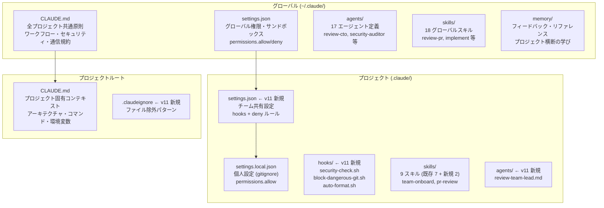
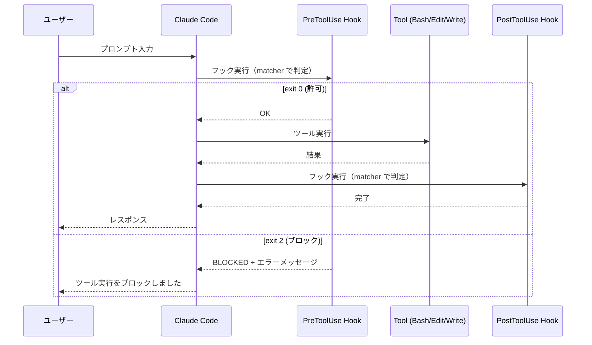
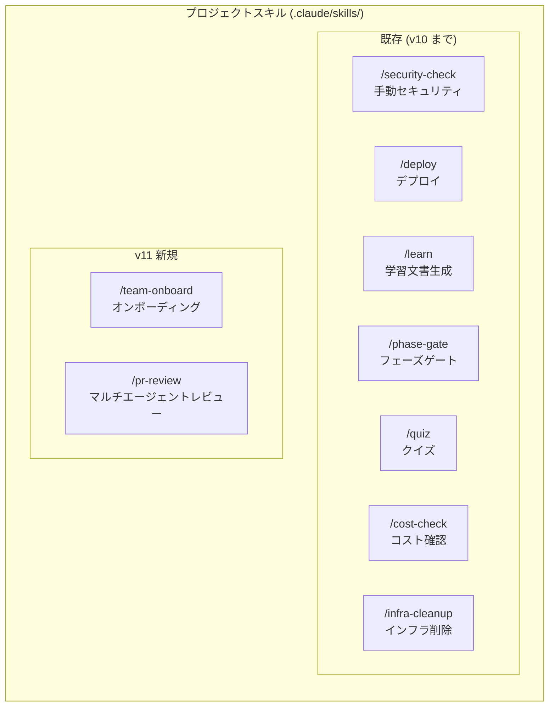
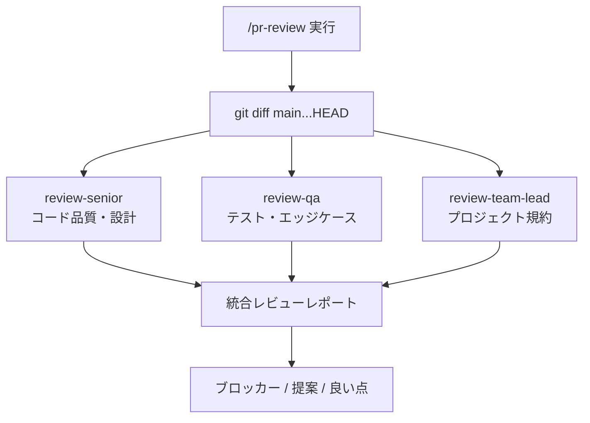
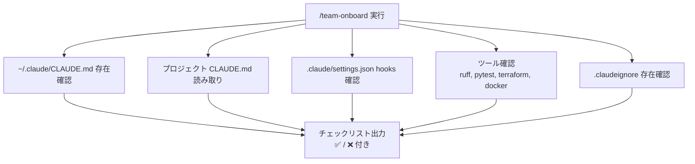

# アーキテクチャ設計書 (v11)

| 項目 | 内容 |
|------|------|
| プロジェクト名 | sample_cicd |
| 作成日 | 2026-04-09 |
| バージョン | 11.0 |
| 前バージョン | [architecture_v10.md](architecture_v10.md) (v10.0) |

## 変更概要

v10 のアーキテクチャ（AWS インフラ）に変更はない。v11 では **Claude Code の設定アーキテクチャ** を設計・実装する:

- **Hooks**: PreToolUse / PostToolUse による自動チェック・フォーマットの仕組み
- **設定階層**: グローバル → プロジェクト共有 → 個人設定の 3 層構造
- **スキル・エージェント**: チーム向けカスタムスキルとレビューエージェント

> AWS インフラ、アプリケーションコード、CI/CD ワークフローへの変更はなし。

## 1. Claude Code 設定階層

### 1.1 全体構成図



### 1.2 設定の優先順位

Claude Code は設定を以下の順に読み込む（下ほど優先度が高い）:

```
優先度: 低 ─────────────────────────────────── 高

~/.claude/CLAUDE.md        全プロジェクト共通の原則
     ↓
~/.claude/settings.json    グローバル権限・サンドボックス
     ↓
.claude/settings.json      チーム共有設定（git 管理）    ← v11 新規
     ↓
.claude/settings.local.json 個人設定（gitignore 対象）    ← 既存
     ↓
./CLAUDE.md                プロジェクト固有コンテキスト
```

### 1.3 各レイヤーの役割分担

| レイヤー | ファイル | git 管理 | 内容 | 変更頻度 |
|---------|---------|:---:|------|---------|
| グローバル原則 | `~/.claude/CLAUDE.md` | ✕ | ワークフロー、セキュリティポリシー、通信規約 | 低（月 1 回程度） |
| グローバル設定 | `~/.claude/settings.json` | ✕ | サンドボックス、deny リスト、effortLevel | 低 |
| チーム共有設定 | `.claude/settings.json` | ✅ | hooks、permissions.deny | 中（バージョン毎） |
| 個人設定 | `.claude/settings.local.json` | ✕ | permissions.allow（個人の AWS コマンド等） | 高（随時） |
| プロジェクト指示 | `./CLAUDE.md` | ✅ | アーキテクチャ、コマンド、環境変数、規約 | 中（バージョン毎） |
| 除外パターン | `.claudeignore` | ✅ | 機密・バイナリ・ビルド成果物の除外 | 低 |

**設計判断**: `settings.json`（チーム共有）と `settings.local.json`（個人用）を分離する理由:
- **共有すべきもの**: hooks（全員に同じセキュリティチェックを適用）、deny ルール（危険操作のブロック）
- **個人に委ねるもの**: allow リスト（使う AWS コマンドは人によって異なる）、MCP 設定

## 2. Hooks アーキテクチャ

### 2.1 フックの実行フロー



### 2.2 フック一覧

| フック名 | タイプ | matcher | トリガー条件 | 動作 |
|---------|--------|---------|-------------|------|
| block-dangerous-git.sh | PreToolUse | `Bash` | `git push --force`, `git reset --hard`, `rm -rf` 等 | exit 2 でブロック |
| security-check.sh | PreToolUse | `Bash` | `git commit` コマンド | staged changes を機密スキャン、検出時 exit 2 |
| auto-format.sh | PostToolUse | `Edit\|Write` | `.py` ファイルの変更 | `ruff check --fix` + `ruff format` 実行 |

### 2.3 フックの exit code 規約

| exit code | 意味 | Claude Code の動作 |
|-----------|------|-------------------|
| 0 | 許可 | ツール実行を続行 |
| 1 | エラー（非ブロック） | 警告を表示するが、ツール実行は続行 |
| 2 | ブロック | ツール実行を中止、エラーメッセージを表示 |

### 2.4 フックへの入力

Claude Code はフックスクリプトの stdin に JSON を渡す:

**PreToolUse の場合:**
```json
{
  "tool_name": "Bash",
  "tool_input": {
    "command": "git commit -m 'fix: something'"
  }
}
```

**PostToolUse の場合:**
```json
{
  "tool_name": "Edit",
  "tool_input": {
    "file_path": "/path/to/file.py",
    "old_string": "...",
    "new_string": "..."
  }
}
```

フックスクリプトは stdin から JSON を読み取り、必要な情報を抽出して処理を行う。

## 3. スキル・エージェント設計

### 3.1 スキル構成



### 3.2 `/pr-review` のエージェント連携



**設計判断**: 3 エージェントを並列起動する理由:
- **review-senior**: グローバルエージェント。汎用的なコード品質・設計パターンを評価
- **review-qa**: グローバルエージェント。テストカバレッジ・エッジケースを評価
- **review-team-lead**: プロジェクトエージェント（v11 新規）。このプロジェクト固有の規約（AWS クレデンシャルマスク、Terraform 命名、日本語通信）を評価

### 3.3 `/team-onboard` のチェックフロー



## 4. `.claudeignore` 設計

### 4.1 `.claudeignore` vs `.gitignore`

| 項目 | `.gitignore` | `.claudeignore` |
|------|-------------|-----------------|
| 対象 | git の追跡 | Claude の読み取り |
| 効果 | ファイルが git に追加されない | Claude がファイル内容を読めない |
| セキュリティ | コミットされた秘密は履歴に残る | Claude のコンテキストに秘密が入らない |
| 必要性 | 両方必要（異なる目的） | 両方必要（異なる目的） |

### 4.2 除外カテゴリと理由

| カテゴリ | パターン | 除外理由 |
|---------|---------|---------|
| 機密情報 | `.env`, `.env.*`, `*.pem`, `*.key` | API キー・パスワード・秘密鍵の漏洩防止 |
| Terraform state | `*.tfstate`, `*.tfstate.backup`, `.terraform/` | 実 AWS アカウント ID・リソース ARN の漏洩防止 |
| ビルド成果物 | `node_modules/`, `__pycache__/`, `.venv/`, `frontend/dist/` | コンテキストウィンドウの無駄遣い防止 |
| バイナリ | `*.png`, `*.jpg`, `*.gif`, `*.zip` | Claude が有意に処理できないファイルの除外 |

## 5. AWS アーキテクチャ（変更なし）

v11 では AWS インフラへの変更はない。v10 のアーキテクチャがそのまま維持される:

```
Route 53 → CloudFront (WAF)
  ├─ /tasks*  → API Gateway (REST, REGIONAL) → ALB → ECS → Redis → RDS
  └─ /*       → S3 (Web UI)
```

詳細は [architecture_v10.md](architecture_v10.md) を参照。
