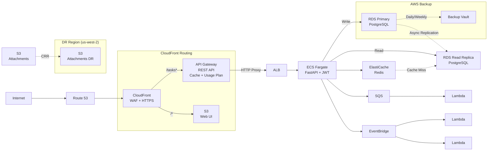
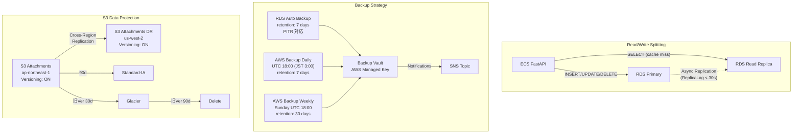
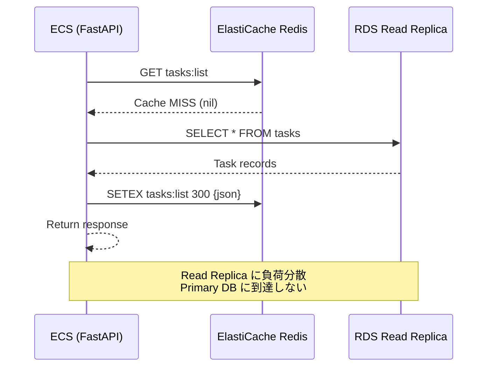
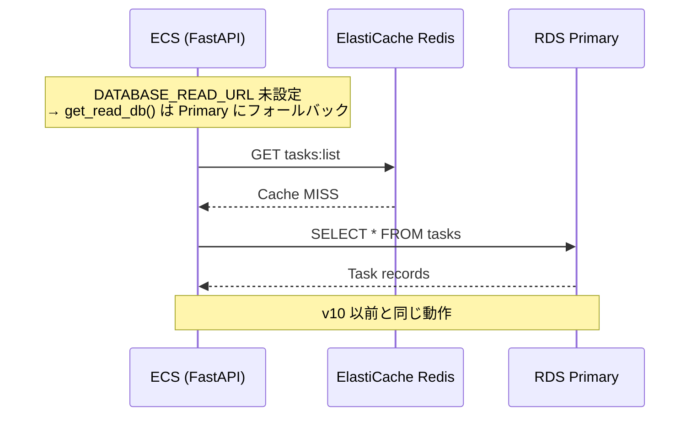

# アーキテクチャ設計書 (v12)

| 項目 | 内容 |
|------|------|
| プロジェクト名 | sample_cicd |
| 作成日 | 2026-04-10 |
| バージョン | 12.0 |
| 前バージョン | [architecture_v10.md](architecture_v10.md) (v10.0) |

## 変更概要

v10 のアーキテクチャに以下を追加する:

- **RDS バックアップ強化 + AWS Backup**: 自動バックアップの有効化と統合バックアップ管理
- **RDS Read Replica**: 読み取りスケーリング。ECS からの読み取りクエリをレプリカにルーティング
- **S3 Versioning + Lifecycle**: オブジェクトバージョン管理とストレージクラス自動移行
- **S3 Cross-Region Replication**: DR リージョン（us-west-2）への添付ファイル自動複製

> アプリケーションコードは `app/database.py` の読み書き分離 + `app/routers/tasks.py` のルーティング変更のみ。フロントエンド変更なし。

## 1. システム構成図

### v12 全体構成



### v12 追加部分（データ保護詳細）



## 2. リクエストフロー

### 2.1 GET /tasks（読み書き分離 — キャッシュミス時）



### 2.2 POST /tasks（書き込みはプライマリ — 変更なし）

```mermaid
sequenceDiagram
    participant ECS as ECS (FastAPI)
    participant Primary as RDS Primary
    participant Redis as ElastiCache Redis
    participant Replica as RDS Read Replica

    ECS->>Primary: INSERT INTO tasks
    Primary-->>ECS: New task record
    ECS->>Redis: DEL tasks:list
    ECS-->>ECS: Return 201 Created
    Primary-.>>Replica: Async Replication
    Note over Primary,Replica: 書き込みは常に Primary<br>Replica への反映は非同期
```

### 2.3 Graceful Degradation（DATABASE_READ_URL 未設定時）



## 3. 読み書き分離設計

### 3.1 セッション構成

| セッション | 接続先 | 用途 | 関数 |
|-----------|--------|------|------|
| Write Session | RDS Primary | INSERT, UPDATE, DELETE | `get_db()` (既存) |
| Read Session | RDS Read Replica | SELECT (list, get) | `get_read_db()` (新規) |

### 3.2 環境変数

| 変数 | 値 | 必須 |
|------|-----|------|
| `DATABASE_URL` | Primary DB URL (local/test) | Yes (local) |
| `DB_*` (5変数) | Primary DB credentials (ECS) | Yes (ECS) |
| `DATABASE_READ_URL` | Read Replica endpoint URL | Optional |

### 3.3 フォールバック設計

```python
# database.py の設計方針
# 1. DATABASE_READ_URL が設定されている場合
#    → 読み取り専用エンジン・セッションを作成
# 2. DATABASE_READ_URL が未設定の場合
#    → get_read_db() は get_db() と同じ Primary セッションを返す
#    → コード変更なしで既存動作を維持
```

### 3.4 ルーティングマトリクス

| エンドポイント | メソッド | DB Session | キャッシュ |
|---------------|---------|------------|-----------|
| `GET /api/tasks` | list_tasks | **Read** | Redis → Read Replica |
| `GET /api/tasks/{id}` | get_task | **Read** | Redis → Read Replica |
| `POST /api/tasks` | create_task | Write | Primary + cache invalidate |
| `PUT /api/tasks/{id}` | update_task | Write | Primary + cache invalidate |
| `DELETE /api/tasks/{id}` | delete_task | Write | Primary + cache invalidate |

## 4. AWS Backup 設計

### 4.1 バックアップ構成

| 項目 | 日次 | 週次 |
|------|------|------|
| スケジュール | 毎日 UTC 18:00 | 毎週日曜 UTC 18:00 |
| 保持期間 | 7 日 | 30 日 |
| 対象 | RDS (タグ: Backup=true) | RDS (タグ: Backup=true) |
| 暗号化 | AWS Managed Key | AWS Managed Key |

### 4.2 通知設計

| イベント | 通知先 | アクション |
|---------|--------|-----------|
| BACKUP_JOB_COMPLETED | 既存 SNS Topic | 情報通知 |
| BACKUP_JOB_FAILED | 既存 SNS Topic | アラート |

## 5. S3 データ保護設計

### 5.1 Versioning

| 項目 | 設定 |
|------|------|
| バケット | `${prefix}-attachments` |
| Versioning | Enabled (デフォルト変更: false → true) |
| 効果 | 誤削除・上書きからの復旧が可能 |

### 5.2 Lifecycle Rules

| ルール | 対象 | 経過日数 | アクション |
|--------|------|---------|-----------|
| 現行バージョン IA 移行 | 現行バージョン | 90 日 | Standard → Standard-IA |
| 旧バージョン Glacier | 非現行バージョン | 30 日 | Standard → Glacier |
| 旧バージョン削除 | 非現行バージョン | 90 日 | 完全削除 |

### 5.3 Cross-Region Replication

| 項目 | 設定 |
|------|------|
| ソース | `${prefix}-attachments` (ap-northeast-1) |
| 宛先 | `${prefix}-attachments-dr` (us-west-2) |
| レプリケーション範囲 | 全オブジェクト |
| 有効化 | `enable_s3_replication` 変数で制御 |
| 前提 | ソース・宛先バケット共にバージョニング有効 |

## 6. セキュリティグループ設計

### 6.1 RDS SG（変更なし）

Read Replica は Primary と同じセキュリティグループ `aws_security_group.rds` を共有する。

| 方向 | ポート | プロトコル | ソース | 説明 |
|------|--------|----------|--------|------|
| Ingress | 5432 | TCP | ECS Tasks SG | PostgreSQL from ECS tasks |
| Ingress | 5432 | TCP | Lambda Cleanup SG | PostgreSQL from cleanup Lambda |
| Egress | All | All | 0.0.0.0/0 | Allow all outbound |

> Read Replica は既存 RDS SG のルールで ECS タスクからのアクセスを許可。新規 SG は不要。

## 7. モニタリング設計

### 7.1 Dashboard 追加

| Row | 内容 | メトリクス |
|-----|------|-----------|
| Row 8 (左) | RDS Replica Lag | `ReplicaLag` (Average) — Read Replica の同期遅延 |
| Row 8 (右) | RDS Replica CPU | `CPUUtilization` — Read Replica の CPU 使用率 |

> Row 8 は `enable_read_replica = true` の場合のみ表示。

### 7.2 Alarm 追加

| Alarm | メトリクス | 閾値 | 期間 | 評価期間 |
|-------|-----------|------|------|---------|
| Replica Lag High | `ReplicaLag` | >= 30 秒 | 300s | 2 期間 |

> AWS Backup ジョブ失敗は Vault 通知（SNS）で対応。CloudWatch Alarm は不要。

## 8. 3層キャッシュ + 読み書き分離の統合

```
GET /tasks の読み取りフロー:

L1: API Gateway Cache (HTTP response)
  ↓ MISS
L2: ElastiCache Redis (DB query result)
  ↓ MISS
L3: RDS Read Replica (PostgreSQL)

POST/PUT/DELETE の書き込みフロー:

RDS Primary (write)
  → Redis cache invalidate (DEL)
  → API Gateway cache: TTL 経過で自然失効

Read Replica への非同期レプリケーション:
Primary → Replica (通常数秒以内)
```

v10 の 2 層キャッシュ（API Gateway + Redis）に Read Replica を追加し、全キャッシュミス時のDB負荷をPrimaryから分離。書き込みは常にPrimaryで一貫性を保証。
