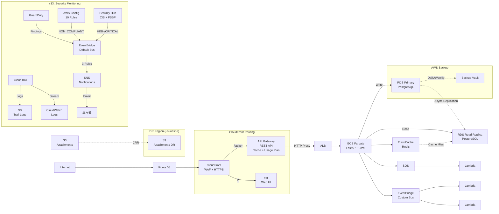
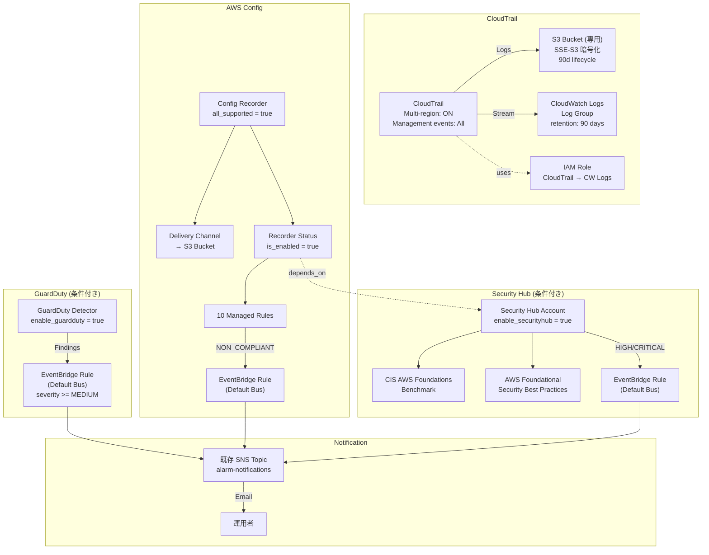
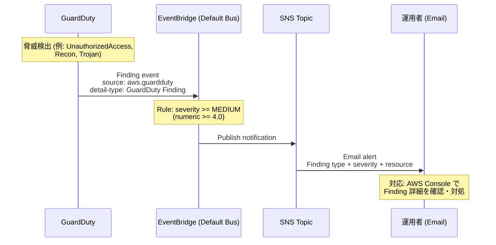
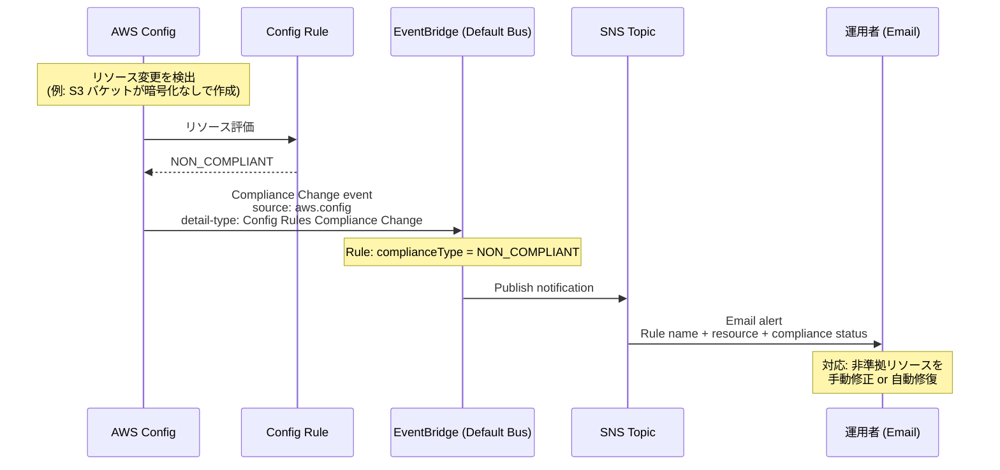
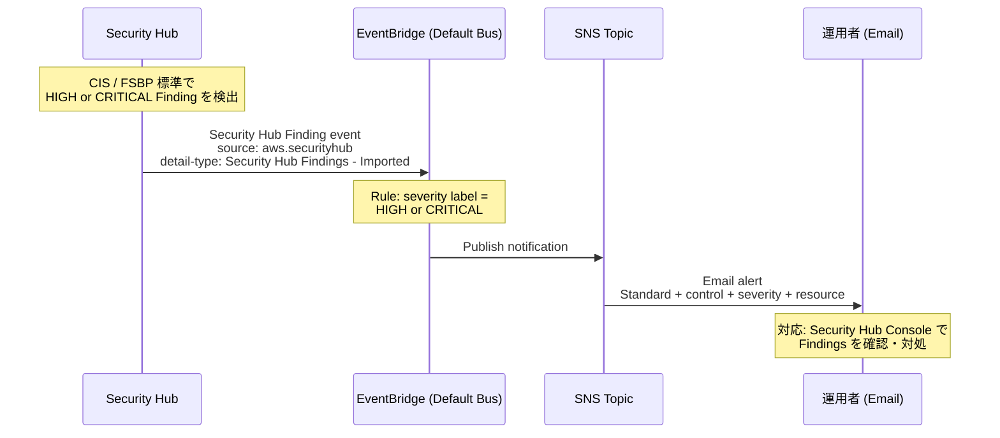
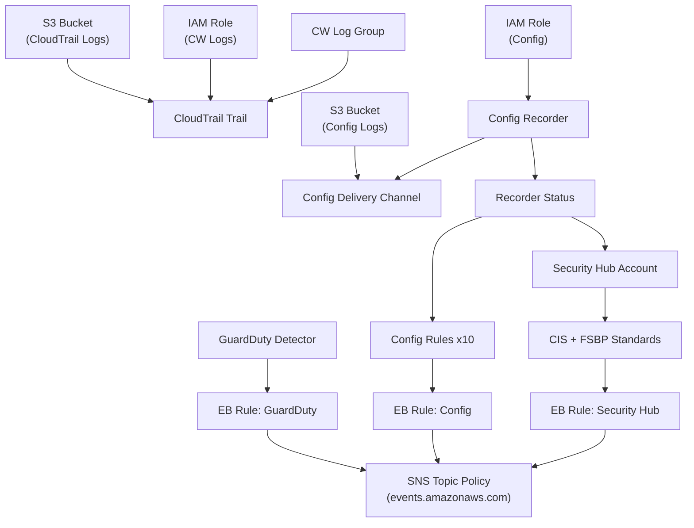

# アーキテクチャ設計書 (v13)

| 項目 | 内容 |
|------|------|
| プロジェクト名 | sample_cicd |
| 作成日 | 2026-04-10 |
| バージョン | 13.0 |
| 前バージョン | [architecture_v12.md](architecture_v12.md) (v12.0) |

## 1. 変更概要

v12 のアーキテクチャに以下を追加する:

- **CloudTrail**: マルチリージョン証跡。全管理イベントの記録 + S3 保存 + CloudWatch Logs 連携
- **GuardDuty**: 脅威検知（条件付き有効化）。MEDIUM 以上の検出を通知
- **AWS Config**: 構成記録 + 10 個のマネージドルールによるコンプライアンス継続監視
- **Security Hub**: CIS Benchmark + AWS FSBP の統合セキュリティスコアリング（条件付き、Config 依存）
- **EventBridge → SNS 通知**: セキュリティイベントをデフォルトバスで集約し、既存 SNS トピックへ通知

> アプリケーションコードの変更なし。全て Terraform インフラストラクチャのみの変更。フロントエンド変更なし。

## 2. システム構成図

### v13 全体構成



### v13 追加部分（セキュリティモニタリング詳細）



## 3. セキュリティイベントフロー

### 3.1 GuardDuty 検出 → 通知フロー



### 3.2 Config NON_COMPLIANT → 通知フロー



### 3.3 Security Hub HIGH Finding → 通知フロー



## 4. CloudTrail 設計

### 4.1 Trail 構成

| 項目 | 設定 |
|------|------|
| Trail 名 | `${prefix}-trail` |
| マルチリージョン | `true` |
| 管理イベント | Read + Write (全管理イベント) |
| データイベント | なし（コスト抑制） |
| ログファイル検証 | `true` (SSE-S3 + digest) |
| グローバルサービスイベント | `true` (IAM 等) |

### 4.2 S3 バケット設計

| 項目 | 設定 |
|------|------|
| バケット名 | `${prefix}-cloudtrail-logs` |
| 暗号化 | SSE-S3 (AES256) |
| パブリックアクセス | 全ブロック |
| バケットポリシー | CloudTrail サービスプリンシパルに `s3:PutObject` + `s3:GetBucketAcl` を許可 |
| Versioning | 無効（ログは追記のみ） |
| Lifecycle | 90 日後に Glacier 移行、365 日後に削除 |

### 4.3 CloudWatch Logs 連携

| 項目 | 設定 |
|------|------|
| Log Group | `/aws/cloudtrail/${prefix}` |
| 保持期間 | 90 日 |
| IAM Role | CloudTrail → CloudWatch Logs 書き込み用 |
| 用途 | リアルタイムログ検索・メトリクスフィルタ |

## 5. GuardDuty 設計

### 5.1 Detector 構成

| 項目 | 設定 |
|------|------|
| 有効化条件 | `enable_guardduty` 変数 (default: `false`) |
| Detector | `aws_guardduty_detector.main` |
| 検出機能 | 基本的な脅威検出（CloudTrail, VPC Flow Logs, DNS Logs） |

> GuardDuty は新規アカウントでは重複有効化エラーが発生しうるため、変数で条件制御する。

### 5.2 EventBridge Rule

| 項目 | 設定 |
|------|------|
| Rule 名 | `${prefix}-guardduty-finding` |
| バス | **default** (デフォルトイベントバス) |
| ソース | `aws.guardduty` |
| detail-type | `GuardDuty Finding` |
| フィルタ | `detail.severity` >= 4.0 (MEDIUM 以上) |
| ターゲット | 既存 SNS Topic (`alarm-notifications`) |

**EventBridge パターン:**

```json
{
  "source": ["aws.guardduty"],
  "detail-type": ["GuardDuty Finding"],
  "detail": {
    "severity": [{ "numeric": [">=", 4] }]
  }
}
```

## 6. AWS Config 設計

### 6.1 Recorder + Delivery Channel

| 項目 | 設定 |
|------|------|
| Recorder 名 | `${prefix}-config-recorder` |
| recording_group | `all_supported = true` |
| IAM Role | AWS マネージドポリシー `AWS_ConfigRole` |
| Delivery Channel | S3 バケット (`${prefix}-config-logs`) |
| S3 暗号化 | SSE-S3 |
| S3 Lifecycle | 90 日後に Glacier、365 日後に削除 |
| Recorder Status | `is_enabled = true` |

### 6.2 マネージドルール一覧

| # | ルール名 | source_identifier | 対象 | 説明 |
|---|---------|-------------------|------|------|
| 1 | S3 パブリック読み取り禁止 | `S3_BUCKET_PUBLIC_READ_PROHIBITED` | S3 | バケットがパブリック読み取りを許可していないこと |
| 2 | S3 サーバーサイド暗号化 | `S3_BUCKET_SERVER_SIDE_ENCRYPTION_ENABLED` | S3 | バケットにデフォルト暗号化が有効であること |
| 3 | S3 バージョニング有効 | `S3_BUCKET_VERSIONING_ENABLED` | S3 | バケットのバージョニングが有効であること |
| 4 | RDS 削除保護 | `RDS_INSTANCE_DELETION_PROTECTION_ENABLED` | RDS | DB インスタンスの削除保護が有効であること |
| 5 | RDS 暗号化 | `RDS_STORAGE_ENCRYPTED` | RDS | DB ストレージが暗号化されていること |
| 6 | RDS Multi-AZ | `RDS_MULTI_AZ_SUPPORT` | RDS | DB インスタンスが Multi-AZ 構成であること |
| 7 | SSH 制限 | `RESTRICTED_SSH` | SG | セキュリティグループが 0.0.0.0/0 からの SSH を許可していないこと |
| 8 | CloudTrail 有効 | `CLOUD_TRAIL_ENABLED` | CloudTrail | CloudTrail が有効であること |
| 9 | IAM ルートアクセスキー | `IAM_ROOT_ACCESS_KEY_CHECK` | IAM | ルートアカウントにアクセスキーが存在しないこと |
| 10 | Lambda パブリックアクセス禁止 | `LAMBDA_FUNCTION_PUBLIC_ACCESS_PROHIBITED` | Lambda | Lambda 関数がパブリックアクセスを許可していないこと |

### 6.3 EventBridge Rule (Config)

| 項目 | 設定 |
|------|------|
| Rule 名 | `${prefix}-config-noncompliant` |
| バス | **default** (デフォルトイベントバス) |
| ソース | `aws.config` |
| detail-type | `Config Rules Compliance Change` |
| フィルタ | `detail.newEvaluationResult.complianceType` = `NON_COMPLIANT` |
| ターゲット | 既存 SNS Topic (`alarm-notifications`) |

**EventBridge パターン:**

```json
{
  "source": ["aws.config"],
  "detail-type": ["Config Rules Compliance Change"],
  "detail": {
    "messageType": ["ComplianceChangeNotification"],
    "newEvaluationResult": {
      "complianceType": ["NON_COMPLIANT"]
    }
  }
}
```

## 7. Security Hub 設計

### 7.1 Hub Account 構成

| 項目 | 設定 |
|------|------|
| 有効化条件 | `enable_securityhub` 変数 (default: `false`) |
| `depends_on` | `aws_config_configuration_recorder_status` |
| Auto-enable controls | `true` |

### 7.2 Config 依存の理由

Security Hub の CIS Benchmark および AWS FSBP 標準は、内部的に AWS Config ルールを使用してリソースの評価を実行する。Config Recorder が有効でない状態で Security Hub を有効化すると、以下の問題が発生する:

1. **評価不能**: CIS / FSBP のコントロールが「データなし」状態になり、スコアが算出できない
2. **Config ルール重複**: Security Hub が自動作成する Config ルールが、既存の Config Recorder なしでは動作しない
3. **Terraform 依存**: `aws_securityhub_account` は `aws_config_configuration_recorder_status` の後に作成する必要がある

```hcl
# Terraform での依存関係表現
resource "aws_securityhub_account" "main" {
  count      = var.enable_securityhub ? 1 : 0
  depends_on = [aws_config_configuration_recorder_status.main]
}
```

### 7.3 セキュリティ標準

| 標準 | ARN パターン | 説明 |
|------|-------------|------|
| CIS AWS Foundations Benchmark v1.4.0 | `arn:aws:securityhub:${region}::standards/cis-aws-foundations-benchmark/v/1.4.0` | CIS ベンチマーク準拠 |
| AWS Foundational Security Best Practices (FSBP) | `arn:aws:securityhub:${region}::standards/aws-foundational-security-best-practices/v/1.0.0` | AWS セキュリティベストプラクティス |

### 7.4 EventBridge Rule (Security Hub)

| 項目 | 設定 |
|------|------|
| Rule 名 | `${prefix}-securityhub-high` |
| バス | **default** (デフォルトイベントバス) |
| ソース | `aws.securityhub` |
| detail-type | `Security Hub Findings - Imported` |
| フィルタ | `detail.findings[].Severity.Label` = `HIGH` or `CRITICAL` |
| ターゲット | 既存 SNS Topic (`alarm-notifications`) |
| 有効化条件 | `enable_securityhub` 変数に連動 |

**EventBridge パターン:**

```json
{
  "source": ["aws.securityhub"],
  "detail-type": ["Security Hub Findings - Imported"],
  "detail": {
    "findings": {
      "Severity": {
        "Label": ["HIGH", "CRITICAL"]
      }
    }
  }
}
```

## 8. EventBridge 設計判断

### 8.1 デフォルトバス vs カスタムバス

v4 で作成したカスタムイベントバス (`${prefix}-bus`) はアプリケーション独自イベント（`TaskCompleted` 等）用である。v13 のセキュリティイベントは **デフォルトイベントバスを使用する**。

| 項目 | カスタムバス (v4) | デフォルトバス (v13) |
|------|-----------------|-------------------|
| バス名 | `${prefix}-bus` | `default` |
| 用途 | アプリケーションイベント | AWS サービスイベント |
| ソース | `sample-cicd` (自前) | `aws.guardduty`, `aws.config`, `aws.securityhub` |
| 理由 | アプリが `PutEvents` で送信 | **AWS サービスはデフォルトバスにのみ発行** |

> **重要**: AWS サービス（GuardDuty, Config, Security Hub）が自動発行するイベントは、常にデフォルトイベントバスに送信される。カスタムバスには到達しないため、セキュリティイベントのルールは必ずデフォルトバスに作成する必要がある。

### 8.2 EventBridge Rules 一覧

| # | Rule 名 | ソース | 条件 | ターゲット |
|---|---------|--------|------|-----------|
| 1 | `${prefix}-guardduty-finding` | `aws.guardduty` | severity >= MEDIUM (4.0) | SNS `alarm-notifications` |
| 2 | `${prefix}-config-noncompliant` | `aws.config` | complianceType = NON_COMPLIANT | SNS `alarm-notifications` |
| 3 | `${prefix}-securityhub-high` | `aws.securityhub` | Severity.Label = HIGH/CRITICAL | SNS `alarm-notifications` |

### 8.3 SNS Topic Policy 追加

既存の SNS Topic (`alarm-notifications`) に EventBridge からの発行を許可するリソースポリシーを追加する必要がある。

```json
{
  "Effect": "Allow",
  "Principal": {
    "Service": "events.amazonaws.com"
  },
  "Action": "sns:Publish",
  "Resource": "<SNS Topic ARN>"
}
```

> CloudWatch Alarms は SNS への発行に暗黙的な権限を持つが、EventBridge は明示的な SNS Topic Policy が必要。これを追加しないとイベント通知が失敗する。

## 9. サービス間依存関係

```
CloudTrail (独立)
  └─ S3 Bucket Policy → Trail 作成
  └─ IAM Role → CloudWatch Logs 連携

Config (独立)
  └─ IAM Role → Recorder
  └─ S3 Bucket → Delivery Channel
  └─ Recorder Status (is_enabled) → Config Rules (10個)

Security Hub (Config 依存)
  └─ depends_on: Config Recorder Status
  └─ CIS + FSBP Standards

GuardDuty (独立, 条件付き)
  └─ enable_guardduty 変数で制御

EventBridge Rules (各サービス依存)
  └─ GuardDuty Rule → SNS (count = enable_guardduty)
  └─ Config Rule → SNS (常時)
  └─ Security Hub Rule → SNS (count = enable_securityhub)

SNS Topic Policy
  └─ events.amazonaws.com に Publish 許可を追加
```

### Terraform リソース作成順序



## 10. モニタリング設計

### 10.1 Dashboard 追加

| Row | y 座標 | 内容 | メトリクス |
|-----|--------|------|-----------|
| Row 9 (左) | y=48 | Config Compliant Rules | `aws_config_rule` の準拠ルール数 (カスタムメトリクス or テキストウィジェット) |
| Row 9 (右) | y=48 | GuardDuty Findings | GuardDuty の直近 Finding 数 (テキストウィジェット) |

> Row 9 はセキュリティモニタリングの概要ビュー。各サービスの詳細は AWS Console の専用ダッシュボードを使用。

### 10.2 アラーム方針

v13 では新規 CloudWatch Alarm を追加しない。理由:

| 通知経路 | 対象 | 方式 |
|---------|------|------|
| EventBridge → SNS | GuardDuty Findings | severity >= MEDIUM でリアルタイム通知 |
| EventBridge → SNS | Config NON_COMPLIANT | コンプライアンス違反でリアルタイム通知 |
| EventBridge → SNS | Security Hub HIGH/CRITICAL | 高/重大 Finding でリアルタイム通知 |

セキュリティイベントは EventBridge → SNS パイプラインで通知されるため、CloudWatch Alarm による二重通知は不要。既存の 17 個の CloudWatch Alarm (v6: 12 + v10: 4 + v12: 1) および Backup Vault SNS 通知はそのまま維持。

## 11. AWS アーキテクチャ（既存部分 — 変更なし）

v12 までのアーキテクチャに変更なし。以下の構成を維持:

| レイヤー | コンポーネント | バージョン |
|---------|--------------|-----------|
| CDN + ドメイン | CloudFront + Route 53 + ACM + WAF | v5, v7, v8 |
| API Gateway | REST API + Usage Plan + Cache | v10 |
| コンピュート | ECS Fargate + ALB + Auto Scaling | v1, v3 |
| 認証 | Cognito + JWT | v7 |
| キャッシュ | ElastiCache Redis (Cache-aside) | v10 |
| データベース | RDS PostgreSQL + Read Replica | v2, v12 |
| ストレージ | S3 + CloudFront OAC + Versioning + CRR | v5, v12 |
| イベント駆動 | SQS + EventBridge (Custom Bus) + Lambda | v4 |
| バックアップ | AWS Backup Vault (Daily/Weekly) | v12 |
| オブザーバビリティ | CloudWatch Dashboard/Alarms + X-Ray + SNS | v6 |
| CI/CD | GitHub Actions + CodeDeploy B/G + OIDC | v1, v9 |
| Remote State | S3 + DynamoDB Lock | v8 |
| **セキュリティ監視 (v13)** | **CloudTrail + GuardDuty + Config + Security Hub + EventBridge** | **v13** |
