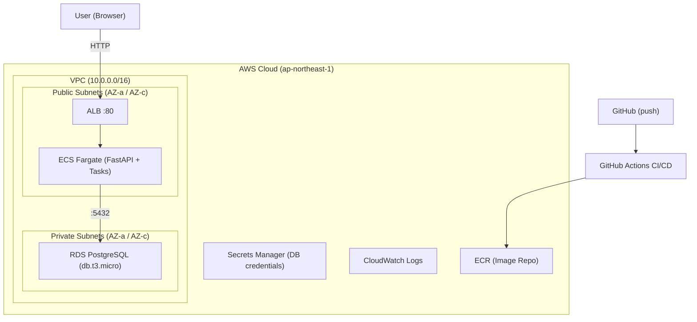

# アーキテクチャ設計書 (v2)

| 項目 | 内容 |
|------|------|
| プロジェクト名 | sample_cicd |
| 作成日 | 2026-04-03 |
| バージョン | 2.0 |
| 前バージョン | [architecture.md](architecture.md) (v1.0) |

## 変更概要

v1 のアーキテクチャに以下を追加する:
- RDS PostgreSQL（プライベートサブネットに配置）
- Secrets Manager（DB クレデンシャル管理）
- プライベートサブネット（2 AZ）

## 1. システム構成図



## 2. コンポーネント一覧

### v1 から継続

| コンポーネント | 役割 | 対応要件 | v2 変更 |
|----------------|------|----------|---------|
| FastAPI Application | API 提供 | FR-1, FR-2 | タスク CRUD ルーター追加 |
| Docker | アプリケーションのコンテナ化 | FR-3 | ビルドコンテキスト変更 |
| ALB | HTTP リクエストの受付 | NFR-1 | なし |
| ECS (Fargate) | コンテナの実行環境 | FR-1, FR-2 | Secrets Manager 統合 |
| ECR | Docker イメージの保存 | FR-4 | なし |
| GitHub Actions | CI/CD パイプライン | FR-3, FR-4 | Docker コンテキスト変更 |
| CloudWatch Logs | ログ収集 | NFR-4 | なし |
| Terraform | インフラのコード管理 | — | リソース追加 |

### v2 新規

| コンポーネント | 役割 | 対応要件 |
|----------------|------|----------|
| RDS PostgreSQL | タスクデータの永続化 | FR-10 |
| Secrets Manager | DB クレデンシャルの管理 | NFR-2 |
| SQLAlchemy | Python ORM | FR-5〜FR-9 |
| Alembic | DB マイグレーション管理 | FR-10 |

## 3. ネットワーク構成

### 3.1 VPC 設計

| 項目 | 値 | v2 変更 |
|------|------|---------|
| VPC CIDR | 10.0.0.0/16 | なし |
| パブリックサブネット 1 | 10.0.1.0/24 (ap-northeast-1a) | なし |
| パブリックサブネット 2 | 10.0.2.0/24 (ap-northeast-1c) | なし |
| **プライベートサブネット 1** | **10.0.11.0/24 (ap-northeast-1a)** | **新規** |
| **プライベートサブネット 2** | **10.0.12.0/24 (ap-northeast-1c)** | **新規** |
| Internet Gateway | あり | なし |
| NAT Gateway | なし（コスト削減） | なし |

### 3.2 サブネット設計判断

**パブリックサブネット（既存）:**
- ALB と ECS タスクを配置
- ECS タスクに Public IP を付与し、IGW 経由で ECR イメージを Pull
- v1 から変更なし

**プライベートサブネット（新規）:**
- RDS PostgreSQL を配置
- インターネットゲートウェイへのルートを持たない（外部からアクセス不可）
- RDS の DB Subnet Group として 2 AZ のサブネットを指定（RDS の要件）
- ルートテーブルはデフォルト（ローカルルートのみ）

### 3.3 セキュリティグループ

**ALB 用セキュリティグループ（変更なし）:**

| ルール | プロトコル | ポート | ソース |
|--------|-----------|--------|--------|
| Inbound | TCP | 80 | 0.0.0.0/0 |
| Outbound | All | All | 0.0.0.0/0 |

**ECS タスク用セキュリティグループ（変更なし）:**

| ルール | プロトコル | ポート | ソース |
|--------|-----------|--------|--------|
| Inbound | TCP | 8000 | ALB SG |
| Outbound | All | All | 0.0.0.0/0 |

**RDS 用セキュリティグループ（新規）:**

| ルール | プロトコル | ポート | ソース |
|--------|-----------|--------|--------|
| Inbound | TCP | 5432 | ECS Tasks SG |
| Outbound | All | All | 0.0.0.0/0 |

> **設計判断:** RDS へのアクセスを ECS タスクのセキュリティグループからのみに制限する。
> これにより、インターネットからの DB 直接アクセスを防止する（NFR-2 対応）。

## 4. 通信フロー

### 4.1 リクエスト処理フロー（v2）

```
User → Internet → ALB (:80) → ECS Task (:8000) → FastAPI → SQLAlchemy → RDS (:5432) → Response
```

1. ユーザーが ALB の DNS 名に HTTP リクエストを送信
2. ALB がリクエストを受信し、ECS タスクに転送
3. FastAPI がルーティング（`/tasks/*` は tasks ルーターへ）
4. SQLAlchemy が RDS PostgreSQL にクエリを実行
5. レスポンスを ALB 経由でユーザーに返却

### 4.2 Secrets Manager → ECS 連携フロー

```
Terraform → Secrets Manager (JSON) → ECS Task Definition (secrets block) → Container ENV vars
```

1. Terraform が `random_password` で DB パスワードを生成
2. Secrets Manager に JSON 形式で DB 接続情報を保存
3. ECS タスク定義の `secrets` ブロックで個別キーを環境変数に注入
4. FastAPI アプリが環境変数から DATABASE_URL を組み立て

**Secrets Manager に保存する JSON:**

```json
{
  "username": "postgres",
  "password": "<auto-generated>",
  "host": "<rds-endpoint>",
  "port": "5432",
  "dbname": "sample_cicd"
}
```

**ECS タスク定義への注入:**

| 環境変数名 | Secrets Manager キー |
|------------|---------------------|
| DB_USERNAME | `username` |
| DB_PASSWORD | `password` |
| DB_HOST | `host` |
| DB_PORT | `port` |
| DB_NAME | `dbname` |

### 4.3 デプロイフロー（v2）

```
git push → GitHub Actions → Build Image → Push to ECR → Update ECS Task Definition → Rolling Deploy
```

v1 から変更なし。ただし Docker ビルドコンテキストがプロジェクトルートに変更。

### 4.4 ヘルスチェックフロー（変更なし）

```
ALB → GET /health (30s interval) → ECS Task → {"status": "healthy"}
```

## 5. アプリケーション構成

### 5.1 ファイル構成（v2）

```
app/
├── __init__.py          # パッケージ初期化（空）
├── main.py              # FastAPI エントリーポイント（ルーター追加）
├── database.py          # SQLAlchemy エンジン・セッション設定
├── models.py            # SQLAlchemy ORM モデル（Task）
├── schemas.py           # Pydantic リクエスト/レスポンススキーマ
├── routers/
│   ├── __init__.py      # パッケージ初期化（空）
│   └── tasks.py         # タスク CRUD エンドポイント
├── requirements.txt     # Python 依存パッケージ
├── Dockerfile           # コンテナイメージ定義
├── alembic.ini          # Alembic 設定ファイル
└── alembic/
    ├── env.py           # Alembic 環境設定
    └── versions/
        └── 001_create_tasks_table.py  # 初回マイグレーション
```

### 5.2 依存パッケージ

| パッケージ | 用途 | v1 | v2 |
|------------|------|:--:|:--:|
| fastapi | Web フレームワーク | o | o |
| uvicorn[standard] | ASGI サーバー | o | o |
| sqlalchemy | ORM | - | **o** |
| psycopg2-binary | PostgreSQL ドライバ | - | **o** |
| alembic | DB マイグレーション | - | **o** |
