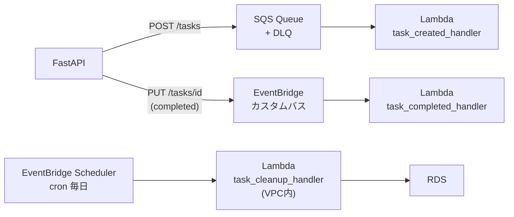

# アーキテクチャ設計書 (v4)

| 項目 | 内容 |
|------|------|
| プロジェクト名 | sample_cicd |
| 作成日 | 2026-04-06 |
| バージョン | 4.0 |
| 前バージョン | [architecture_v3.md](architecture_v3.md) (v3.0) |

## 変更概要

v3 のアーキテクチャに以下を追加する:

- FastAPI タスク作成時に SQS へメッセージ送信 → `task_created_handler` Lambda がログ記録
- FastAPI タスク完了時に EventBridge カスタムバスへイベント発行 → `task_completed_handler` Lambda がログ記録
- EventBridge Scheduler が毎日定期実行 → `task_cleanup_handler` Lambda が RDS から古い完了済みタスクを削除

## 1. システム構成図

### v4 追加部分



> 全体構成は v3 のアーキテクチャに上記を追加した形。

<details>
<summary>全体構成図（ASCII）</summary>

```
                         ┌──────────────────────────────────────────────────────────────────────────┐
                         │                            AWS Cloud (ap-northeast-1)                     │
                         │                                                                           │
  ┌──────────┐           │  ┌──────────────────────────────────────────────────────────────────────┐ │
  │  User     │──HTTP──▶ │  │                       VPC (10.0.0.0/16)                              │ │
  │ (Browser) │          │  │                                                                      │ │
  └──────────┘           │  │  ┌──────────────────────────────────────────────────────────────┐   │ │
                         │  │  │  Public Subnets (AZ-a / AZ-c)                                │   │ │
                         │  │  │                                                              │   │ │
                         │  │  │  ┌─────┐     ┌────────────────────────────────────────────┐ │   │ │
                         │  │  │  │ ALB │────▶│  ECS Fargate (Auto Scaling 1〜3 tasks)     │ │   │ │
                         │  │  │  │ :80 │     │  FastAPI + Tasks                           │ │   │ │
                         │  │  │  └─────┘     │    │POST /tasks ──────────────────────────┼─┼───┼─┼──▶ SQS
                         │  │  │              │    │PUT /tasks/{id} (completed=true) ─────┼─┼───┼─┼──▶ EventBridge
                         │  │  │              └────┼───────────────────────────────────────┘ │   │ │
                         │  │  │                   │ :5432                                   │   │ │
                         │  │  └───────────────────┼──────────────────────────────────────────┘   │ │
                         │  │                      │                                               │ │
                         │  │  ┌───────────────────┼──────────────────────────────────────────┐   │ │
                         │  │  │  Private Subnets (AZ-a / AZ-c)                               │   │ │
                         │  │  │                   │                                          │   │ │
                         │  │  │    ┌──────────────▼──────────────────────────────────────┐  │   │ │
                         │  │  │    │  RDS PostgreSQL (Multi-AZ)                          │  │   │ │
                         │  │  │    │  Primary (AZ-a) | Standby (AZ-c)                   │  │   │ │
                         │  │  │    └─────────────────────────────────────────────────────┘  │   │ │
                         │  │  │                           ▲ :5432                           │   │ │
                         │  │  │    ┌──────────────────────┘                                 │   │ │
                         │  │  │    │  task_cleanup_handler (Lambda in VPC)                  │   │ │
                         │  │  │    │  ← EventBridge Scheduler (cron)                        │   │ │
                         │  │  │    │  → Secrets Manager VPC Endpoint                        │   │ │
                         │  │  │    │  → CloudWatch Logs VPC Endpoint                        │   │ │
                         │  │  └────┼───────────────────────────────────────────────────────┘   │ │
                         │  └───────┼───────────────────────────────────────────────────────────┘ │
                         │          │                                                              │
                         │  ┌───────┼───────────────────────────────────────────────────────────┐ │
                         │  │  AWS Managed Services                                             │ │
                         │  │                                                                   │ │
                         │  │  SQS ──────────────────▶ task_created_handler (Lambda)            │ │
                         │  │  ├── sample-cicd-task-events (Standard Queue)                    │ │
                         │  │  └── sample-cicd-task-events-dlq (Dead Letter Queue)             │ │
                         │  │                               │ CloudWatch Logs                   │ │
                         │  │  EventBridge ──────────────▶ task_completed_handler (Lambda)      │ │
                         │  │  ├── sample-cicd-bus (Custom Event Bus)                          │ │
                         │  │  └── Rule: source=sample-cicd, detail-type=TaskCompleted         │ │
                         │  │                               │ CloudWatch Logs                   │ │
                         │  │  EventBridge Scheduler ─────▶ task_cleanup_handler (Lambda, VPC) │ │
                         │  │  └── cron(0 15 * * ? *) UTC  │ CloudWatch Logs (VPC Endpoint)   │ │
                         │  │                                                                   │ │
                         │  │  Secrets Manager, CloudWatch Logs, App AutoScaling, ECR          │ │
                         │  └───────────────────────────────────────────────────────────────────┘ │
                         │                                                                        │
                         └────────────────────────────────────────────────────────────────────────┘
                                  ▲
  ┌──────────┐   ┌──────────────┐ │
  │  GitHub   │──▶│GitHub Actions│─┘  (CI: lint/test/build/lambda-zip, CD: ECR push + ECS deploy + Lambda deploy)
  │  (push)   │   └──────────────┘
  └──────────┘
```

</details>

## 2. コンポーネント一覧

### v3 から継続

| コンポーネント | 役割 | v4 変更 |
|----------------|------|---------|
| FastAPI Application | API 提供 | イベント発行コード追加（tasks.py, services/events.py） |
| ALB | HTTP リクエスト受付・分散 | なし |
| ECS (Fargate) | コンテナ実行環境 | SQS / EventBridge への送信権限追加 |
| ECR | Docker イメージ保存 | なし |
| GitHub Actions | CI/CD パイプライン | Lambda デプロイステップ追加 |
| CloudWatch Logs | ログ収集 | Lambda ロググループ追加 |
| RDS PostgreSQL | データ永続化 | なし |
| Secrets Manager | DB クレデンシャル管理 | cleanup Lambda からアクセス追加 |
| Application Auto Scaling | ECS タスク数自動調整 | なし |
| Terraform | インフラコード管理 | SQS / Lambda / EventBridge リソース追加 |

### v4 新規

| コンポーネント | 役割 | 対応要件 | VPC内 |
|----------------|------|----------|:-----:|
| SQS Standard Queue | タスク作成イベントのキューイング | FR-12 | - |
| SQS Dead Letter Queue | 失敗メッセージの退避（3回リトライ後） | FR-12 | - |
| Lambda: task_created_handler | SQS トリガー → CloudWatch Logs 記録 | FR-12 | - |
| EventBridge Custom Bus | タスク完了イベントの受信・ルーティング | FR-13 | - |
| EventBridge Rule | source=sample-cicd かつ TaskCompleted イベントを Lambda へルーティング | FR-13 | - |
| Lambda: task_completed_handler | EventBridge トリガー → CloudWatch Logs 記録 | FR-13 | - |
| EventBridge Scheduler | 毎日 0:00 JST に cleanup Lambda を起動 | FR-14 | - |
| Lambda: task_cleanup_handler | Scheduler トリガー → RDS 接続 → 古いタスク削除 | FR-14 | ✅ |
| VPC Endpoint: secretsmanager | cleanup Lambda から Secrets Manager へのプライベートアクセス | FR-14 | ✅ |
| VPC Endpoint: logs | cleanup Lambda から CloudWatch Logs へのプライベートアクセス | FR-14 | ✅ |

## 3. ネットワーク構成

### 3.1 VPC 設計（変更）

| 項目 | 値 | v4 変更 |
|------|------|---------|
| VPC CIDR | 10.0.0.0/16 | なし |
| パブリックサブネット 1 | 10.0.1.0/24 (ap-northeast-1a) | なし |
| パブリックサブネット 2 | 10.0.2.0/24 (ap-northeast-1c) | なし |
| プライベートサブネット 1 | 10.0.11.0/24 (ap-northeast-1a) | cleanup Lambda 配置先に追加 |
| プライベートサブネット 2 | 10.0.12.0/24 (ap-northeast-1c) | cleanup Lambda 配置先に追加 |
| Internet Gateway | あり | なし |
| NAT Gateway | なし（コスト削減） | なし |
| VPC Endpoint (secretsmanager) | なし | **追加**（cleanup Lambda 用） |
| VPC Endpoint (logs) | なし | **追加**（cleanup Lambda 用） |

### 3.2 セキュリティグループ

**v3 から継続（変更なし）:** ALB SG、ECS Tasks SG、RDS SG

**v4 新規: Lambda (cleanup) SG**

| ルール | プロトコル | ポート | 送信先 |
|--------|-----------|--------|--------|
| Outbound | TCP | 5432 | RDS SG |
| Outbound | TCP | 443 | VPC Endpoint SG |

**v4 新規: VPC Endpoint SG**

| ルール | プロトコル | ポート | ソース |
|--------|-----------|--------|--------|
| Inbound | TCP | 443 | Lambda cleanup SG |

> **設計判断 - NAT Gateway を使わない理由:**
> cleanup Lambda は SQS/EventBridge/S3 等の公開エンドポイントへのアクセス不要。
> Secrets Manager と CloudWatch Logs の 2 サービスのみ VPC エンドポイント経由でアクセスする。
> NAT Gateway ($0.062/h ≒ $45/月) よりも VPC エンドポイント 2 つ ($0.014/h × 2 ≒ $20/月) の方が安価。

## 4. 通信フロー

### 4.1 タスク作成フロー（FR-12）

```
User → ALB → ECS Task (FastAPI)
  1. POST /tasks のリクエストを受信
  2. RDS にタスクを INSERT（同期）
  3. SQS "sample-cicd-task-events" にメッセージを送信（非同期・失敗してもAPIはブロックしない）
  4. 201 Created を返す

  SQS → Lambda "task_created_handler"（非同期・別プロセス）
  5. Lambda が SQS メッセージをポーリング
  6. CloudWatch Logs "/aws/lambda/sample-cicd-task-created" に記録
  7. SQS メッセージを削除
  ※ Lambda 実行失敗時: 最大 3 回リトライ後に DLQ "sample-cicd-task-events-dlq" へ転送
```

### 4.2 タスク完了フロー（FR-13）

```
User → ALB → ECS Task (FastAPI)
  1. PUT /tasks/{id} のリクエストを受信（completed=true）
  2. RDS でタスクを UPDATE（同期）
  3. completed が false → true に変化した場合のみ:
     EventBridge "sample-cicd-bus" にイベント発行（非同期・失敗してもAPIはブロックしない）
  4. 200 OK を返す

  EventBridge Rule → Lambda "task_completed_handler"（非同期・別プロセス）
  5. Rule が source=sample-cicd かつ detail-type=TaskCompleted をマッチ
  6. Lambda がトリガーされ CloudWatch Logs "/aws/lambda/sample-cicd-task-completed" に記録
```

### 4.3 定期クリーンアップフロー（FR-14）

```
EventBridge Scheduler (毎日 15:00 UTC = 0:00 JST)
  1. Lambda "task_cleanup_handler" を起動
  2. Lambda が Secrets Manager VPC Endpoint 経由で DB 認証情報を取得
  3. Lambda が RDS PostgreSQL に接続（VPC 内プライベートサブネット経由）
  4. completed=true AND updated_at < now() - 30日 のタスクを DELETE
  5. 削除件数を CloudWatch Logs "/aws/lambda/sample-cicd-task-cleanup" に記録（VPC Endpoint 経由）
```

### 4.4 既存フロー（変更なし）

- リクエスト処理フロー（v2 から継続）
- Auto Scaling フロー（v3 から継続）
- デプロイフロー（→ v4 では Lambda デプロイを追加。cicd_v4.md 参照）

## 5. アプリケーション構成

### 5.1 ファイル構成（v4 変更あり）

```
app/
├── main.py            [変更なし]
├── database.py        [変更なし]
├── models.py          [変更なし]
├── schemas.py         [変更なし]
├── routers/
│   └── tasks.py       [変更: create/update 時にイベント発行を追加]
├── services/
│   └── events.py      [新規: SQS / EventBridge 送信クライアント]
├── requirements.txt   [変更: boto3 追加]
├── Dockerfile         [変更なし]
├── alembic.ini        [変更なし]
└── alembic/           [変更なし]

lambda/
├── task_created_handler.py    [新規: SQS トリガー]
├── task_completed_handler.py  [新規: EventBridge トリガー]
└── task_cleanup_handler.py    [新規: Scheduler トリガー, VPC 内 RDS 接続]
```

### 5.2 events.py 設計

```python
# app/services/events.py の責務
- SQS クライアント（boto3）の初期化
- EventBridge クライアント（boto3）の初期化
- publish_task_created(task_id, title) → SQS SendMessage
- publish_task_completed(task_id, title) → EventBridge PutEvents

# 設計判断:
# - AWS_REGION / SQS_QUEUE_URL / EVENTBRIDGE_BUS_NAME は環境変数で設定（ハードコード禁止）
# - 送信失敗は例外をキャッチしてwarningログを記録（APIブロックしない）
# - テスト時は moto でモック
```

### 5.3 Lambda 関数設計

| 関数名 | トリガー | 処理内容 | VPC | タイムアウト | メモリ |
|--------|---------|---------|:---:|------------|--------|
| task_created_handler | SQS | メッセージをパースしてCloudWatch Logsに記録 | - | 30秒 | 128MB |
| task_completed_handler | EventBridge | イベントdetailをCloudWatch Logsに記録 | - | 30秒 | 128MB |
| task_cleanup_handler | Scheduler | RDS接続→古い完了タスク削除→削除件数を記録 | ✅ | 60秒 | 256MB |

### 5.4 環境変数（ECS タスク定義への追加）

| 変数名 | 設定先 | 値の例 |
|--------|--------|--------|
| `SQS_QUEUE_URL` | ECS タスク定義（Terraform `ecs.tf` で設定） | `https://sqs.ap-northeast-1.amazonaws.com/...` |
| `EVENTBRIDGE_BUS_NAME` | ECS タスク定義（Terraform `ecs.tf` で設定） | `sample-cicd-bus` |
| `AWS_REGION` | ECS タスク定義 | `ap-northeast-1` |

> ECS タスクは IAM ロールで SQS / EventBridge へのアクセス権を持つ。アクセスキー不要。

## 6. IAM 設計

### 6.1 ECS タスク実行ロール（iam.tf 更新）

既存の ECS タスクロールに以下のポリシーを追加:

| 権限 | アクション | リソース |
|------|-----------|---------|
| SQS 送信 | `sqs:SendMessage` | `sample-cicd-task-events` ARN のみ |
| EventBridge 発行 | `events:PutEvents` | `sample-cicd-bus` ARN のみ |

### 6.2 Lambda 実行ロール（iam.tf 追加）

**共通（全 Lambda）:**

| 権限 | アクション | リソース |
|------|-----------|---------|
| CloudWatch Logs | `logs:CreateLogGroup`, `logs:CreateLogStream`, `logs:PutLogEvents` | Lambda ロググループ ARN |

**task_created_handler 追加:**

| 権限 | アクション | リソース |
|------|-----------|---------|
| SQS 受信・削除 | `sqs:ReceiveMessage`, `sqs:DeleteMessage`, `sqs:GetQueueAttributes` | `sample-cicd-task-events` ARN のみ |

**task_cleanup_handler 追加:**

| 権限 | アクション | リソース |
|------|-----------|---------|
| Secrets Manager 読み取り | `secretsmanager:GetSecretValue` | DB クレデンシャル Secret ARN のみ |
| VPC 設定 | `ec2:CreateNetworkInterface`, `ec2:DescribeNetworkInterfaces`, `ec2:DeleteNetworkInterface` | * |
