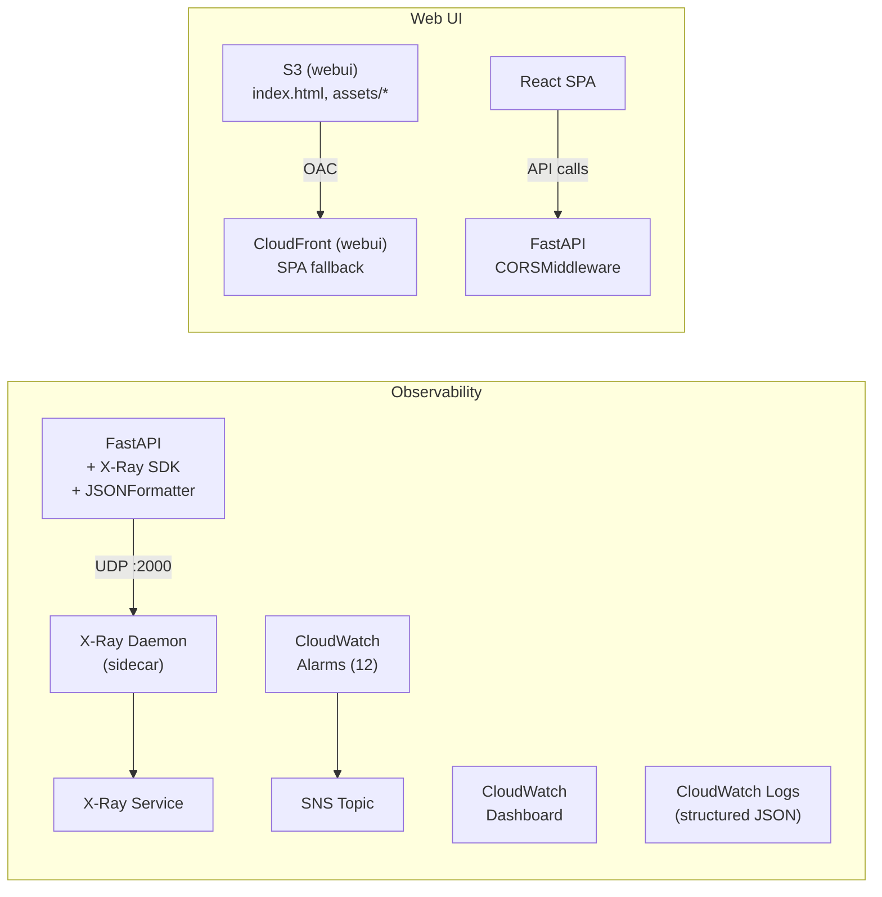

# アーキテクチャ設計書 (v6)

| 項目 | 内容 |
|------|------|
| プロジェクト名 | sample_cicd |
| 作成日 | 2026-04-06 |
| バージョン | 6.0 |
| 前バージョン | [architecture_v5.md](architecture_v5.md) (v5.0) |

## 変更概要

v5 のアーキテクチャに以下を追加する:

- **Observability（監視・可観測性）**: CloudWatch Dashboard / Alarms（12 個）、SNS 通知基盤、X-Ray 分散トレーシング（ECS サイドカー + Lambda Active tracing）、構造化ログ（JSON フォーマット）
- **Web UI（SPA）**: React + Vite で構築した管理画面を新規 S3 バケット + 新規 CloudFront ディストリビューションでホスティング。FastAPI に CORS ミドルウェアを追加

## 1. システム構成図

### v6 追加部分



> 全体構成は v5 のアーキテクチャに上記を追加した形。

<details>
<summary>全体構成図（ASCII）</summary>

```
                         ┌──────────────────────────────────────────────────────────────────────────────┐
                         │                   AWS Cloud (ap-northeast-1) — Workspace: dev                │
                         │                                                                              │
  ┌──────────┐           │  ┌──────────────────────────────────────────────────────────────────────────┐│
  │  User     │──HTTP──▶ │  │                   VPC (10.0.0.0/16)                                      ││
  │ (Browser) │          │  │                                                                          ││
  └──────┬───┘           │  │  ┌──────────────────────────────────────────────────────────────────┐   ││
         │               │  │  │  Public Subnets (AZ-a / AZ-c)                                    │   ││
         │               │  │  │                                                                  │   ││
         │               │  │  │  ┌─────┐     ┌────────────────────────────────────────────────┐ │   ││
         │               │  │  │  │ ALB │────▶│  ECS Fargate (Auto Scaling 1〜2 tasks)         │ │   ││
         │               │  │  │  │ :80 │     │  ┌──────────────────────────────────────────┐  │ │   ││
         │               │  │  │  └─────┘     │  │ FastAPI + Tasks + Attachments             │  │ │   ││
         │               │  │  │              │  │  + X-Ray SDK + CORS + JSONFormatter       │  │ │   ││
         │               │  │  │              │  │   │POST /tasks ──────────────────────────┼──┼─┼───┼─┼──▶ SQS
         │               │  │  │              │  │   │PUT /tasks/{id} (completed) ──────────┼──┼─┼───┼─┼──▶ EventBridge
         │               │  │  │              │  │   │POST /tasks/{id}/attachments ─────────┼──┼─┼───┼─┼──▶ S3 (Presigned URL)
         │               │  │  │              │  │   │DELETE /tasks/{id}/attachments/{id} ──┼──┼─┼───┼─┼──▶ S3 (DeleteObject)
         │               │  │  │              │  └──────────────────────────────────────────┘  │ │   ││
         │               │  │  │              │  ┌──────────────────────────────────────────┐  │ │   ││
         │               │  │  │              │  │ X-Ray Daemon (sidecar container)         │──┼─┼───┼─┼──▶ X-Ray Service
         │               │  │  │              │  │ UDP :2000                                │  │ │   ││
         │               │  │  │              │  └──────────────────────────────────────────┘  │ │   ││
         │               │  │  │              └────┼───────────────────────────────────────────┘ │   ││
         │               │  │  │                   │ :5432                                       │   ││
         │               │  │  └───────────────────┼────────────────────────────────────────────┘   ││
         │               │  │                      │                                                 ││
         │               │  │  ┌───────────────────┼────────────────────────────────────────────┐   ││
         │               │  │  │  Private Subnets (AZ-a / AZ-c)                                 │   ││
         │               │  │  │                   │                                            │   ││
         │               │  │  │    ┌──────────────▼──────────────────────────────────────┐    │   ││
         │               │  │  │    │  RDS PostgreSQL (dev: Single-AZ)                    │    │   ││
         │               │  │  │    │  + attachments table (v5)                           │    │   ││
         │               │  │  │    └─────────────────────────────────────────────────────┘    │   ││
         │               │  │  │                           ▲ :5432                             │   ││
         │               │  │  │    ┌──────────────────────┘                                   │   ││
         │               │  │  │    │  task_cleanup_handler (Lambda in VPC, Active tracing)    │   ││
         │               │  │  │    │  ← EventBridge Scheduler (cron)                          │   ││
         │               │  │  │    │  → Secrets Manager VPC Endpoint                          │   ││
         │               │  │  │    │  → CloudWatch Logs VPC Endpoint                          │   ││
         │               │  │  └────┼──────────────────────────────────────────────────────────┘   ││
         │               │  └───────┼──────────────────────────────────────────────────────────────┘│
         │               │          │                                                               │
         │  Presigned    │  ┌───────┼──────────────────────────────────────────────────────────────┐│
         │  PUT URL      │  │  AWS Managed Services                                                ││
         │    │          │  │                                                                      ││
         │    ▼          │  │  S3 (attachments) ───────────────────────────────────────────────┐  ││
         │  ┌──────┐     │  │  └── sample-cicd-dev-attachments (Private bucket)                │  ││
         └──│  S3  │     │  │       └── tasks/{task_id}/{uuid}-{filename}                      │  ││
            │Upload│     │  │                              │ OAC                               │  ││
            └──────┘     │  │                              ▼                                   │  ││
                         │  │  CloudFront (attachments) ── S3 Origin ──────────────────────────┘  ││
  ┌──────────┐           │  │  └── sample-cicd-dev (Distribution)                                  ││
  │  User     │─HTTPS──▶ │  │       └── OAC でセキュア接続                                         ││
  │(Download) │          │  │                                                                      ││
  └──────────┘           │  │  S3 (webui) ─────────────────────────────────────────────────────┐  ││
                         │  │  └── sample-cicd-dev-webui (Private bucket)                       │  ││
  ┌──────────┐           │  │       └── index.html, assets/*, config.js                        │  ││
  │  User     │─HTTPS──▶ │  │                              │ OAC                               │  ││
  │ (Web UI)  │          │  │                              ▼                                   │  ││
  └─────┬────┘           │  │  CloudFront (webui) ──────── S3 Origin ──────────────────────────┘  ││
        │                │  │  └── sample-cicd-dev-webui (Distribution)                            ││
        │ API calls      │  │       └── OAC + SPA fallback (403/404 → /index.html)                 ││
        │ (CORS)         │  │                                                                      ││
        └────────────────│──│──▶ ALB → ECS (FastAPI with CORSMiddleware)                           ││
                         │  │                                                                      ││
                         │  │  SQS ──────────────────▶ task_created_handler (Lambda, Active tracing)││
                         │  │  EventBridge ──────────▶ task_completed_handler (Lambda, Active tracing)│
                         │  │  EventBridge Scheduler ▶ task_cleanup_handler (Lambda, VPC)           ││
                         │  │                                                                      ││
                         │  │  X-Ray Service ◀──────── ECS (daemon sidecar) + Lambda (Active)      ││
                         │  │                                                                      ││
                         │  │  CloudWatch ─────────────────────────────────────────────────────┐  ││
                         │  │  ├── Dashboard (ALB / ECS / RDS / Lambda / SQS)                  │  ││
                         │  │  ├── Alarms (12) ────▶ SNS Topic ────▶ (サブスクリプション未設定) │  ││
                         │  │  └── Logs (structured JSON)                                      │  ││
                         │  │                                                                      ││
                         │  │  Secrets Manager, App AutoScaling, ECR                               ││
                         │  └──────────────────────────────────────────────────────────────────────┘│
                         └──────────────────────────────────────────────────────────────────────────┘
                                  ▲
  ┌──────────┐   ┌──────────────┐ │
  │  GitHub   │──▶│GitHub Actions│─┘  (CI/CD: Backend + Frontend deploy)
  │  (push)   │   └──────────────┘
  └──────────┘
```

</details>

## 2. コンポーネント一覧

### v5 から継続

| コンポーネント | 役割 | v6 変更 |
|----------------|------|---------|
| FastAPI Application | API 提供 | X-Ray SDK 統合、CORSMiddleware 追加、構造化ログ（JSONFormatter）導入 |
| ALB | HTTP リクエスト受付・分散 | なし |
| ECS (Fargate) | コンテナ実行環境 | X-Ray daemon サイドカー追加、CPU/Memory 引き上げ (dev: 512/1024) |
| ECR | Docker イメージ保存 | なし |
| GitHub Actions | CI/CD パイプライン | Node.js セットアップ + フロントエンドビルド + S3 sync + CloudFront invalidation 追加 |
| CloudWatch Logs | ログ収集 | 構造化ログ（JSON）出力、X-Ray daemon ロググループ追加 |
| RDS PostgreSQL | データ永続化 | なし |
| Secrets Manager | DB クレデンシャル管理 | なし |
| Application Auto Scaling | ECS タスク数自動調整 | なし |
| SQS | タスク作成イベントキュー | なし |
| Lambda (3 関数) | イベントハンドラ | Active tracing 有効化、構造化ログ（JSONFormatter）導入 |
| EventBridge | イベントバス + ルール + Scheduler | なし |
| VPC Endpoints | Lambda → AWS サービスアクセス | なし |
| S3 (attachments) | ファイル添付のオブジェクトストレージ | なし |
| CloudFront (attachments) | CDN（添付ファイル配信） | なし |
| Terraform | インフラコード管理 | Dashboard / Alarms / SNS / X-Ray / WebUI S3 / WebUI CloudFront 追加 |

### v6 新規

| コンポーネント | 役割 | 対応要件 |
|----------------|------|----------|
| CloudWatch Dashboard | ALB / ECS / RDS / Lambda / SQS メトリクスの統合表示（5 ウィジェット行） | FR-20 |
| CloudWatch Alarms (12 個) | 障害検知（閾値超過時に SNS へ通知） | FR-21 |
| SNS Topic | アラーム通知基盤（サブスクリプションなし、後から追加可能） | FR-22 |
| X-Ray (ECS) | aws-xray-sdk による自動計装 + サイドカー daemon コンテナ | FR-23 |
| X-Ray (Lambda) | Active tracing（Terraform 設定のみ、コード変更不要） | FR-23 |
| 構造化ログ (JSONFormatter) | JSON フォーマットログ出力（FastAPI + Lambda 3 関数） | FR-24 |
| S3 Bucket (webui) | Web UI 静的アセットホスティング（`${local.prefix}-webui`） | FR-25, FR-26, FR-27, FR-28, FR-29 |
| CloudFront Distribution (webui) | Web UI CDN 配信（OAC + SPA fallback） | FR-25, FR-26, FR-27, FR-28, FR-29 |
| CORSMiddleware | FastAPI のクロスオリジンリクエスト制御 | FR-30 |
| フロントエンド CI/CD | npm build → S3 sync → CloudFront invalidation | FR-31 |

## 3. ネットワーク構成

### 3.1 VPC 設計（変更なし）

| 項目 | 値 | v6 変更 |
|------|------|---------|
| VPC CIDR | 10.0.0.0/16 | なし |
| パブリックサブネット 1 | 10.0.1.0/24 (ap-northeast-1a) | なし |
| パブリックサブネット 2 | 10.0.2.0/24 (ap-northeast-1c) | なし |
| プライベートサブネット 1 | 10.0.11.0/24 (ap-northeast-1a) | なし |
| プライベートサブネット 2 | 10.0.12.0/24 (ap-northeast-1c) | なし |
| Internet Gateway | あり | なし |
| NAT Gateway | なし（コスト削減） | なし |
| VPC Endpoints | secretsmanager, logs | なし |

> Web UI 用の S3 / CloudFront、X-Ray サービス、CloudWatch Dashboard / Alarms、SNS はすべて VPC 外のマネージドサービスのため、VPC 構成に変更なし。
> ECS タスク内の X-Ray daemon サイドカーは Internet Gateway 経由で X-Ray API エンドポイントにトレースデータを送信する。

### 3.2 セキュリティグループ（変更なし）

v5 から全 SG を継続。X-Ray daemon はサイドカーコンテナとして ECS タスク内で動作するため、追加の SG ルールは不要（同一タスク内の localhost 通信）。
CloudWatch / SNS / X-Ray Service へのアクセスは SG ではなく IAM ポリシーで制御する。

## 4. 通信フロー

### 4.1 Web UI 静的アセット配信フロー（FR-25〜FR-29 / 新規）

```
User (Browser) → CloudFront (webui)
  1. https://{webui_cloudfront_domain}/ にアクセス
  2. CloudFront がキャッシュをチェック
     - キャッシュヒット: エッジから直接レスポンス
     - キャッシュミス: OAC で認証して S3 (webui) からフェッチ → キャッシュ → レスポンス
  3. SPA ルーティング: 存在しないパス（403/404）→ /index.html を返す（Custom Error Response）
  4. ブラウザが React アプリを実行
```

> **設計判断 - SPA fallback の実装方法:**
> CloudFront の Custom Error Response で 403 / 404 エラー時に `/index.html` を HTTP 200 で返す。
> S3 は OAC 経由のアクセスのみ許可しているため、存在しないキーへのアクセスは 403 になる。
> これを `/index.html` にリダイレクトすることで、React Router のクライアントサイドルーティングが正常動作する。

### 4.2 Web UI → API 通信フロー（FR-30 / 新規）

```
User (Browser) → React App (SPA)
  1. React アプリが config.js から API URL を読み込み
  2. fetch() で API リクエスト送信（例: GET /tasks）

Browser → ALB → ECS Task (FastAPI with CORSMiddleware)
  3. ブラウザが Preflight リクエスト送信（OPTIONS）
  4. FastAPI CORSMiddleware が CORS ヘッダーを返す
     - Access-Control-Allow-Origin: {webui_cloudfront_domain}
     - Access-Control-Allow-Methods: GET, POST, PUT, DELETE, OPTIONS
     - Access-Control-Allow-Headers: *
  5. ブラウザが実際のリクエストを送信
  6. FastAPI がレスポンスに CORS ヘッダーを付与して返す
```

> **設計判断 - CORS 設定の環境分離:**
> `CORS_ALLOWED_ORIGINS` 環境変数で許可するオリジンを制御する。
> dev 環境では `*`（全オリジン許可）でローカル開発を容易にし、
> prod 環境では Web UI の CloudFront ドメインのみを許可してセキュリティを確保する。

### 4.3 X-Ray トレーシングフロー（FR-23 / 新規）

```
ECS タスク内:
  1. FastAPI リクエスト受信 → X-Ray SDK がセグメントを開始
  2. boto3 呼び出し（SQS / EventBridge / S3）→ 自動パッチによりサブセグメント記録
  3. SQLAlchemy クエリ → 自動パッチによりサブセグメント記録
  4. レスポンス返却 → セグメント完了

  FastAPI Container ──UDP :2000──▶ X-Ray Daemon (sidecar)
  5. X-Ray Daemon がトレースデータをバッファリング
  6. X-Ray Daemon が HTTPS で X-Ray Service API にバッチ送信

Lambda:
  7. Active tracing 有効 → Lambda ランタイムが自動でセグメントを生成
  8. Lambda 実行完了後、X-Ray Service にトレースデータを送信
```

> **設計判断 - サイドカー daemon 方式を採用する理由:**
> X-Ray SDK はトレースデータを UDP で daemon に送信し、daemon が HTTPS で X-Ray API にバッチ送信する。
> アプリケーションコンテナから直接 X-Ray API を呼ぶ方式と比較して、
> (1) アプリのレイテンシへの影響が最小限、(2) バッファリングとリトライを daemon が担当、
> (3) アプリの IAM 権限ではなく daemon の IAM 権限でトレースを送信できるメリットがある。

### 4.4 CloudWatch Alarm → SNS 通知フロー（FR-21, FR-22 / 新規）

```
CloudWatch Metrics
  1. 各サービス（ALB / ECS / RDS / Lambda / SQS）がメトリクスを CloudWatch に送信
  2. CloudWatch Alarm が評価期間ごとにメトリクスを評価
  3. 閾値超過 → アラーム状態が OK → ALARM に遷移
  4. アラームアクションとして SNS Topic にメッセージを発行

SNS Topic (${local.prefix}-alarm-topic)
  5. サブスクリプション（メール等）が設定されている場合、通知を配信
  ※ v6 初期構築時はサブスクリプション未設定（Topic のみ作成）

  6. 閾値回復 → アラーム状態が ALARM → OK に遷移
  7. OK アクションとして SNS Topic にメッセージを発行（回復通知）
```

### 4.5 既存フロー（変更なし）

- ファイルアップロードフロー + Presigned URL（v5 FR-15）
- ファイルダウンロードフロー + CloudFront OAC（v5 FR-17）
- ファイル削除フロー（v5 FR-18）
- タスク削除時のカスケードフロー（v5 FR-9）
- タスク作成フロー + SQS 通知（v4 FR-12）
- タスク完了フロー + EventBridge 通知（v4 FR-13）
- 定期クリーンアップフロー（v4 FR-14）
- Auto Scaling フロー（v3）

## 5. アプリケーション構成

### 5.1 ファイル構成（v6 変更あり）

```
app/
├── main.py              [変更: X-Ray 初期化, CORSMiddleware 追加, 構造化ログ設定]
├── database.py          [変更なし]
├── models.py            [変更なし]
├── schemas.py           [変更なし]
├── logging_config.py    [新規: JSONFormatter クラス定義]
├── routers/
│   ├── tasks.py         [変更なし]
│   └── attachments.py   [変更なし]
├── services/
│   ├── events.py        [変更なし]
│   └── storage.py       [変更なし]
├── requirements.txt     [変更: aws-xray-sdk 追加]
├── Dockerfile           [変更なし]
├── alembic.ini          [変更なし]
└── alembic/             [変更なし]

lambda/
├── task_created_handler.py    [変更: 構造化ログ (JSONFormatter) 導入]
├── task_completed_handler.py  [変更: 構造化ログ (JSONFormatter) 導入]
└── task_cleanup_handler.py    [変更: 構造化ログ (JSONFormatter) 導入]

frontend/                      [新規: React + Vite SPA]
├── package.json
├── vite.config.js
├── index.html
├── public/
│   └── config.js              [CD パイプラインで API URL を動的注入]
├── src/
│   ├── main.jsx               [エントリポイント]
│   ├── App.jsx                [ルーティング定義]
│   ├── api/
│   │   └── client.js          [API クライアント (config.js から URL 取得)]
│   ├── components/
│   │   ├── TaskList.jsx       [タスク一覧 + フィルタ]
│   │   ├── TaskForm.jsx       [タスク作成フォーム]
│   │   ├── TaskDetail.jsx     [タスク詳細・編集・削除・完了切替]
│   │   ├── AttachmentList.jsx [添付ファイル一覧・ダウンロード・削除]
│   │   └── AttachmentUpload.jsx [添付ファイルアップロード]
│   └── styles/
│       └── index.css
└── dist/                      [ビルド成果物 → S3 にデプロイ]
```

### 5.2 app/main.py 設計（v6 変更）

#### X-Ray 初期化

```python
# X-Ray initialization (graceful degradation)
# ENABLE_XRAY 環境変数が "true" の場合のみ有効化
import os

ENABLE_XRAY = os.getenv("ENABLE_XRAY", "").lower() == "true"

if ENABLE_XRAY:
    try:
        from aws_xray_sdk.core import xray_recorder, patch_all
        from aws_xray_sdk.ext.fastapi.middleware import XRayMiddleware

        xray_recorder.configure(service="sample-cicd-api")
        XRayMiddleware(app, recorder=xray_recorder)
        patch_all()  # boto3, sqlalchemy を自動パッチ
    except Exception:
        logger.warning("X-Ray initialization failed, continuing without tracing")
```

> **設計判断 - Graceful degradation:**
> `ENABLE_XRAY` が未設定の場合や X-Ray daemon が到達不能な場合でもアプリは正常動作を継続する。
> ローカル開発時に X-Ray daemon を起動する必要がなく、開発体験を損なわない。

#### CORSMiddleware

```python
# CORS configuration
from fastapi.middleware.cors import CORSMiddleware

cors_origins = os.getenv("CORS_ALLOWED_ORIGINS", "*").split(",")

app.add_middleware(
    CORSMiddleware,
    allow_origins=[origin.strip() for origin in cors_origins],
    allow_credentials=True,
    allow_methods=["GET", "POST", "PUT", "DELETE", "OPTIONS"],
    allow_headers=["*"],
)
```

> **設計判断 - 環境変数による CORS 制御:**
> dev 環境では `CORS_ALLOWED_ORIGINS` を未設定（デフォルト `*`）にして開発を容易にし、
> prod 環境では `https://{webui_cloudfront_domain}` のみを設定してセキュリティを確保する。

#### 構造化ログ（JSONFormatter）

```python
# Structured logging setup
import logging
from app.logging_config import JSONFormatter

handler = logging.StreamHandler()
handler.setFormatter(JSONFormatter())
logging.basicConfig(level=logging.INFO, handlers=[handler])
```

出力例:

```json
{
  "timestamp": "2026-04-06T12:00:00.000Z",
  "level": "INFO",
  "logger": "app.routers.tasks",
  "message": "Task created: id=1, title=Example",
  "xray_trace_id": "1-abc123-def456"
}
```

> **設計判断 - 標準ライブラリのみで実装:**
> `structlog` 等の外部パッケージを使わず、`logging.Formatter` のサブクラスとして実装する。
> 依存パッケージを最小限に抑え、Lambda 関数でも同じ JSONFormatter を再利用可能にする。
> `xray_trace_id` フィールドは X-Ray が有効な場合のみ出力し、ログとトレースの相関を実現する。

### 5.3 環境変数（v6 追加分）

| 変数名 | 設定先 | 値の例 | 説明 |
|--------|--------|--------|------|
| `ENABLE_XRAY` | ECS タスク定義 | `true` | X-Ray SDK を有効化。未設定時はスキップ |
| `CORS_ALLOWED_ORIGINS` | ECS タスク定義 | `*`（dev）/ `https://d1234abcdef.cloudfront.net`（prod） | CORS 許可オリジン（カンマ区切り） |
| `S3_BUCKET_NAME` | 既存 | （変更なし） | |
| `CLOUDFRONT_DOMAIN_NAME` | 既存 | （変更なし） | |
| `SQS_QUEUE_URL` | 既存 | （変更なし） | |
| `EVENTBRIDGE_BUS_NAME` | 既存 | （変更なし） | |
| `AWS_REGION` | 既存 | （変更なし） | |

## 6. IAM 設計

### 6.1 ECS タスクロール（iam.tf 更新）

既存の ECS タスクロールに以下のポリシーを追加:

| 権限 | アクション | リソース |
|------|-----------|---------|
| X-Ray トレース送信 | `xray:PutTraceSegments` | `*` |
| X-Ray テレメトリ送信 | `xray:PutTelemetryRecords` | `*` |
| X-Ray サンプリングルール取得 | `xray:GetSamplingRules` | `*` |
| X-Ray サンプリングターゲット取得 | `xray:GetSamplingTargets` | `*` |

> **設計判断 - X-Ray 権限のリソースが `*` の理由:**
> X-Ray の `PutTraceSegments` / `PutTelemetryRecords` / `GetSamplingRules` / `GetSamplingTargets` は
> 特定のリソース ARN を指定できない API アクション（リソースレベルの権限制御が存在しない）ため、
> `Resource: "*"` で設定する。これは AWS のベストプラクティスに準拠している。

### 6.2 Lambda 実行ロール（3 関数共通、iam.tf 更新）

既存の Lambda 実行ロール 3 つに以下のポリシーを追加:

| 権限 | アクション | リソース |
|------|-----------|---------|
| X-Ray トレース送信 | `xray:PutTraceSegments` | `*` |
| X-Ray テレメトリ送信 | `xray:PutTelemetryRecords` | `*` |
| X-Ray サンプリングルール取得 | `xray:GetSamplingRules` | `*` |
| X-Ray サンプリングターゲット取得 | `xray:GetSamplingTargets` | `*` |

> Lambda の Active tracing では、Lambda ランタイムが自動的にトレースデータを X-Ray に送信するため、
> 実行ロールに X-Ray 権限が必要。コード変更は不要で、Terraform の `tracing_config { mode = "Active" }` のみ。

### 6.3 CloudFront OAC → S3 バケットポリシー（webui）

```json
{
  "Effect": "Allow",
  "Principal": {"Service": "cloudfront.amazonaws.com"},
  "Action": "s3:GetObject",
  "Resource": "arn:aws:s3:::sample-cicd-dev-webui/*",
  "Condition": {
    "StringEquals": {
      "AWS:SourceArn": "arn:aws:cloudfront::ACCOUNT_ID:distribution/WEBUI_DISTRIBUTION_ID"
    }
  }
}
```

> v5 の attachments 用 OAC バケットポリシーと同じパターン。
> webui 用の CloudFront ディストリビューションのみが S3 バケットにアクセスできる。

### 6.4 既存 IAM ロール（変更なし）

ECS タスク実行ロール、Lambda cleanup の Secrets Manager / VPC 権限は v5 から変更なし。

## 7. Observability 設計

### 7.1 CloudWatch Dashboard レイアウト（FR-20）

ダッシュボード名: `${local.prefix}-dashboard`

| 行 | カテゴリ | ウィジェット | メトリクス |
|----|---------|-------------|-----------|
| 1 | ALB | RequestCount | `AWS/ApplicationELB` `RequestCount` (Sum) |
| 1 | ALB | 5XX Errors | `AWS/ApplicationELB` `HTTPCode_Target_5XX_Count` (Sum) |
| 1 | ALB | Response Time | `AWS/ApplicationELB` `TargetResponseTime` (Avg) |
| 2 | ECS | CPU Utilization | `AWS/ECS` `CPUUtilization` (Avg) |
| 2 | ECS | Memory Utilization | `AWS/ECS` `MemoryUtilization` (Avg) |
| 2 | ECS | Running Task Count | `ECS/ContainerInsights` `RunningTaskCount` (Avg) |
| 3 | RDS | CPU Utilization | `AWS/RDS` `CPUUtilization` (Avg) |
| 3 | RDS | Free Storage Space | `AWS/RDS` `FreeStorageSpace` (Avg) |
| 3 | RDS | Database Connections | `AWS/RDS` `DatabaseConnections` (Sum) |
| 4 | Lambda | Invocations | `AWS/Lambda` `Invocations` (Sum) — 3 関数合算 |
| 4 | Lambda | Errors | `AWS/Lambda` `Errors` (Sum) — 3 関数合算 |
| 4 | Lambda | Duration | `AWS/Lambda` `Duration` (Avg) — 3 関数合算 |
| 5 | SQS | Messages Sent | `AWS/SQS` `NumberOfMessagesSent` (Sum) — Main Queue |
| 5 | SQS | Messages Visible (DLQ) | `AWS/SQS` `ApproximateNumberOfMessagesVisible` (Sum) — DLQ |

> **設計判断 - ダッシュボード 1 つに集約する理由:**
> CloudWatch Dashboard は 1 つあたり $3/月のコストがかかる。
> サービスごとに分割するとコストが増加するため、5 行構成の 1 ダッシュボードに全メトリクスを集約する。
> 各行をサービスカテゴリごとにグループ化し、一覧性を確保する。

### 7.2 CloudWatch Alarms 閾値一覧（FR-21）

| # | アラーム名 | メトリクス | Namespace | Statistic | 比較 | 閾値 (dev) | 閾値 (prod) | 期間 | 評価回数 |
|---|-----------|-----------|-----------|-----------|------|-----------|-------------|------|---------|
| 1 | `${prefix}-alb-5xx` | HTTPCode_Target_5XX_Count | AWS/ApplicationELB | Sum | >= | 10 | 5 | 60s | 3 |
| 2 | `${prefix}-alb-unhealthy` | UnHealthyHostCount | AWS/ApplicationELB | Avg | >= | 1 | 1 | 60s | 2 |
| 3 | `${prefix}-alb-latency` | TargetResponseTime | AWS/ApplicationELB | Avg | >= | 3.0 | 1.0 | 60s | 3 |
| 4 | `${prefix}-ecs-cpu` | CPUUtilization | AWS/ECS | Avg | >= | 90 | 80 | 300s | 2 |
| 5 | `${prefix}-ecs-memory` | MemoryUtilization | AWS/ECS | Avg | >= | 90 | 80 | 300s | 2 |
| 6 | `${prefix}-rds-cpu` | CPUUtilization | AWS/RDS | Avg | >= | 90 | 80 | 300s | 2 |
| 7 | `${prefix}-rds-storage` | FreeStorageSpace | AWS/RDS | Avg | <= | 2 (GB) | 5 (GB) | 300s | 1 |
| 8 | `${prefix}-rds-connections` | DatabaseConnections | AWS/RDS | Avg | >= | 50 | 100 | 300s | 2 |
| 9 | `${prefix}-lambda-errors` | Errors | AWS/Lambda | Sum | >= | 5 | 3 | 300s | 1 |
| 10 | `${prefix}-lambda-throttles` | Throttles | AWS/Lambda | Sum | >= | 1 | 1 | 300s | 1 |
| 11 | `${prefix}-lambda-duration` | Duration | AWS/Lambda | Avg | >= | 10000 (ms) | 5000 (ms) | 300s | 2 |
| 12 | `${prefix}-sqs-dlq` | ApproximateNumberOfMessagesVisible | AWS/SQS | Sum | >= | 1 | 1 | 300s | 1 |

全アラームの `alarm_actions` と `ok_actions` に SNS Topic ARN を設定。

> **設計判断 - dev / prod で閾値を分離する理由:**
> dev 環境はトラフィックが少なくリソースも小さいため、閾値を緩めに設定してノイズアラートを抑制する。
> prod 環境はより厳格な閾値で早期検知を優先する。閾値は `dev.tfvars` / `prod.tfvars` の変数で制御する。

> **設計判断 - `treat_missing_data` の設定:**
> ALB 系アラーム（5xx, Unhealthy, Latency）は `treat_missing_data = "notBreaching"` とする。
> トラフィックがない時間帯にメトリクスが欠落してもアラーム発火しないようにする。
> RDS / ECS 系は常時メトリクスが発生するため `treat_missing_data = "missing"` （デフォルト）を使用する。

### 7.3 SNS Topic 設計（FR-22）

| 項目 | 内容 |
|------|------|
| Topic 名 | `${local.prefix}-alarm-topic` |
| サブスクリプション | なし（初期構築時は空） |
| 拡張方法 | `alarm_email` 変数にメールアドレスを設定すると `aws_sns_topic_subscription` (email) が作成される |
| Terraform リソース | `aws_sns_topic`, `aws_sns_topic_subscription` (conditional: `count = var.alarm_email != "" ? 1 : 0`) |

> **設計判断 - メールサブスクリプションを初期構築に含めない理由:**
> SNS メールサブスクリプションは作成時に確認メールの承認が必要。
> Terraform apply 中に手動操作が必要になり、自動化の妨げになる。
> Topic のみ作成しておき、サブスクリプションは後から手動追加するか、
> `alarm_email` 変数を設定して再 apply する運用とする。

### 7.4 X-Ray サンプリング設計（FR-23）

| 項目 | 内容 |
|------|------|
| サンプリング戦略 | X-Ray デフォルトルール（カスタムルール設定なし） |
| リザーバサイズ | 1（1 秒あたり 1 リクエストを確実にトレース） |
| 固定レート | 5%（リザーバ超過分の 5% を追加トレース） |
| 適用対象 | ECS（aws-xray-sdk `patch_all()`）+ Lambda（Active tracing） |
| 自動計装対象 | boto3（SQS / EventBridge / S3 呼び出し）、sqlalchemy（DB クエリ） |

> **設計判断 - デフォルトサンプリングを採用する理由:**
> 学習プロジェクトの規模ではカスタムサンプリングルールは不要。
> デフォルトルール（1/s + 5%）で十分なトレース量を確保できる。
> 無料枠（月 10 万トレース記録）を超過する可能性も低い。

### 7.5 構造化ログ設計（FR-24）

#### JSONFormatter 仕様

```python
# app/logging_config.py

class JSONFormatter(logging.Formatter):
    """JSON structured log formatter for CloudWatch Logs Insights compatibility."""

    def format(self, record: logging.LogRecord) -> str:
        log_entry = {
            "timestamp": self.formatTime(record, datefmt="%Y-%m-%dT%H:%M:%S.%fZ"),
            "level": record.levelname,
            "logger": record.name,
            "message": record.getMessage(),
        }
        if record.exc_info and record.exc_info[0] is not None:
            log_entry["exception"] = self.formatException(record.exc_info)
        # X-Ray trace ID correlation (if available)
        xray_trace_id = getattr(record, "xray_trace_id", None)
        if xray_trace_id:
            log_entry["xray_trace_id"] = xray_trace_id
        return json.dumps(log_entry, ensure_ascii=False)
```

#### 適用対象

| 対象 | 適用方法 |
|------|---------|
| FastAPI (ECS) | `app/main.py` の `logging.basicConfig()` で JSONFormatter を設定 |
| task_created_handler | Lambda ハンドラ先頭で JSONFormatter を設定 |
| task_completed_handler | Lambda ハンドラ先頭で JSONFormatter を設定 |
| task_cleanup_handler | Lambda ハンドラ先頭で JSONFormatter を設定 |

> **設計判断 - Lambda での JSONFormatter 再利用:**
> Lambda 関数は `app/` ディレクトリとは別パッケージのため、JSONFormatter のコードを
> 各 Lambda ハンドラファイル内に直接定義する（コピー方式）。
> Lambda の zip パッケージを最小限に保ち、`app/` への依存を排除する。

#### CloudWatch Logs Insights サンプルクエリ

```
# エラーログの検索
fields @timestamp, level, logger, message
| filter level = "ERROR"
| sort @timestamp desc
| limit 20

# 特定の X-Ray トレース ID でログを横断検索
fields @timestamp, level, logger, message
| filter xray_trace_id = "1-abc123-def456"
| sort @timestamp asc

# 5 分間のエラー数をロガー別に集計
fields logger
| filter level = "ERROR"
| stats count(*) as error_count by logger
| sort error_count desc
```
