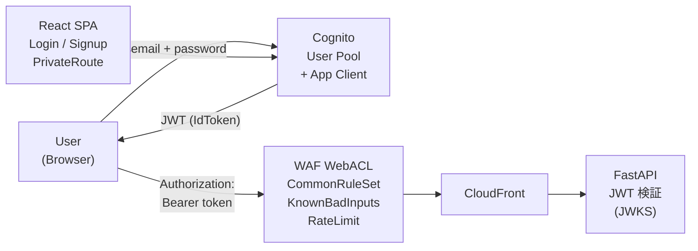
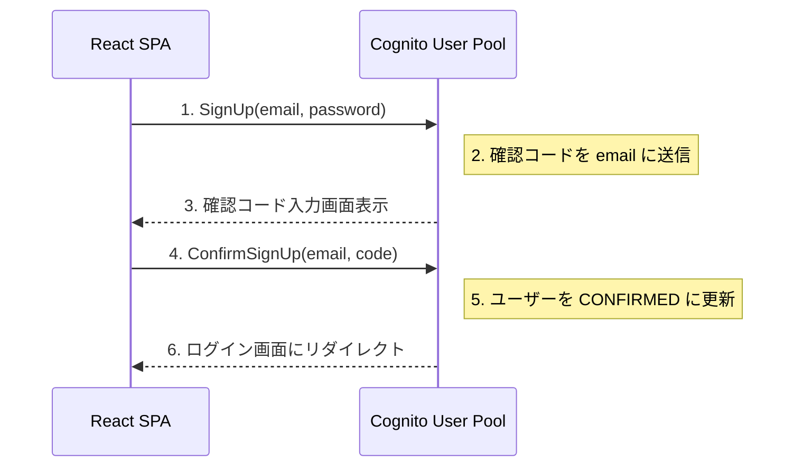
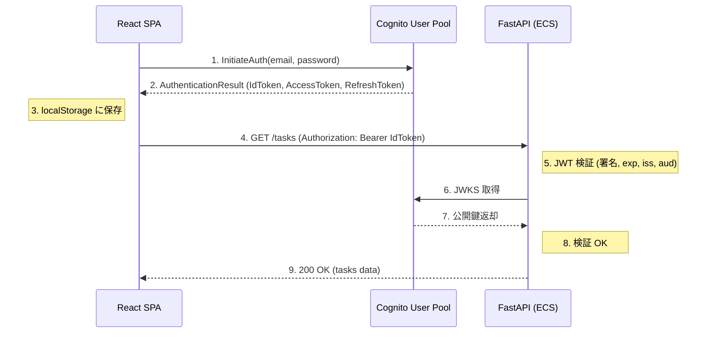
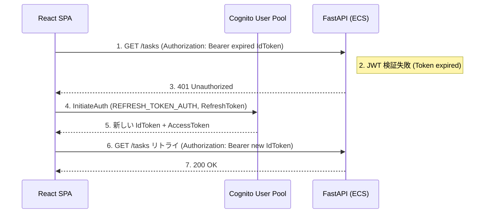
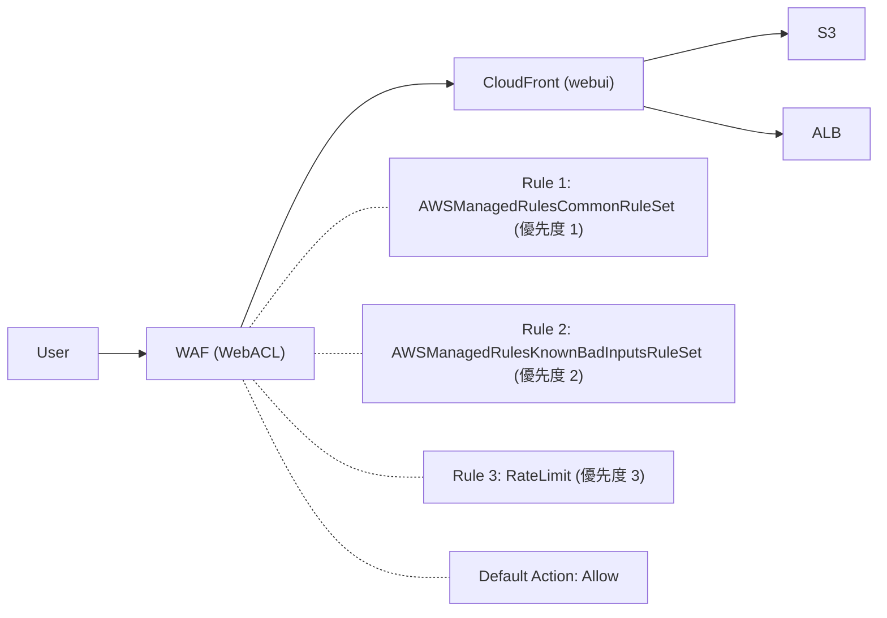
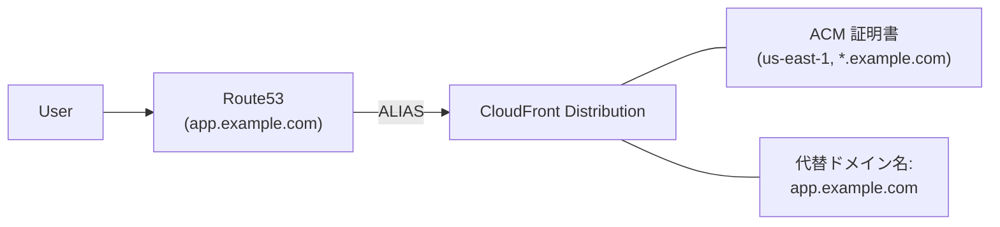

# アーキテクチャ設計書 (v7)

| 項目 | 内容 |
|------|------|
| プロジェクト名 | sample_cicd |
| 作成日 | 2026-04-07 |
| バージョン | 7.0 |
| 前バージョン | [architecture_v6.md](architecture_v6.md) (v6.0) |

## 変更概要

v6 のアーキテクチャに以下を追加する:

- **認証・認可**: Amazon Cognito User Pool による JWT 認証。FastAPI に JWT 検証ミドルウェアを追加し、`/tasks*` エンドポイントを保護。React SPA にログイン / サインアップ画面を追加
- **WAF**: CloudFront に AWS WAF v2 を適用。マネージドルールグループ（CommonRuleSet, KnownBadInputs）+ IP レートリミットで防御
- **HTTPS + カスタムドメイン**: ACM + Route53 によるカスタムドメイン対応（オプション、`enable_custom_domain` で制御）

## 1. システム構成図

### v7 追加部分



> 全体構成は v6 のアーキテクチャに上記を追加した形。詳細は [architecture_v6.md](architecture_v6.md) を参照。

## 2. 認証フロー

### 2.1 サインアップフロー



### 2.2 ログインフロー



### 2.3 トークンリフレッシュフロー



## 3. JWT 検証ミドルウェア設計

### 3.1 検証フロー

```python
# app/auth.py — 設計概要

1. アプリ起動時に JWKS をキャッシュ
   GET https://cognito-idp.{region}.amazonaws.com/{pool_id}/.well-known/jwks.json

2. リクエスト受信時:
   a. Authorization ヘッダーから Bearer トークンを抽出
   b. JWT ヘッダーの kid (Key ID) で JWKS からマッチする公開鍵を取得
   c. python-jose で署名検証 + クレーム検証:
      - exp: トークンの有効期限
      - iss: https://cognito-idp.{region}.amazonaws.com/{pool_id}
      - aud (ID Token) / client_id (Access Token): App Client ID
      - token_use: "id" (ID Token を使用)
   d. 検証成功 → リクエスト続行（ユーザー情報をリクエストに付与）
   e. 検証失敗 → 401 Unauthorized
```

### 3.2 Graceful Degradation

```python
# COGNITO_USER_POOL_ID, COGNITO_APP_CLIENT_ID が未設定の場合:
# → 認証ミドルウェアをスキップ（全エンドポイント公開）
# → ローカル開発時に Cognito 不要で動作

AUTH_ENABLED = bool(os.getenv("COGNITO_USER_POOL_ID")) and bool(os.getenv("COGNITO_APP_CLIENT_ID"))
```

### 3.3 エンドポイント分類

| パス | メソッド | 認証 | 理由 |
|------|---------|------|------|
| `/` | GET | 不要 | Hello World（ヘルスチェック兼用） |
| `/health` | GET | 不要 | ALB ヘルスチェック（認証不可） |
| `/tasks` | GET | 必要 | タスク一覧取得 |
| `/tasks` | POST | 必要 | タスク作成 |
| `/tasks/{id}` | GET | 必要 | タスク取得 |
| `/tasks/{id}` | PUT | 必要 | タスク更新 |
| `/tasks/{id}` | DELETE | 必要 | タスク削除 |
| `/tasks/{id}/attachments` | GET, POST | 必要 | 添付ファイル操作 |
| `/tasks/{id}/attachments/{att_id}` | GET, DELETE | 必要 | 添付ファイル操作 |

## 4. WAF 設計

### 4.1 WAF 配置



### 4.2 ルール設計

| # | ルール名 | タイプ | 動作 | 理由 |
|---|---------|--------|------|------|
| 1 | AWSManagedRulesCommonRuleSet | マネージド | Block | SQL インジェクション、XSS、パストラバーサル等を防御 |
| 2 | AWSManagedRulesKnownBadInputsRuleSet | マネージド | Block | Log4j (CVE-2021-44228)、既知の攻撃パターンを防御 |
| 3 | RateLimitPerIP | レートベース | Block | IP あたり 2000 req/5min（dev）で DDoS 緩和 |

> **設計判断 - CloudFront のみに WAF を適用する理由:**
> v6 で ALB への直接アクセスは CloudFront 経由にルーティングされている（`/tasks*` → ALB Origin）。
> そのため CloudFront に WAF を適用すれば、API リクエストも WAF でフィルタリングされる。
> ALB に別途 WAF を追加する必要はない（コスト削減）。

> **設計判断 - WAF のリージョン:**
> CloudFront に関連付ける WAF WebACL は `us-east-1` に作成する必要がある（AWS の制約）。
> Terraform では `aws` プロバイダのエイリアス（`provider "aws" { alias = "us_east_1" }`）を使用する。

## 5. HTTPS + カスタムドメイン設計（オプション）

### 5.1 構成



### 5.2 制御

| 変数 | デフォルト | 説明 |
|------|----------|------|
| `enable_custom_domain` | `false` | `true` で ACM + Route53 + CloudFront 代替ドメインを有効化 |
| `domain_name` | `""` | カスタムドメイン名（例: `app.example.com`） |
| `hosted_zone_id` | `""` | Route53 ホストゾーン ID |

デフォルト無効のため、ドメイン未保有でも v7 の主要機能（Cognito + WAF）は利用可能。

## 6. React SPA 画面設計

### 6.1 画面一覧

| 画面 | ルート | 認証 | 説明 |
|------|--------|------|------|
| ログイン | `/login` | 不要 | メールアドレス + パスワード入力 |
| サインアップ | `/signup` | 不要 | メールアドレス + パスワード + パスワード確認 |
| 確認コード | `/confirm` | 不要 | メール確認コード入力 |
| タスク一覧 | `/` | **必要** | 既存画面（認証ガード追加） |
| タスク作成 | `/tasks/new` | **必要** | 既存画面 |
| タスク詳細 | `/tasks/:id` | **必要** | 既存画面 |

### 6.2 コンポーネント構成（追加分）

```
frontend/src/
├── auth/
│   ├── cognito.js          # Cognito SDK 初期化 (UserPool, AppClient)
│   ├── AuthContext.jsx      # React Context (user, login, logout, signup)
│   ├── PrivateRoute.jsx     # 認証ガード (未認証 → /login にリダイレクト)
│   ├── Login.jsx            # ログイン画面
│   ├── Signup.jsx           # サインアップ画面
│   └── ConfirmSignup.jsx    # 確認コード入力画面
├── components/
│   └── Header.jsx           # ヘッダーにユーザー名 + ログアウトボタン追加
└── App.jsx                  # ルーティングに認証画面追加 + PrivateRoute 適用
```

### 6.3 トークン管理

| 項目 | 方式 |
|------|------|
| 保管場所 | `localStorage` |
| キー | `CognitoIdentityServiceProvider.{clientId}.{username}.idToken` 等（SDK が自動管理） |
| API 送信 | `fetch` ラッパーで `Authorization: Bearer <idToken>` を自動付与 |
| リフレッシュ | 401 レスポンス時に SDK の `getSession()` で自動リフレッシュ |
| ログアウト | SDK の `signOut()` で localStorage クリア + `/login` にリダイレクト |

> **設計判断 - localStorage vs httpOnly Cookie:**
> 本番では XSS 対策として httpOnly Cookie が推奨されるが、学習目的では
> localStorage を使用する。理由: (1) Cognito SDK のデフォルト動作が localStorage、
> (2) httpOnly Cookie は BFF (Backend For Frontend) パターンが必要で v7 のスコープを超える。

## 7. CORS 変更

v6 の CORS 設定に `Authorization` ヘッダーの許可を追加する。

```python
# v6 → v7 の変更
app.add_middleware(
    CORSMiddleware,
    allow_origins=cors_origins,
    allow_credentials=not allow_all,
    allow_methods=["GET", "POST", "PUT", "DELETE", "OPTIONS"],
    allow_headers=["*"],  # Authorization を含む全ヘッダーを許可（変更なし、* で既にカバー）
)
```

> `allow_headers=["*"]` は `Authorization` を含む。ただし v7 では `allow_credentials` の
> 設定に注意が必要。特定オリジン指定時（prod 環境）は `allow_credentials=True` にする。

## 8. 環境変数追加

| 変数 | コンテナ | 必須 | 説明 |
|------|---------|------|------|
| `COGNITO_USER_POOL_ID` | ECS | Optional | Cognito User Pool ID。未設定時は認証スキップ |
| `COGNITO_APP_CLIENT_ID` | ECS | Optional | Cognito App Client ID。未設定時は認証スキップ |
| `AWS_REGION` | ECS | Optional | JWKS エンドポイント構築に使用。デフォルト `ap-northeast-1` |
