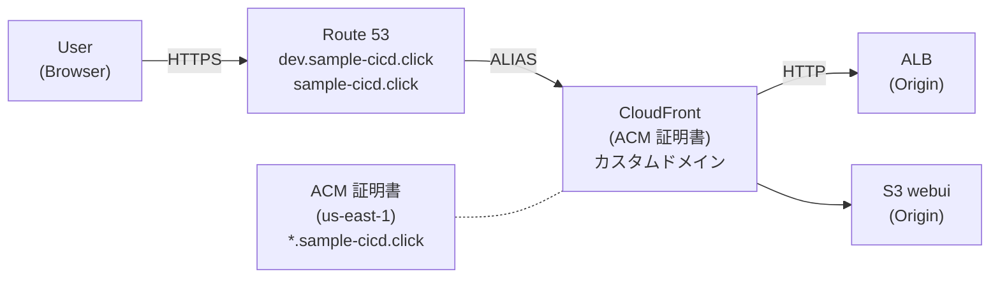
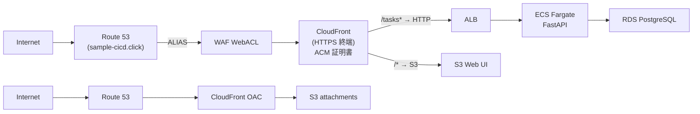
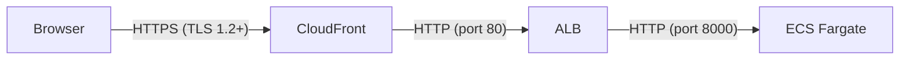
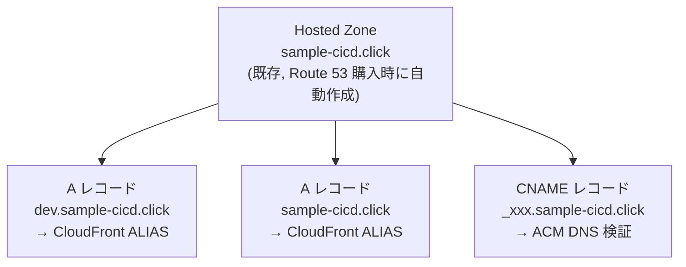
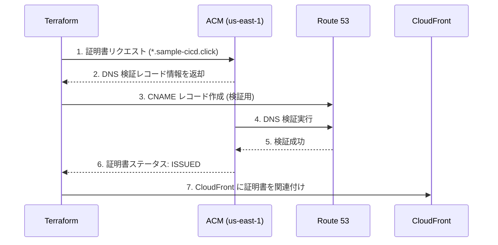
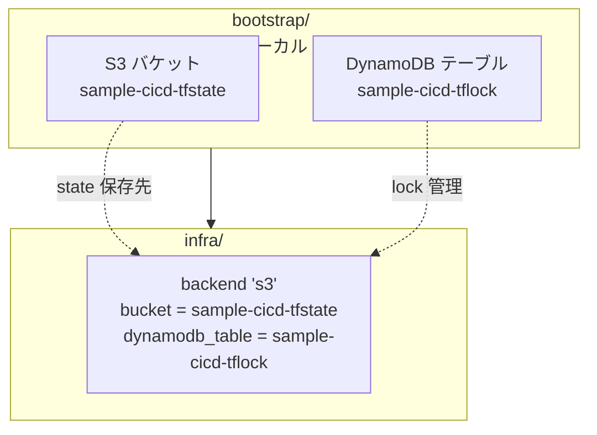

# アーキテクチャ設計書 (v8)

| 項目 | 内容 |
|------|------|
| プロジェクト名 | sample_cicd |
| 作成日 | 2026-04-07 |
| バージョン | 8.0 |
| 前バージョン | [architecture_v7.md](architecture_v7.md) (v7.0) |

## 変更概要

v7 のアーキテクチャに以下を追加する:

- **HTTPS + カスタムドメイン**: Route 53 + ACM + CloudFront によるカスタムドメイン対応。`sample-cicd.click` ドメインで HTTPS アクセスを実現
- **サブドメイン設計**: dev 環境は `dev.sample-cicd.click`、prod 環境は `sample-cicd.click` に割り当て
- **Remote State**: Terraform state を S3 + DynamoDB に移行し、チーム開発・CI/CD 統合の基盤を構築

## 1. システム構成図

### v8 追加部分



> 全体構成は v7 のアーキテクチャに上記を追加した形。詳細は [architecture_v7.md](architecture_v7.md) を参照。

## 2. リクエストフロー

### 2.1 全体フロー（v8）



### 2.2 HTTPS 終端ポイント



| 区間 | プロトコル | 理由 |
|------|----------|------|
| Browser → CloudFront | HTTPS | ACM 証明書で TLS 終端。ユーザーとの通信を暗号化 |
| CloudFront → ALB | HTTP | ALB は VPC 内部。CloudFront Origin Protocol = `http-only`（v6 既存設定を継続） |
| ALB → ECS | HTTP | プライベートサブネット内の通信。暗号化不要 |

> **設計判断 - CloudFront で TLS 終端する理由:**
> ALB に ACM 証明書を配置して HTTPS リスナーを作成する方式（v3 の https.tf）は、
> CloudFront を経由する現在のアーキテクチャでは不要。CloudFront が TLS を終端し、
> バックエンドへは HTTP で転送する。これにより ALB の HTTPS リスナーと
> ALB 用 ACM 証明書が不要になり、構成がシンプルになる。

## 3. サブドメイン設計

### 3.1 ドメイン割り当て

| 環境 | ドメイン | 用途 |
|------|---------|------|
| dev | `dev.sample-cicd.click` | 開発環境（Web UI + API） |
| prod | `sample-cicd.click` | 本番環境（Web UI + API） |

### 3.2 Terraform Workspace との対応

```hcl
# dev workspace → dev.sample-cicd.click
# prod workspace → sample-cicd.click

locals {
  # dev.tfvars: custom_domain_name = "dev.sample-cicd.click"
  # prod.tfvars: custom_domain_name = "sample-cicd.click"
}
```

### 3.3 DNS レコード構成



> **設計判断 - Hosted Zone を data source で参照する理由:**
> Route 53 でドメインを購入した際に Hosted Zone が自動作成されている。
> v3 の https.tf では `aws_route53_zone` リソースで新規作成していたが、
> v8 では `data "aws_route53_zone"` で既存の Hosted Zone を参照する。
> これにより Hosted Zone の重複作成を防ぎ、NS レコードの不整合を回避する。

## 4. ACM 証明書設計

### 4.1 証明書の配置

| 項目 | 値 |
|------|-----|
| リージョン | `us-east-1`（CloudFront の要件） |
| ドメイン名 | `*.sample-cicd.click` |
| SAN (Subject Alternative Name) | `sample-cicd.click` |
| 検証方式 | DNS 検証（Route 53 で自動検証） |

> **設計判断 - ワイルドカード証明書を使う理由:**
> `*.sample-cicd.click` と `sample-cicd.click` の両方をカバーする 1 枚の証明書で、
> dev (`dev.sample-cicd.click`) と prod (`sample-cicd.click`) の両環境に対応できる。
> 環境ごとに証明書を作成する必要がなく、管理がシンプルになる。

### 4.2 証明書のライフサイクル



## 5. Remote State アーキテクチャ

### 5.1 bootstrap / main 分離



| ディレクトリ | State 管理 | 目的 |
|-------------|-----------|------|
| `infra/bootstrap/` | ローカル（`.tfstate` ファイル） | Remote State 用の S3 バケットと DynamoDB テーブルを作成 |
| `infra/` | リモート（S3 + DynamoDB） | アプリケーションインフラの全リソースを管理 |

> **設計判断 - bootstrap を分離する理由:**
> Remote State の保存先（S3 バケット、DynamoDB テーブル）は Terraform 自身の
> state が依存するため、同じ state で管理するとブートストラップ問題（鶏と卵）が発生する。
> bootstrap ディレクトリでローカル state を使って先にバックエンドリソースを作成し、
> その後 main の infra/ で remote backend を設定する。

### 5.2 State ロック

| 項目 | 値 |
|------|-----|
| ロック方式 | DynamoDB テーブル（`LockID` パーティションキー） |
| 目的 | 同時実行による state の競合を防止 |
| 対象 | `terraform plan` / `terraform apply` 実行時に自動ロック |

### 5.3 State 分離（Workspace）

```
s3://sample-cicd-tfstate/
  ├── env:/dev/terraform.tfstate      # dev workspace
  └── env:/prod/terraform.tfstate     # prod workspace
```

> Terraform Workspace を使用しているため、同一バケット内で `env:/{workspace}/` プレフィックスにより
> 環境ごとの state が自動的に分離される。

### 5.4 既存 State のマイグレーション

```bash
# 1. bootstrap を apply して S3 + DynamoDB を作成
cd infra/bootstrap && terraform init && terraform apply

# 2. main の backend を S3 に変更して init
cd infra && terraform init -migrate-state

# 3. Terraform が対話的にローカル → S3 へのコピーを実行
# "Do you want to copy existing state to the new backend?" → yes
```

> **注意**: `terraform init -migrate-state` により既存のローカル state が S3 に移行される。
> マイグレーション後はローカルの `terraform.tfstate` は不要になる（`.gitignore` に追加推奨）。

## 6. 環境変数変更

### 6.1 ECS 環境変数

変更なし。v8 では ECS タスク定義の環境変数に追加はない。

### 6.2 CI/CD 環境変数

| 変数 | 変更 | 説明 |
|------|------|------|
| `config.js` の `API_URL` | 変更 | CloudFront ドメイン → カスタムドメインに変更 |

## 7. セキュリティ考慮事項

| 項目 | 対策 |
|------|------|
| TLS バージョン | CloudFront の `minimum_protocol_version = TLSv1.2_2021` |
| HTTP → HTTPS リダイレクト | CloudFront の `viewer_protocol_policy = redirect-to-https`（既存設定を継続） |
| S3 State バケット | バージョニング有効、暗号化 (SSE-S3)、パブリックアクセスブロック |
| DynamoDB テーブル | PAY_PER_REQUEST（最小権限、コスト最小化） |
| State ファイル | シークレット（DB パスワード等）を含むため、S3 バケットへのアクセスを IAM で厳密に制御 |
