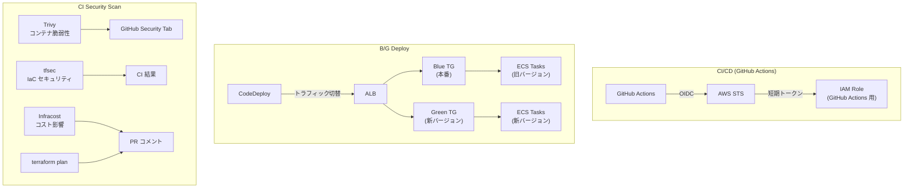
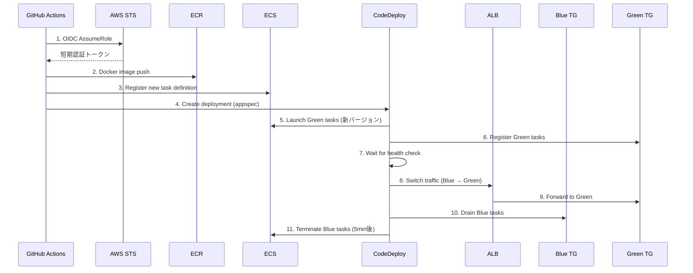
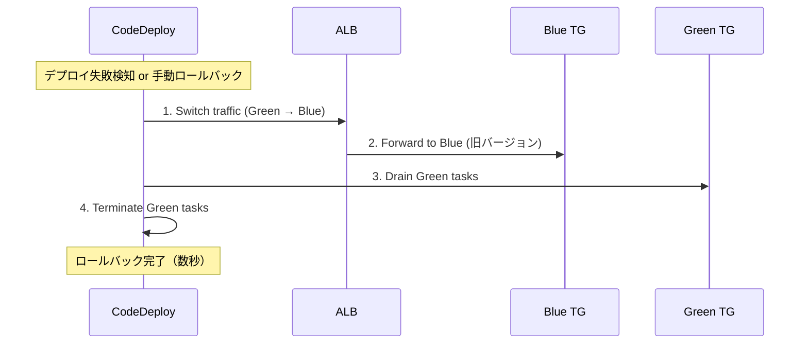
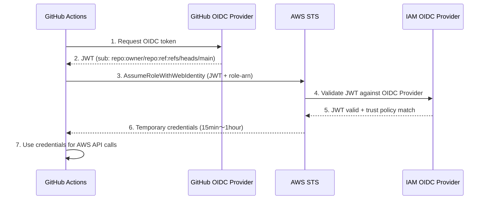
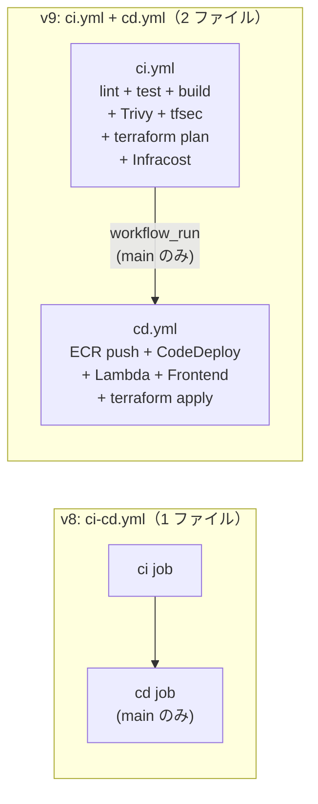
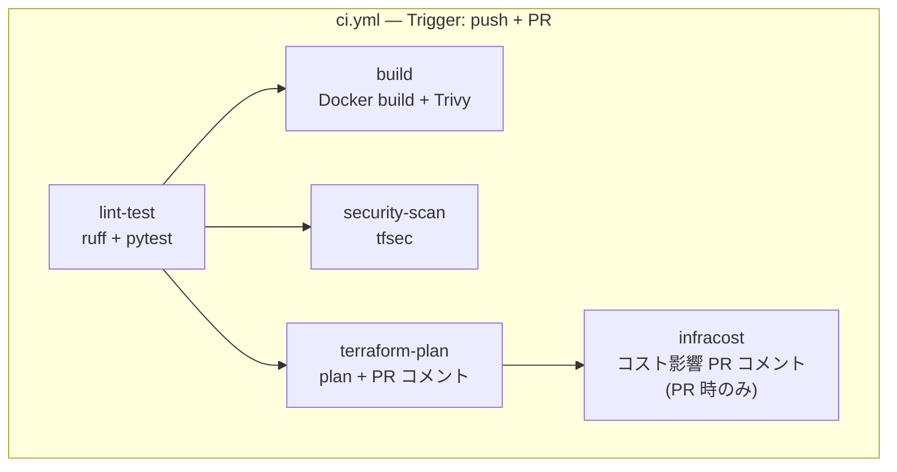
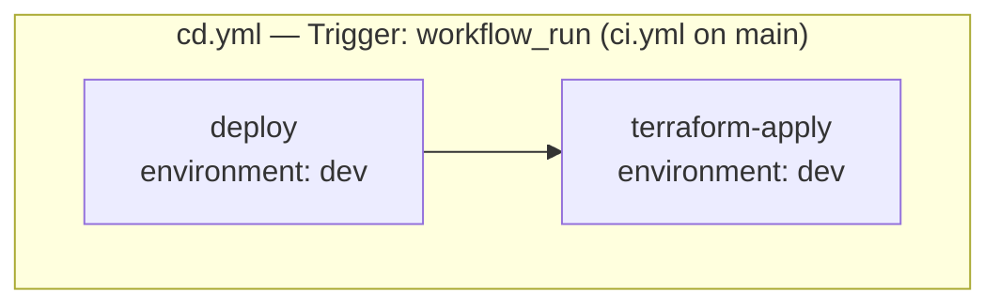
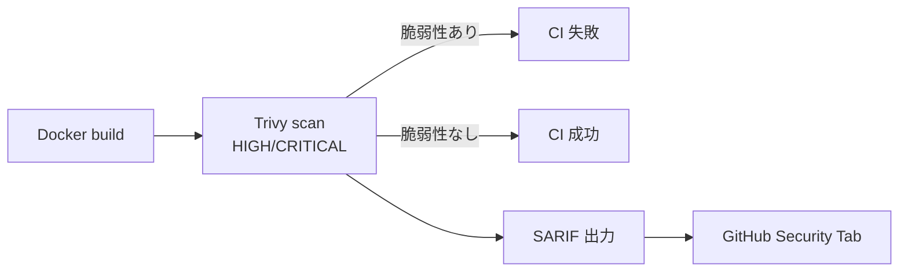
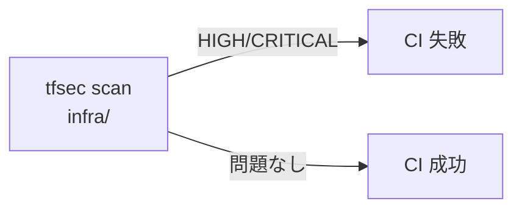
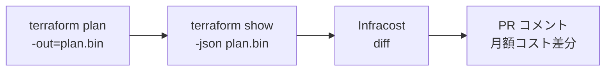

# アーキテクチャ設計書 (v9)

| 項目 | 内容 |
|------|------|
| プロジェクト名 | sample_cicd |
| 作成日 | 2026-04-08 |
| バージョン | 9.0 |
| 前バージョン | [architecture_v8.md](architecture_v8.md) (v8.0) |

## 変更概要

v8 のアーキテクチャに以下を追加する:

- **CodeDeploy B/G デプロイ**: ECS のデプロイ方式をローリングデプロイから CodeDeploy B/G デプロイに変更。Blue/Green 2 つのターゲットグループで即時ロールバック
- **OIDC 認証**: GitHub Actions → AWS の認証を Access Key から OIDC に移行。短期トークンでキーレス認証
- **CI/CD ワークフロー分割**: `ci-cd.yml` を `ci.yml` + `cd.yml` に分割。セキュリティスキャン（Trivy, tfsec）と Terraform CI/CD を統合
- **Infracost**: PR 時にインフラ変更のコスト影響を自動表示

> アプリケーションコードの変更はなし。v9 はインフラ・CI/CD のみの変更。

## 1. システム構成図

### v9 追加部分



> 全体構成は v8 のアーキテクチャに上記を追加した形。詳細は [architecture_v8.md](architecture_v8.md) を参照。

## 2. CodeDeploy B/G デプロイフロー

### 2.1 デプロイシーケンス



### 2.2 ロールバックフロー



### 2.3 ローリングデプロイ vs B/G デプロイ

| 項目 | ローリングデプロイ (v8) | B/G デプロイ (v9) |
|------|----------------------|-------------------|
| デプロイ方式 | 旧タスクを順次置換 | 新環境を並行起動後にトラフィック切替 |
| ロールバック | 新しいデプロイをやり直す（遅い） | ALB のターゲットグループを切り替える（数秒） |
| ダウンタイム | なし（健全なタスクが常に存在） | なし（Blue/Green が同時に稼働） |
| リソース使用量 | デプロイ中は最大 200%（一時的） | デプロイ中は常に 200%（Blue + Green） |
| テスト | デプロイ後に本番環境でテスト | テストリスナー (Port 8080) で事前テスト可能 |
| `deployment_controller` | `ECS` | `CODE_DEPLOY` |
| Terraform 管理 | ECS サービスがデプロイを管理 | CodeDeploy がデプロイを管理 |

> **設計判断 - B/G デプロイを選択する理由:**
> ローリングデプロイは構成がシンプルだが、問題発生時のロールバックが遅い。
> B/G デプロイは CodeDeploy のリソースが追加で必要だが、即時ロールバックが可能で
> 本番運用のベストプラクティスに近い。学習目的としても CodeDeploy の理解は重要。

## 3. OIDC 認証フロー

### 3.1 認証シーケンス



### 3.2 Access Key vs OIDC

| 項目 | Access Key (v8) | OIDC (v9) |
|------|----------------|-----------|
| 認証方式 | 長期間有効なキーペア | 短期トークン（自動ローテーション） |
| GitHub 側 | `secrets.AWS_ACCESS_KEY_ID` + `secrets.AWS_SECRET_ACCESS_KEY` | `secrets.AWS_OIDC_ROLE_ARN`（ARN のみ） |
| AWS 側 | IAM ユーザー + Access Key | IAM OIDC Provider + IAM ロール |
| セキュリティリスク | キー漏洩時に無制限アクセス | トークン有効期間のみアクセス可能 |
| アクセス制限 | IAM ユーザーポリシーで制御 | 信頼ポリシーで GitHub リポジトリ・ブランチを制限 |
| ローテーション | 手動 | 不要（自動） |
| 推奨度 | AWS 非推奨 | AWS 推奨 |

> **設計判断 - OIDC を選択する理由:**
> Access Key は漏洩リスクがあり、定期的なローテーションが必要。OIDC は短期トークンのみを
> 使用し、信頼ポリシーで特定の GitHub リポジトリ・ブランチに限定できるため、セキュリティが
> 大幅に向上する。AWS 公式でも OIDC を推奨している。

### 3.3 信頼ポリシーの設計

```json
{
  "Version": "2012-10-17",
  "Statement": [
    {
      "Effect": "Allow",
      "Principal": {
        "Federated": "arn:aws:iam::ACCOUNT_ID:oidc-provider/token.actions.githubusercontent.com"
      },
      "Action": "sts:AssumeRoleWithWebIdentity",
      "Condition": {
        "StringEquals": {
          "token.actions.githubusercontent.com:aud": "sts.amazonaws.com"
        },
        "StringLike": {
          "token.actions.githubusercontent.com:sub": "repo:OWNER/REPO:*"
        }
      }
    }
  ]
}
```

> **`sub` 条件を `repo:OWNER/REPO:*` にする理由:**
> `ref:refs/heads/main` に限定すると PR 時の CI（terraform plan 等）が認証できない。
> リポジトリ単位で許可し、ブランチ制限は GitHub Actions の `if` 条件で制御する。

## 4. CI/CD ワークフロー分割

### 4.1 分割前 vs 分割後



### 4.2 ci.yml ジョブ構成



| ジョブ | 実行条件 | 内容 |
|--------|---------|------|
| `lint-test` | 全 push / PR | ruff lint + pytest (62 tests) |
| `build` | `lint-test` 成功後 | Docker build + Trivy HIGH/CRITICAL スキャン + SARIF upload |
| `security-scan` | `lint-test` 成功後 | tfsec HIGH/CRITICAL スキャン |
| `terraform-plan` | `lint-test` 成功後 | `terraform plan` → PR コメント |
| `infracost` | `terraform-plan` 成功後, PR 時のみ | Infracost → PR コメント |

### 4.3 cd.yml ジョブ構成



| ジョブ | 実行条件 | 内容 |
|--------|---------|------|
| `deploy` | CI 成功 + main | OIDC 認証 → ECR push → CodeDeploy B/G → Lambda → Frontend S3 + CF invalidation |
| `terraform-apply` | `deploy` 成功後 | `terraform apply -auto-approve` (dev) |

> **設計判断 - terraform apply を deploy 後に実行する理由:**
> CodeDeploy B/G デプロイでは `deployment_controller = CODE_DEPLOY` に設定された
> ECS サービスの更新は CodeDeploy が管理するため、`terraform apply` はアプリデプロイと
> 独立して実行する。インフラ変更（モニタリング閾値、新リソース追加等）を反映する。

## 5. セキュリティスキャン統合

### 5.1 Trivy フロー



### 5.2 tfsec フロー



> 学習用インフラの一部ルール（S3 暗号化方式等）は `#tfsec:ignore` でインライン除外する。

### 5.3 Infracost フロー



## 6. GitHub Environments

### 6.1 環境構成

| 環境 | 承認ゲート | デプロイ対象 | シークレット |
|------|----------|------------|------------|
| `dev` | なし（自動デプロイ） | `cd.yml` で使用 | `AWS_OIDC_ROLE_ARN` |
| `prod` | Required Reviewers | 設定のみ（v9 では実デプロイなし） | `AWS_OIDC_ROLE_ARN` (prod用) |

> **設計判断 - prod は設定のみ:**
> 学習用プロジェクトのため、prod 環境への実デプロイは行わない。
> GitHub Environments の Protection Rules 設定を学習する。

## 7. 環境変数変更

### 7.1 GitHub Secrets / Variables

| 変数 | 変更 | 説明 |
|------|------|------|
| `AWS_ACCESS_KEY_ID` | **削除** | OIDC 移行に伴い廃止 |
| `AWS_SECRET_ACCESS_KEY` | **削除** | OIDC 移行に伴い廃止 |
| `AWS_OIDC_ROLE_ARN` | **追加** | OIDC IAM ロール ARN |
| `INFRACOST_API_KEY` | **追加** | Infracost Cloud API キー |
| `CUSTOM_DOMAIN_NAME` | 維持 | GitHub Variables（変更なし） |

### 7.2 ECS 環境変数

変更なし。v8 と同一。

### 7.3 Terraform 変数追加

| 変数 | 型 | デフォルト | 説明 |
|------|-----|----------|------|
| `github_repo` | `string` | - | GitHub リポジトリ（`owner/repo`）。OIDC 信頼ポリシー |
| `codedeploy_traffic_routing` | `string` | `"AllAtOnce"` | トラフィックシフト方式 |
| `enable_test_listener` | `bool` | `false` | テストリスナー (Port 8080) の作成 |

## 8. セキュリティ考慮事項

| 項目 | 対策 |
|------|------|
| OIDC 信頼ポリシー | 特定の GitHub リポジトリに限定。ワイルドカードでブランチを許可（PR 時 CI 対応） |
| IAM ロール権限 | 最小権限の原則。必要なサービスのみアクセス許可 |
| Infracost API キー | GitHub Secrets に保存（ログに表示されない） |
| Trivy SARIF | GitHub Security Tab で脆弱性を一元管理 |
| tfsec 除外ルール | 除外理由をインラインコメントで明記 |
| CodeDeploy ロールバック | デプロイ失敗時の自動ロールバック有効 |
| Terraform state | OIDC ロール経由で S3/DynamoDB にアクセス（既存 Remote State 基盤を活用） |
| Actions permissions | `permissions` ブロックで必要最小限のスコープを明示 |
