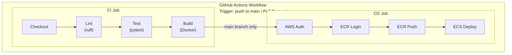

# CI/CD パイプライン設計書

| 項目 | 内容 |
|------|------|
| プロジェクト名 | sample_cicd |
| 作成日 | 2026-04-02 |
| バージョン | 1.0 |

## 1. パイプライン全体像



## 2. トリガー条件

| トリガー | 実行ジョブ | 条件 |
|----------|-----------|------|
| Push to `main` | CI + CD | main ブランチへの直接 push またはマージ |
| Pull Request to `main` | CI のみ | main ブランチへの PR 作成・更新 |

## 3. CI ジョブ設計（FR-3 対応）

### 3.1 ジョブ構成

| ステップ | アクション | 説明 |
|----------|-----------|------|
| 1. Checkout | `actions/checkout` | リポジトリのチェックアウト |
| 2. Setup Python | `actions/setup-python` | Python 3.12 のセットアップ |
| 3. Install dependencies | `pip install` | 依存パッケージのインストール |
| 4. Lint | `ruff check` | コード品質チェック |
| 5. Test | `pytest` | ユニットテスト実行 |
| 6. Build Docker image | `docker build` | イメージビルド（ビルド検証） |

### 3.2 実行環境

| 項目 | 値 |
|------|------|
| Runner | `ubuntu-latest` |
| Python version | 3.12 |

### 3.3 Lint 設定

- ツール: ruff
- 対象: `app/` および `tests/` ディレクトリ
- ルール: デフォルト設定（PEP 8 準拠）

### 3.4 テスト設定

- フレームワーク: pytest
- 対象: `tests/` ディレクトリ
- テストパッケージ: pytest, httpx（FastAPI テスト用）

## 4. CD ジョブ設計（FR-4 対応）

### 4.1 ジョブ構成

| ステップ | アクション | 説明 |
|----------|-----------|------|
| 1. Checkout | `actions/checkout` | リポジトリのチェックアウト |
| 2. Configure AWS credentials | `aws-actions/configure-aws-credentials` | AWS 認証情報の設定 |
| 3. Login to ECR | `aws-actions/amazon-ecr-login` | ECR へのログイン |
| 4. Build & Push | `docker build` + `docker push` | イメージビルドと ECR へのプッシュ |
| 5. Update ECS | `aws-actions/amazon-ecs-render-task-definition` + `aws-actions/amazon-ecs-deploy-task-definition` | タスク定義更新と ECS デプロイ |

### 4.2 実行条件

- CI ジョブが成功していること（`needs: ci`）
- `main` ブランチへの push であること（`if: github.ref == 'refs/heads/main'`）

### 4.3 デプロイ方式

| 項目 | 値 |
|------|------|
| 方式 | ローリングデプロイ |
| wait-for-service-stability | true（デプロイ完了まで待機） |

## 5. イメージタグ戦略

| タグ | 値 | 用途 |
|------|------|------|
| Git SHA | `${{ github.sha }}` の先頭 7 文字 | イミュータブルなバージョン識別 |
| latest | `latest` | 最新イメージの参照 |

ECR にプッシュする際は両方のタグを付与する:

```
<account-id>.dkr.ecr.ap-northeast-1.amazonaws.com/sample-cicd:<sha>
<account-id>.dkr.ecr.ap-northeast-1.amazonaws.com/sample-cicd:latest
```

## 6. GitHub Actions Secrets

| Secret 名 | 説明 | 設定方法 |
|------------|------|----------|
| `AWS_ACCESS_KEY_ID` | AWS アクセスキー ID | GitHub リポジトリ Settings → Secrets |
| `AWS_SECRET_ACCESS_KEY` | AWS シークレットアクセスキー | GitHub リポジトリ Settings → Secrets |
| `AWS_ACCOUNT_ID` | AWS アカウント ID | GitHub リポジトリ Settings → Secrets |

**注意:** これらのシークレットは GitHub Actions の実行時のみ参照される。ソースコードやログに出力してはならない。

## 7. ワークフローファイル設計

ファイルパス: `.github/workflows/ci-cd.yml`

```yaml
# Workflow structure (pseudo):
name: CI/CD Pipeline
on:
  push:
    branches: [main]
  pull_request:
    branches: [main]

jobs:
  ci:
    runs-on: ubuntu-latest
    steps:
      - Checkout
      - Setup Python 3.12
      - Install dependencies
      - Run ruff
      - Run pytest
      - Build Docker image

  cd:
    needs: ci
    if: github.ref == 'refs/heads/main'
    runs-on: ubuntu-latest
    steps:
      - Checkout
      - Configure AWS credentials
      - Login to ECR
      - Build, tag, push image
      - Render ECS task definition
      - Deploy to ECS
```

## 8. アクションバージョン管理

CLAUDE.md の規約に従い、GitHub Actions のアクションは SHA でバージョンを固定する。

```yaml
# Example:
- uses: actions/checkout@<commit-sha>  # v4
```

実装時に各アクションの最新安定版の SHA を確認して使用する。
