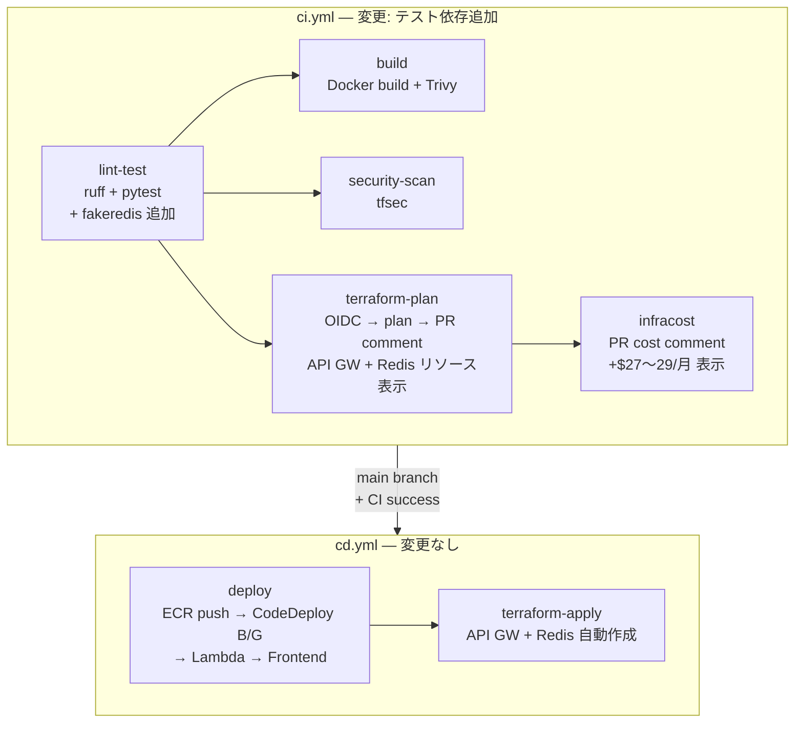
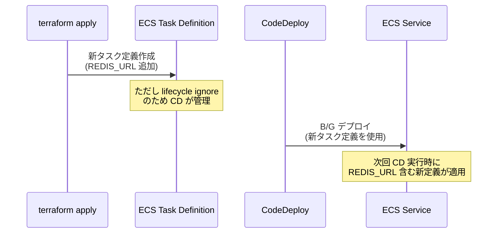

# CI/CD パイプライン設計書 (v10)

| 項目 | 内容 |
|------|------|
| プロジェクト名 | sample_cicd |
| 作成日 | 2026-04-08 |
| バージョン | 10.0 |
| 前バージョン | [cicd_v9.md](cicd_v9.md) (v9.0) |

## 変更概要

v10 の CI/CD パイプラインは**軽微変更**のみ。API Gateway と ElastiCache は Terraform で管理されるため、既存の `terraform plan` / `terraform apply` フローで自動デプロイされる。

- **CI**: テスト依存ライブラリに `fakeredis` 追加
- **CD**: 変更なし（API Gateway / ElastiCache は `terraform apply` で管理）

> ワークフローファイルの構造やジョブ構成は v9 から変更なし。

## 1. パイプライン全体像（v10）



## 2. CI 変更詳細

### 2.1 lint-test ジョブの変更

テスト依存に `fakeredis` を追加:

```yaml
# ci.yml — lint-test ジョブの pip install ステップ
- name: Install dependencies
  run: |
    pip install -r app/requirements.txt
    pip install ruff pytest httpx "moto[sqs,events,s3]" fakeredis
```

`redis` ライブラリは `app/requirements.txt` に追加されるため、`pip install -r app/requirements.txt` で自動インストールされる。`fakeredis` はテスト用のみ必要なので別途追加。

### 2.2 terraform-plan ジョブ

変更なし。v10 の新規リソース（API Gateway, ElastiCache）は `infra/` 配下に `.tf` ファイルとして追加されるため、既存の `terraform plan` フローで自動的に差分が検出・表示される。

PR コメントには以下のような表示が期待される:

```
Plan: 20 to add, 2 to change, 0 to destroy.
```

### 2.3 infracost ジョブ

変更なし。v10 のリソース追加により、PR コメントに以下のようなコスト差分が表示される:

```
Monthly cost will increase by $27〜29 ▲

+ aws_api_gateway_stage.main             $14/mo
+ aws_elasticache_cluster.main           $13/mo
+ aws_cloudwatch_log_group.apigw         <$1/mo
```

## 3. CD 変更なし

v10 では CD ワークフローの変更は不要:

- **API Gateway**: `terraform apply` で作成・更新。デプロイアクション不要
- **ElastiCache**: `terraform apply` で作成。アプリデプロイ不要
- **ECS**: `REDIS_URL` 環境変数の追加はタスク定義更新時に反映（CodeDeploy B/G で自動）
- **CloudFront**: Origin 変更は `terraform apply` で反映

### 3.1 ECS 環境変数の反映フロー



> **注**: `ecs.tf` の `aws_ecs_task_definition` は `lifecycle { ignore_changes }` が設定されている場合、CD ワークフローの `render-task-definition` で環境変数が反映される。初回は手動でタスク定義を更新するか、CD パイプラインを実行する。

## 4. Docker イメージの変更

`app/requirements.txt` に `redis` が追加されるため、Docker ビルド時に自動的にインストールされる。Dockerfile の変更は不要（既存の `pip install -r requirements.txt` で対応）。

## 5. Terraform CI/CD の対象ファイル

v10 で追加・変更される `infra/` 配下のファイル:

| ファイル | 変更種別 | terraform plan 影響 |
|----------|---------|-------------------|
| `infra/apigateway.tf` | 新規 | +13 リソース |
| `infra/elasticache.tf` | 新規 | +2 リソース |
| `infra/security_groups.tf` | 変更 | +1 リソース |
| `infra/iam.tf` | 変更 | +2 リソース |
| `infra/monitoring.tf` | 変更 | +4 リソース（Alarm） |
| `infra/variables.tf` | 変更 | 変数のみ（リソース影響なし） |
| `infra/dev.tfvars` | 変更 | 変数値のみ |
| `infra/prod.tfvars` | 変更 | 変数値のみ |
| `infra/ecs.tf` | 変更 | タスク定義更新 |
| `infra/webui.tf` | 変更 | CloudFront 更新 |
| `infra/outputs.tf` | 変更 | 出力のみ |

## 6. まとめ

v10 の CI/CD 変更は最小限:

1. **CI**: `fakeredis` のテスト依存追加のみ
2. **CD**: 変更なし。API Gateway / ElastiCache は Terraform で管理
3. **Infracost**: 自動的に +$27〜29/月のコスト差分を表示
4. **terraform plan/apply**: 新規リソース約 20 件の追加が自動表示・適用

v9 で構築した CI/CD 自動化基盤が有効に機能し、v10 のインフラ変更が最小限の CI/CD 変更で対応できることを示す。
