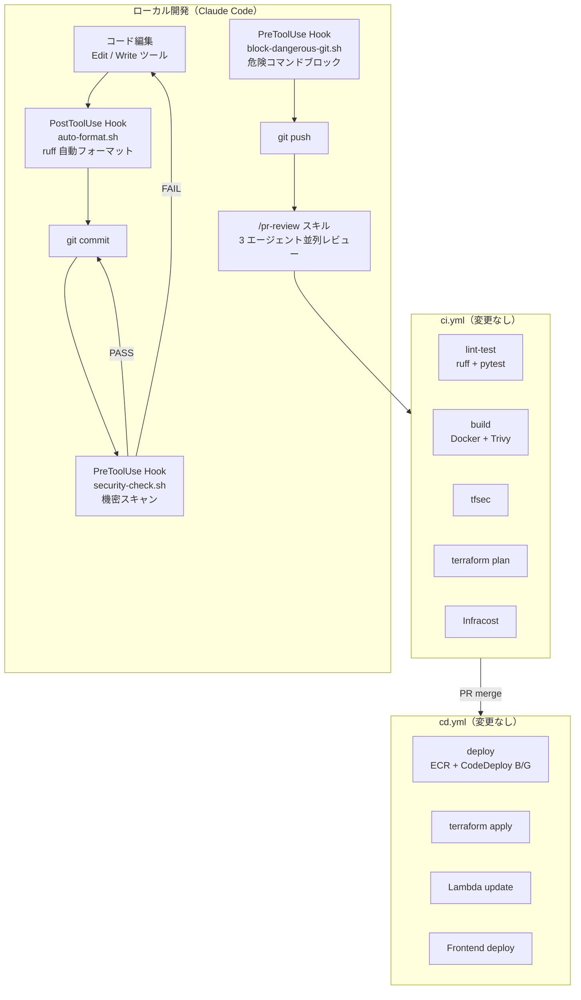
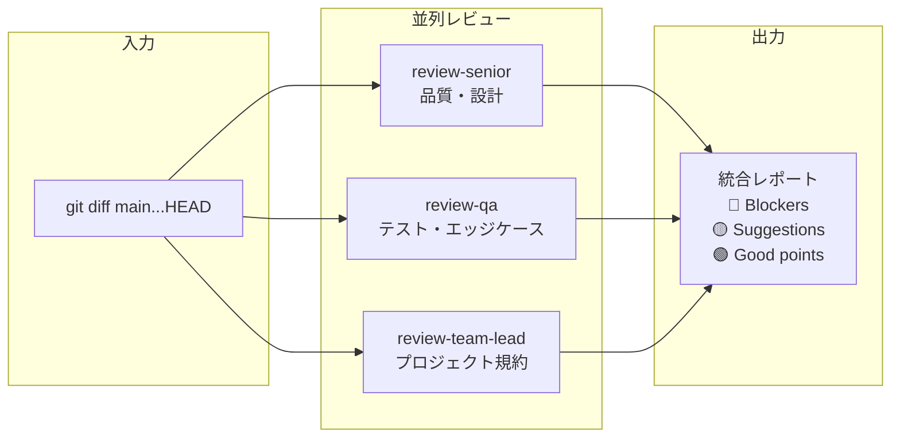

# CI/CD パイプライン設計書 (v11)

| 項目 | 内容 |
|------|------|
| プロジェクト名 | sample_cicd |
| 作成日 | 2026-04-09 |
| バージョン | 11.0 |
| 前バージョン | [cicd_v10.md](cicd_v10.md) (v10.0) |

## 変更概要

v11 では CI/CD ワークフロー（`.github/workflows/ci.yml`, `cd.yml`）への変更はない。

代わりに **Claude Code Hooks による開発時の自動チェック** を導入する。これは CI パイプラインの「前段」として機能し、CI に到達する前の品質ゲートとなる:

- **PreToolUse Hooks**: コミット前に機密チェック・危険コマンドブロック
- **PostToolUse Hook**: コード変更後に自動 ruff フォーマット
- **`/pr-review` スキル**: PR 作成前のマルチエージェントレビュー

> CI/CD ワークフローファイルの構造やジョブ構成は v10 から変更なし。

## 1. 開発ワークフロー全体像（v11）



## 2. Hooks と CI の棲み分け

### 2.1 チェックの 2 層構造

| 層 | 実行タイミング | ツール | チェック内容 | ブロック方法 |
|----|-------------|--------|------------|------------|
| L1: Hooks | ローカル（Claude Code 内） | bash scripts | 機密漏洩、危険コマンド、フォーマット | exit 2 |
| L2: CI | リモート（GitHub Actions） | ruff, pytest, Trivy, tfsec | lint, テスト, 脆弱性, IaC セキュリティ | job failure |

**設計判断**: Hooks は CI を**置き換えない**。補完する。

- **Hooks の役割**: 明らかに間違っている操作を即座にブロック。フィードバックループが最短（秒単位）
- **CI の役割**: 包括的な品質チェック。テスト実行、依存関係の脆弱性スキャン、Terraform plan 等

### 2.2 チェック項目の比較

| チェック項目 | Hooks (L1) | CI (L2) | 備考 |
|------------|:---:|:---:|------|
| 機密情報の検出 | ✅ PreToolUse | ✕ | Hooks でブロックすれば CI に到達しない |
| 危険 git コマンド | ✅ PreToolUse | ✕ | `--force` 等は即座にブロック |
| Python フォーマット | ✅ PostToolUse | ✅ ruff check | Hooks で自動修正 → CI で最終確認 |
| Python lint | ✕ | ✅ ruff check | 詳細な lint は CI で |
| テスト実行 | ✕ | ✅ pytest | テストは CI の責務 |
| Docker ビルド | ✕ | ✅ docker build | ビルドは CI の責務 |
| 脆弱性スキャン | ✕ | ✅ Trivy | 依存関係チェックは CI の責務 |
| IaC セキュリティ | ✕ | ✅ tfsec | Terraform セキュリティは CI の責務 |
| Terraform plan | ✕ | ✅ terraform plan | インフラ変更確認は CI の責務 |
| コスト見積もり | ✕ | ✅ Infracost | コスト確認は CI の責務 |

## 3. `/pr-review` ワークフロー

### 3.1 実行タイミング

`/pr-review` は CI の前、PR 作成前に手動実行する。ワークフロー上の位置づけ:

```
コード実装 → hooks で品質チェック → /pr-review で事前レビュー → PR 作成 → CI 実行 → 人間レビュー → merge → CD
```

### 3.2 レビューエージェント構成



### 3.3 CI/CD への影響

`/pr-review` の結果は **CI/CD パイプラインに影響しない**。あくまで開発者への助言であり、最終判断は人間が行う。

- ブロッカーが見つかった場合 → 開発者が修正してから PR 作成
- 提案のみの場合 → 開発者の判断で PR 作成

## 4. CI/CD ワークフロー（変更なし）

### 4.1 CI（ci.yml）

v10 から変更なし。PR トリガーで以下を実行:

1. `lint-test`: ruff + pytest（84 テスト）
2. `build`: Docker build + Trivy スキャン
3. `tfsec`: Terraform セキュリティスキャン
4. `terraform-plan`: OIDC → plan → PR コメント
5. `infracost`: コスト見積もり → PR コメント
6. `npm-build`: フロントエンドビルド確認

### 4.2 CD（cd.yml）

v10 から変更なし。main push トリガーで以下を実行:

1. `terraform-apply`: インフラ適用
2. `deploy`: ECR push → CodeDeploy B/G
3. `lambda-update`: Lambda コード更新
4. `frontend`: S3 sync + CloudFront invalidation

## 5. ブランチ戦略（v11 適用）

### 5.1 ブランチ命名規則

```
VV-NN-description

VV = バージョン番号（11）
NN = バージョン内連番（01, 02, ...）
description = 小文字ハイフン区切り
```

例:
- `11-01-requirements` — 要件定義
- `11-02-design` — 設計
- `11-03-implementation` — 実装

### 5.2 v11 のフロー

v11 はアプリ/インフラ変更がないため、CD の `terraform-apply` や `deploy` ジョブは実質的にスキップされる（変更検出なし）。

```
11-01-requirements → PR → CI (lint/test PASS) → merge
11-02-design       → PR → CI (lint/test PASS) → merge
11-03-implementation → PR → CI (lint/test PASS) → merge
...
```

CI の既存チェック（ruff, pytest）は引き続き実行され、v11 の設定ファイル追加がアプリの動作に影響しないことを確認する。
