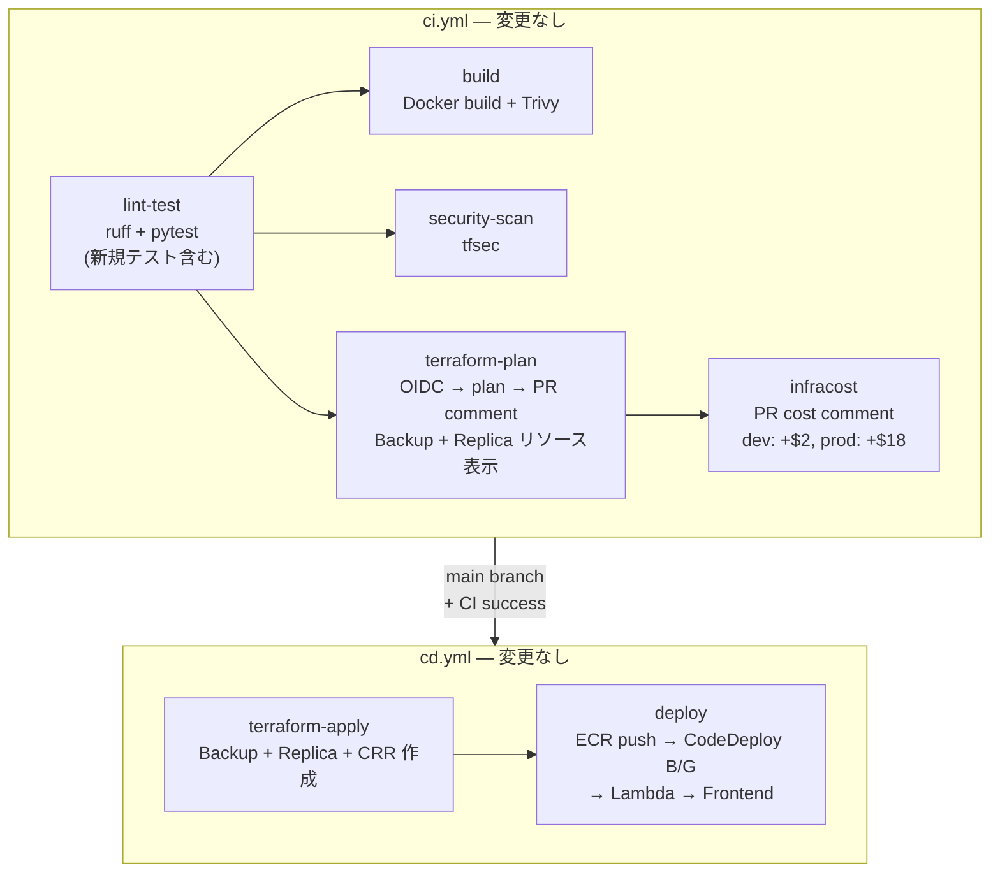
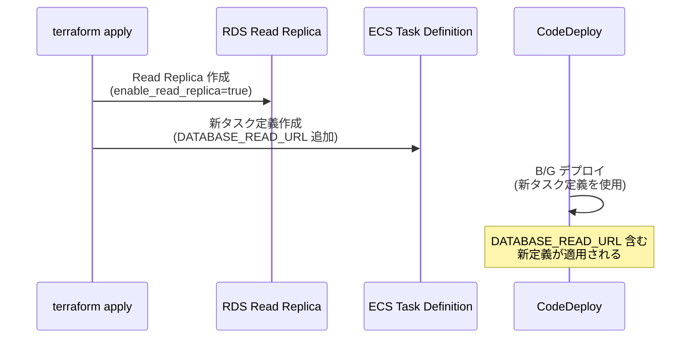

# CI/CD パイプライン設計書 (v12)

| 項目 | 内容 |
|------|------|
| プロジェクト名 | sample_cicd |
| 作成日 | 2026-04-10 |
| バージョン | 12.0 |
| 前バージョン | [cicd_v10.md](cicd_v10.md) (v10.0) |

## 変更概要

v12 の CI/CD パイプラインは**軽微変更**のみ。AWS Backup、RDS Read Replica、S3 CRR は全て Terraform で管理されるため、既存の `terraform plan` / `terraform apply` フローで自動デプロイされる。

- **CI**: 変更なし（テスト依存の追加不要）
- **CD**: 変更なし（新リソースは `terraform apply` で管理）

> ワークフローファイルの構造やジョブ構成は v10 から変更なし。

## 1. パイプライン全体像（v12）



## 2. CI 変更詳細

### 2.1 lint-test ジョブ

変更なし。`test_db_routing.py` は `SQLite` + `moto` の既存テストインフラで動作するため、新規テスト依存の追加は不要。

### 2.2 terraform-plan ジョブ

変更なし。v12 の新規リソース（Backup, Read Replica, S3 CRR）は `infra/` 配下に `.tf` ファイルとして追加されるため、既存の `terraform plan` フローで自動的に差分が検出・表示される。

PR コメントには以下のような表示が期待される:

```
# dev 環境（Read Replica + CRR 無効）
Plan: 8 to add, 3 to change, 0 to destroy.

# prod 環境（Read Replica + CRR 有効）
Plan: 16 to add, 3 to change, 0 to destroy.
```

### 2.3 infracost ジョブ

変更なし。v12 のリソース追加により、PR コメントに以下のようなコスト差分が表示される:

```
# dev 環境
Monthly cost will increase by $2 ▲

+ aws_backup_plan.main                   $1/mo (20GB × $0.05/GB)
~ aws_db_instance.main                   +$0.50/mo (backup storage)

# prod 環境
Monthly cost will increase by $18 ▲

+ aws_backup_plan.main                   $2/mo
+ aws_db_instance.read_replica[0]        $15/mo (db.t3.micro)
+ aws_s3_bucket.attachments_dr[0]        $1/mo (storage + transfer)
```

### 2.4 tfsec

新規リソースに対する tfsec スキャンは自動。以下の項目が検出される可能性:

| ルール | 対象 | 対応 |
|--------|------|------|
| `aws-s3-enable-versioning` | DR バケット | ✅ バージョニング有効化済み |
| `aws-s3-encryption-customer-key` | DR バケット | INFO（SSE-S3 で対応、CMK は学習用途では不要） |
| `aws-s3-block-public-access` | DR バケット | ✅ パブリックアクセスブロック設定済み |
| `aws-rds-backup-retention-specified` | RDS Primary | ✅ 7 日間に設定 |

## 3. CD 変更なし

v12 では CD ワークフローの変更は不要:

- **AWS Backup**: `terraform apply` で Vault + Plan + Selection 作成。デプロイアクション不要
- **RDS Read Replica**: `terraform apply` で条件付き作成（`enable_read_replica` 変数で制御）
- **S3 Lifecycle**: `terraform apply` で設定適用
- **S3 CRR**: `terraform apply` で条件付き設定（`enable_s3_replication` 変数で制御）
- **ECS**: `DATABASE_READ_URL` 環境変数の追加はタスク定義更新時に反映（CodeDeploy B/G で自動）

### 3.1 ECS 環境変数の反映フロー



> dev 環境では `enable_read_replica = false` のため `DATABASE_READ_URL = ""`。アプリの Graceful degradation により、Primary DB にフォールバック。

## 4. Docker イメージの変更

`app/database.py` の変更のみ。新規 Python パッケージの追加なし。Dockerfile の変更は不要（既存の `pip install -r requirements.txt` で対応）。

## 5. Terraform CI/CD の対象ファイル

v12 で追加・変更される `infra/` 配下のファイル:

| ファイル | 変更種別 | terraform plan 影響 |
|----------|---------|-------------------|
| `infra/backup.tf` | 新規 | +6 リソース |
| `infra/s3_dr.tf` | 新規 | +8 リソース (条件付き) |
| `infra/rds.tf` | 変更 | 1 変更 + 1 追加 (条件付き) |
| `infra/s3.tf` | 変更 | +1 リソース (Lifecycle) |
| `infra/main.tf` | 変更 | provider 追加のみ (リソース影響なし) |
| `infra/variables.tf` | 変更 | 変数のみ (リソース影響なし) |
| `infra/dev.tfvars` | 変更 | 変数値のみ |
| `infra/prod.tfvars` | 変更 | 変数値のみ |
| `infra/ecs.tf` | 変更 | タスク定義更新 |
| `infra/iam.tf` | 変更 | +3 リソース (Backup + Replication) |
| `infra/monitoring.tf` | 変更 | Dashboard 更新 + 1 Alarm |
| `infra/outputs.tf` | 変更 | 出力のみ |

## 6. まと���

v12 の CI/CD 変更は最小限:

1. **CI**: 変更なし。新規テスト(`test_db_routing.py`)は既存テストインフラで動作
2. **CD**: 変更なし。AWS Backup / Read Replica / S3 CRR は全て Terraform で管理
3. **Infracost**: 自動的にコスト差分を表示（dev: +$2, prod: +$18）
4. **terraform plan/apply**: dev 約 8 件、prod 約 16 件のリソース追加が自動表示・適用
5. **tfsec**: 新規リソースの自動スキャン。既知の WARNING なし

v9 で構築した CI/CD 自動化基盤が引き続き有効に機能し、v12 のインフラ変更が CI/CD の変更なしで対応できることを示す。
