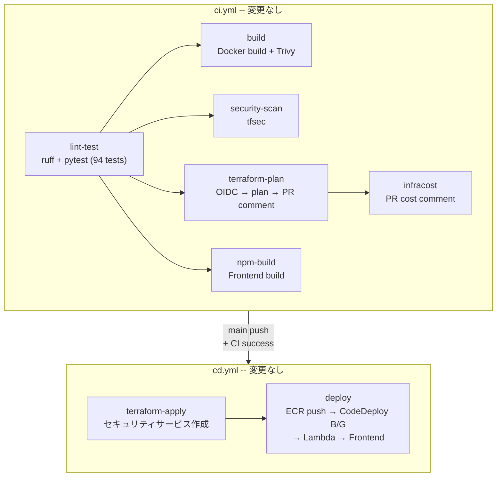

# CI/CD パイプライン設計書 (v13)

| 項目 | 内容 |
|------|------|
| プロジェクト名 | sample_cicd |
| 作成日 | 2026-04-10 |
| バージョン | 13.0 |
| 前バージョン | [cicd_v10.md](cicd_v10.md) (v10.0) |

## 1. 変更概要

v13（Security Monitoring + Compliance）では **CI/CD ワークフローの変更はない**。

CloudTrail、GuardDuty、AWS Config、Security Hub の全リソースは Terraform で管理されるため、既存の `terraform plan` / `terraform apply` フローで自動的にカバーされる。また、tfsec が新しい `.tf` ファイル（`cloudtrail.tf`、`guardduty.tf`、`config.tf`、`securityhub.tf`）を自動的にスキャンする。

- **CI**: ワークフロー変更なし
- **CD**: ワークフロー変更なし
- **アプリコード**: 変更なし

> ワークフローファイルの構造やジョブ構成は v10 から変更なし。

## 2. CI パイプライン影響分析

| ジョブ | 影響 | 説明 |
|--------|------|------|
| `lint-test` | なし | アプリコード変更なし。pytest 94 件は変更なし |
| `build` | なし | Dockerfile、依存パッケージの変更なし |
| `security-scan` (tfsec) | 自動対応 | 新規 `.tf` ファイルを自動スキャン。追加設定不要 |
| `terraform-plan` | 表示増加 | 新リソース約 25-30 個が plan 出力に表示される |
| `infracost` | コスト追加 | セキュリティサービスの月額コスト見積もりが追加される |
| `npm-build` | なし | フロントエンド変更なし |

## 3. CD パイプライン影響分析

| ジョブ | 影響 | 説明 |
|--------|------|------|
| `terraform-apply` | 新リソースのデプロイ | v13 の主な変更。セキュリティサービスの作成・有効化 |
| `deploy` (ECR + CodeDeploy B/G) | なし | ECS タスク定義の変更なし |
| `lambda-update` | なし | Lambda コードの変更なし |
| `frontend` | なし | フロントエンドの変更なし |

### 3.1 OIDC IAM 権限の追加

CD パイプラインが `terraform apply` で新リソースを作成するため、OIDC IAM ポリシー（`oidc.tf`）に以下の権限追加が必要:

- `guardduty:*`
- `securityhub:*`
- `config:*`
- `cloudtrail:*`

## 4. デプロイ順序の考慮事項

- `terraform apply` の実行順序は Terraform の依存関係グラフで自動解決される
- 特別なデプロイ手順は不要
- セキュリティサービス間の依存関係（例: Security Hub が GuardDuty の検出結果を集約）も Terraform が適切に処理する

## 5. 既存パイプライン構成（変更なし）

v9 で構築した CI/CD 自動化基盤が引き続き有効に機能し、v13 のセキュリティサービス追加が CI/CD の変更なしで対応できる。
