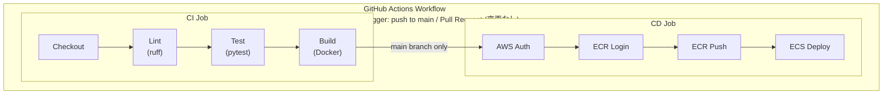

# CI/CD パイプライン設計書 (v3)

| 項目 | 内容 |
|------|------|
| プロジェクト名 | sample_cicd |
| 作成日 | 2026-04-03 |
| バージョン | 3.0 |
| 前バージョン | [cicd_v2.md](cicd_v2.md) (v2.0) |

## 変更概要

**v2 から変更なし。**

v3 の変更はすべて Terraform（インフラ）に閉じており、
アプリケーションコードおよび CI/CD パイプラインへの変更は発生しない。

## 1. パイプライン全体像（変更なし）



## 2. 変更箇所一覧

| # | 変更箇所 | v2 | v3 | 理由 |
|---|---------|-----|-----|------|
| — | （変更なし） | — | — | アプリコードに変更なし |

## 3. 変更なし項目

以下はすべて v2 から変更なし:

| 項目 | 説明 |
|------|------|
| トリガー条件 | push to main / PR to main |
| CI ジョブ構成 | Checkout → Setup Python → Install deps → Lint → Test → Build |
| CD ジョブ構成 | Checkout → AWS Auth → ECR Login → Build & Push → Render Task Def → Deploy |
| CD 実行条件 | CI 成功 + main ブランチ |
| デプロイ方式 | ローリングデプロイ（wait-for-service-stability: true） |
| イメージタグ戦略 | Git SHA (7文字) + latest |
| Actions バージョン管理 | SHA でピン留め |
| GitHub Secrets | AWS_ACCESS_KEY_ID, AWS_SECRET_ACCESS_KEY |
| Docker ビルドコンテキスト | `-f app/Dockerfile .`（プロジェクトルート） |
| テスト用 DB | SQLite インメモリ（`DATABASE_URL: "sqlite://"`） |

## 4. Auto Scaling との関係

ECS Auto Scaling が有効になると、ECS サービスの `desired_count` が動的に変化する。
しかし、CI/CD の `aws ecs deploy` コマンドはタスク定義の更新のみを行い、
`desired_count` を直接変更しない。そのため:

- **デプロイ中:** ローリングデプロイは Auto Scaling が管理するタスク数に基づいて実行される
- **デプロイ後:** Auto Scaling が引き続きタスク数を管理する
- **パイプライン変更:** 不要（`wait-for-service-stability: true` の動作に変化なし）

> **設計判断:** ECS サービスに Auto Scaling を設定した後も、
> `desired_count` の初期値（Terraform で管理）は Auto Scaling の下限（min: 1）として機能する。
> CI/CD パイプラインで `desired_count` を明示的に設定する必要はない。

## 5. テスト実行（変更なし）

v2 と同一。アプリコードの変更がないため、テストコマンドも変更なし。

```yaml
- name: Install dependencies
  run: |
    pip install -r app/requirements.txt
    pip install ruff pytest httpx

- name: Test
  run: pytest tests/ -v
```
