# CI/CD パイプライン設計書 (v6)

| 項目 | 内容 |
|------|------|
| プロジェクト名 | sample_cicd |
| 作成日 | 2026-04-06 |
| バージョン | 6.0 |
| 前バージョン | [cicd_v5.md](cicd_v5.md) (v5.0) |

## 変更概要

v6 ではフロントエンド（React SPA）のビルド・デプロイと X-Ray トレーシングの依存を CI/CD パイプラインに追加する。

- **CI**: Node.js 20 セットアップ + フロントエンドビルド追加、`aws-xray-sdk` は `app/requirements.txt` 経由で自動インストール
- **CD**: フロントエンドビルド → API URL 注入（`config.js`）→ S3 同期 → CloudFront キャッシュ無効化

## 1. パイプライン全体像（v6）

```mermaid
graph TB
    subgraph GHA["GitHub Actions Workflow<br>Trigger: push to main / Pull Request（変更なし）"]
        subgraph CI["CI Job（フロントエンド追加）<br>対象: app/ + tests/ + lambda/"]
            A[Checkout] --> B["Lint<br>(ruff)"]
            B --> C["Test<br>(pytest)"]
            C --> D[Docker Build]
            D --> E[Setup Node.js 20]
            E --> F["npm ci + npm run build<br>(frontend)"]
        end

        F -->|main branch only| G

        subgraph CD["CD Job（フロントエンドデプロイ追加）"]
            G[AWS Auth] --> H[ECR Login]
            H --> I["ECR Push<br>(Docker)"]
            I --> J["ECS Deploy<br>(dev env)"]
            J --> K["Lambda Deploy<br>(3 functions)<br>(dev env)"]
            K --> L[Setup Node.js 20]
            L --> M["npm ci + npm run build<br>(frontend)"]
            M --> N["API URL 注入<br>(config.js)"]
            N --> O["S3 sync<br>(webui)"]
            O --> P[CloudFront Invalidation]
        end
    end
```



## 2. 変更箇所一覧

| # | 変更箇所 | v5 | v6 | 理由 |
|---|---------|-----|-----|------|
| 1 | CI: Node.js セットアップ | なし | `actions/setup-node` (Node.js 20) | フロントエンドビルドに必要 |
| 2 | CI: フロントエンドビルド | なし | `npm ci && npm run build` | ビルドエラーの早期検出 |
| 3 | CI: Python 依存 | `moto[sqs,events,s3]` | `moto[sqs,events,s3]`（`aws-xray-sdk` は requirements.txt 経由） | X-Ray SDK が requirements.txt に追加済み |
| 4 | CD: Node.js セットアップ | なし | `actions/setup-node` (Node.js 20) | デプロイ用フロントエンドビルドに必要 |
| 5 | CD: フロントエンドビルド | なし | `npm ci && npm run build` | デプロイ用成果物の生成 |
| 6 | CD: API URL 注入 | なし | `config.js` に ALB DNS を書き込み | 環境別 API エンドポイント設定 |
| 7 | CD: S3 同期 | なし | `aws s3 sync frontend/dist/ s3://...-webui --delete` | フロントエンド配信 |
| 8 | CD: CloudFront 無効化 | なし | `aws cloudfront create-invalidation --paths "/*"` | キャッシュ即時反映 |

## 3. CI ジョブ変更詳細

### 3.1 依存パッケージインストール（変更あり）

`aws-xray-sdk` は `app/requirements.txt` に追加されているため、CI の `pip install -r app/requirements.txt` で自動的にインストールされる。明示的な変更は不要。

```yaml
# Before (v5) — 変更なし:
- name: Install dependencies
  run: |
    pip install -r app/requirements.txt
    pip install ruff pytest httpx "moto[sqs,events,s3]"
```

### 3.2 Node.js セットアップ（新規追加）

```yaml
- name: Setup Node.js
  uses: actions/setup-node@49933ea5288caeca8642195f572a2b2b8a0a4682 # v4
  with:
    node-version: "20"
```

> **SHA ピン留め:** プロジェクトの慣例に従い、`actions/setup-node` は commit SHA でピン留めする。
> 上記 SHA は `actions/setup-node@v4` に対応する。

### 3.3 フロントエンドビルド（新規追加）

```yaml
- name: Build frontend
  run: cd frontend && npm ci && npm run build
```

### 3.4 CI ジョブ全体（v6）

```yaml
ci:
  runs-on: ubuntu-latest
  steps:
    - name: Checkout
      uses: actions/checkout@34e114876b0b11c390a56381ad16ebd13914f8d5 # v4

    - name: Setup Python
      uses: actions/setup-python@a26af69be951a213d495a4c3e4e4022e16d87065 # v5
      with:
        python-version: "3.12"

    - name: Install dependencies
      run: |
        pip install -r app/requirements.txt
        pip install ruff pytest httpx "moto[sqs,events,s3]"

    - name: Lint
      run: ruff check app/ tests/ lambda/

    - name: Test
      env:
        DATABASE_URL: "sqlite://"
      run: pytest tests/ -v

    - name: Build Docker image
      run: docker build -t sample-cicd:test -f app/Dockerfile .

    - name: Setup Node.js
      uses: actions/setup-node@49933ea5288caeca8642195f572a2b2b8a0a4682 # v4
      with:
        node-version: "20"

    - name: Build frontend
      run: cd frontend && npm ci && npm run build
```

> **設計判断 - CI でもフロントエンドをビルドする理由:**
> CI でフロントエンドをビルドすることで、PR 段階でビルドエラー（TypeScript 型エラー、
> import パス不正、依存不整合など）を早期に検出できる。CD ジョブは main ブランチへの
> マージ後にしか実行されないため、CI で事前に検証しておくことが重要。

## 4. CD ジョブ変更詳細

### 4.1 Node.js セットアップ + フロントエンドビルド（新規追加）

Lambda デプロイステップの後に以下を追加する:

```yaml
- name: Setup Node.js
  uses: actions/setup-node@49933ea5288caeca8642195f572a2b2b8a0a4682 # v4
  with:
    node-version: "20"

- name: Build frontend
  run: cd frontend && npm ci && npm run build
```

> **設計判断 - CD でも `npm ci` を再実行する理由:**
> CI と CD は別ジョブ（別ランナー）で実行されるため、ファイルシステムは共有されない。
> CD ジョブでも `npm ci` から再実行してビルド成果物を生成する必要がある。

### 4.2 API URL 注入（新規追加）

```yaml
- name: Configure API URL
  run: |
    ALB_DNS=$(aws elbv2 describe-load-balancers \
      --names sample-cicd-${{ env.DEPLOY_ENV }}-alb \
      --query 'LoadBalancers[0].DNSName' --output text)
    echo "window.APP_CONFIG = { API_URL: 'http://${ALB_DNS}' };" > frontend/dist/config.js
```

> **設計判断 - ビルド時環境変数ではなく `config.js` を使う理由:**
> React のビルド時環境変数（`REACT_APP_*` / `VITE_*`）はビルド成果物に静的に埋め込まれる。
> この方法では環境ごとにビルドをやり直す必要があり、同一成果物を複数環境にデプロイする
> ことができない。`config.js` によるランタイム注入であれば:
>
> 1. **ビルドは 1 回、デプロイは環境ごと** — 同一の `npm run build` 成果物に対して
>    `config.js` だけ差し替えることで dev/prod 両方にデプロイ可能
> 2. **デプロイパイプラインで完結** — CI/CD の中で動的に ALB の DNS 名を取得して注入するため、
>    設定ファイルのハードコードや手動更新が不要
> 3. **キャッシュ制御が容易** — `config.js` のみ CloudFront で短い TTL を設定すれば、
>    API URL 変更時にフルビルドなしで反映可能

### 4.3 S3 同期（新規追加）

```yaml
- name: Deploy frontend to S3
  run: |
    aws s3 sync frontend/dist/ \
      s3://sample-cicd-${{ env.DEPLOY_ENV }}-webui \
      --delete \
      --region ap-northeast-1
```

> `--delete` フラグにより、S3 バケット内の不要ファイル（前回デプロイの残骸）が自動削除される。
> `frontend/dist/` のビルド成果物が S3 バケットの内容と完全に一致する。

### 4.4 CloudFront キャッシュ無効化（新規追加）

```yaml
- name: Invalidate CloudFront cache
  run: |
    DIST_ID=$(aws cloudfront list-distributions \
      --query "DistributionList.Items[?Comment=='sample-cicd-${{ env.DEPLOY_ENV }} webui CDN'].Id" \
      --output text)
    aws cloudfront create-invalidation \
      --distribution-id $DIST_ID \
      --paths "/*"
```

> **設計判断 - Distribution ID の動的取得:**
> Distribution ID をハードコードや GitHub Secrets で管理するのではなく、
> `Comment` タグをキーにして動的に取得する。Terraform で CloudFront Distribution に
> 設定した `comment` と一致させることで、環境名を変えるだけで正しい Distribution を特定できる。

> **設計判断 - `/*` によるフルパス無効化:**
> フロントエンドのデプロイでは JS/CSS のファイル名にハッシュが含まれるため、
> 実際にキャッシュ無効化が必要なのは `index.html` と `config.js` 程度。
> しかし v6 の学習スコープでは簡潔さを優先し `/*` で全パスを無効化する。
> 本番では無効化パスを限定するか、ファイル名ハッシュ戦略に依存してキャッシュ無効化自体を省略することも検討できる。

### 4.5 CD ジョブ全体（v6）

```yaml
cd:
  needs: ci
  if: github.ref == 'refs/heads/main'
  runs-on: ubuntu-latest
  env:
    DEPLOY_ENV: dev
    AWS_REGION: ap-northeast-1
  steps:
    - name: Checkout
      uses: actions/checkout@34e114876b0b11c390a56381ad16ebd13914f8d5 # v4

    - name: Configure AWS credentials
      uses: aws-actions/configure-aws-credentials@7474bc4690e29a8392af63c5b98e7449536d5c3a # v4
      with:
        aws-access-key-id: ${{ secrets.AWS_ACCESS_KEY_ID }}
        aws-secret-access-key: ${{ secrets.AWS_SECRET_ACCESS_KEY }}
        aws-region: ap-northeast-1

    - name: Login to Amazon ECR
      id: login-ecr
      uses: aws-actions/amazon-ecr-login@f2e9fc6c2b355c1890b65e6f6f0e2ac3e6e22f78 # v2

    - name: Build, tag, and push image to ECR
      id: build-image
      env:
        ECR_REGISTRY: ${{ steps.login-ecr.outputs.registry }}
        ECR_REPOSITORY: sample-cicd-${{ env.DEPLOY_ENV }}
        IMAGE_TAG: ${{ github.sha }}
      run: |
        SHORT_SHA=$(echo $IMAGE_TAG | cut -c1-7)
        docker build -t $ECR_REGISTRY/$ECR_REPOSITORY:$SHORT_SHA -f app/Dockerfile .
        docker tag $ECR_REGISTRY/$ECR_REPOSITORY:$SHORT_SHA $ECR_REGISTRY/$ECR_REPOSITORY:latest
        docker push $ECR_REGISTRY/$ECR_REPOSITORY:$SHORT_SHA
        docker push $ECR_REGISTRY/$ECR_REPOSITORY:latest
        echo "image=$ECR_REGISTRY/$ECR_REPOSITORY:$SHORT_SHA" >> $GITHUB_OUTPUT

    - name: Download current task definition
      run: |
        aws ecs describe-task-definition --task-definition sample-cicd-${{ env.DEPLOY_ENV }} \
          --query taskDefinition > task-definition.json

    - name: Render Amazon ECS task definition
      id: task-def
      uses: aws-actions/amazon-ecs-render-task-definition@77954e213ba1f9f9cb016b86a1d4f6fcdea0d57e # v1
      with:
        task-definition: task-definition.json
        container-name: app
        image: ${{ steps.build-image.outputs.image }}

    - name: Deploy Amazon ECS task definition
      uses: aws-actions/amazon-ecs-deploy-task-definition@fc8fc60f3a60ffd500fcb13b209c59d221ac8c8c # v2
      with:
        task-definition: ${{ steps.task-def.outputs.task-definition }}
        service: sample-cicd-${{ env.DEPLOY_ENV }}
        cluster: sample-cicd-${{ env.DEPLOY_ENV }}
        wait-for-service-stability: true

    - name: Package and deploy Lambda functions
      run: |
        for func in task_created_handler task_completed_handler task_cleanup_handler; do
          zip -j "lambda/${func}.zip" "lambda/${func}.py"
          aws lambda update-function-code \
            --function-name "sample-cicd-${{ env.DEPLOY_ENV }}-${func//_/-}" \
            --zip-file "fileb://lambda/${func}.zip" \
            --region ap-northeast-1
        done

    - name: Setup Node.js
      uses: actions/setup-node@49933ea5288caeca8642195f572a2b2b8a0a4682 # v4
      with:
        node-version: "20"

    - name: Build frontend
      run: cd frontend && npm ci && npm run build

    - name: Configure API URL
      run: |
        ALB_DNS=$(aws elbv2 describe-load-balancers \
          --names sample-cicd-${{ env.DEPLOY_ENV }}-alb \
          --query 'LoadBalancers[0].DNSName' --output text)
        echo "window.APP_CONFIG = { API_URL: 'http://${ALB_DNS}' };" > frontend/dist/config.js

    - name: Deploy frontend to S3
      run: |
        aws s3 sync frontend/dist/ \
          s3://sample-cicd-${{ env.DEPLOY_ENV }}-webui \
          --delete \
          --region ap-northeast-1

    - name: Invalidate CloudFront cache
      run: |
        DIST_ID=$(aws cloudfront list-distributions \
          --query "DistributionList.Items[?Comment=='sample-cicd-${{ env.DEPLOY_ENV }} webui CDN'].Id" \
          --output text)
        aws cloudfront create-invalidation \
          --distribution-id $DIST_ID \
          --paths "/*"
```

## 5. IAM 権限変更

### 5.1 v6 で追加が必要な権限

```
v6 追加:
  s3:PutObject        (arn:aws:s3:::sample-cicd-dev-webui/*)
  s3:DeleteObject      (arn:aws:s3:::sample-cicd-dev-webui/*)
  s3:ListBucket        (arn:aws:s3:::sample-cicd-dev-webui)
  cloudfront:CreateInvalidation
  cloudfront:ListDistributions
  elasticloadbalancing:DescribeLoadBalancers
```

> **S3 権限:** `aws s3 sync --delete` は PutObject（アップロード）、DeleteObject（不要ファイル削除）、
> ListBucket（差分検出）の 3 権限を必要とする。webui バケットのみに制限する。

> **CloudFront 権限:** `ListDistributions` は Distribution ID の動的取得に、
> `CreateInvalidation` はキャッシュ無効化に必要。

> **ELB 権限:** `DescribeLoadBalancers` は ALB の DNS 名取得に必要。
> API URL 注入ステップで使用する。

### 5.2 IAM 権限一覧（累積）

```
ECR:
  ecr:GetAuthorizationToken
  ecr:BatchCheckLayerAvailability, ecr:PutImage, ...

ECS:
  ecs:RegisterTaskDefinition, ecs:DescribeServices, ecs:UpdateService, ...

Lambda:
  lambda:UpdateFunctionCode（3 関数の ARN のみ）

S3 (v6 追加):
  s3:PutObject, s3:DeleteObject   (arn:aws:s3:::sample-cicd-dev-webui/*)
  s3:ListBucket                    (arn:aws:s3:::sample-cicd-dev-webui)

CloudFront (v6 追加):
  cloudfront:CreateInvalidation
  cloudfront:ListDistributions

ELB (v6 追加):
  elasticloadbalancing:DescribeLoadBalancers
```

## 6. 変更なし項目

| 項目 | 説明 |
|------|------|
| トリガー条件 | push to main / PR to main |
| CI/CD ジョブ分離 | CI 成功 + main ブランチの場合のみ CD 実行 |
| デプロイ方式（ECS） | ローリングデプロイ（`wait-for-service-stability: true`） |
| イメージタグ戦略 | Git SHA (7文字) + latest |
| Actions バージョン管理 | SHA でピン留め |
| GitHub Secrets | `AWS_ACCESS_KEY_ID`, `AWS_SECRET_ACCESS_KEY`（変更なし） |
| Docker ビルドコンテキスト | `-f app/Dockerfile .`（プロジェクトルート） |
| テスト用 DB | SQLite インメモリ（`DATABASE_URL: "sqlite://"`） |
| Lint 対象 | `app/ tests/ lambda/`（変更なし） |
| テスト依存 | `moto[sqs,events,s3]`（変更なし） |
| Lambda デプロイ方式 | zip + `update-function-code`（v4 から変更なし） |
| 環境変数 `DEPLOY_ENV` | `dev` 固定（v5 から変更なし） |

## 7. フロントエンドデプロイと既存デプロイの関係

| 項目 | ECS (FastAPI) | Lambda | フロントエンド (SPA) |
|------|--------------|--------|---------------------|
| デプロイ方式 | Docker → ECR → ECS rolling | zip → `update-function-code` | `npm run build` → S3 sync → CloudFront invalidation |
| 配信元 | ALB | AWS Lambda サービス | CloudFront → S3 |
| ロールバック | 旧 ECR タグで ECS タスク定義更新 | 旧 zip を再アップロード | 旧ビルド成果物を S3 に再同期 |
| 設定変更 | Terraform（タスク定義の環境変数） | Terraform（Lambda 環境変数） | CI/CD で `config.js` を動的生成 |

> **設計判断 - デプロイ順序（ECS → Lambda → フロントエンド）:**
> フロントエンドは最後にデプロイする。理由は以下の通り:
>
> 1. フロントエンドは API（ECS）を呼び出す側であるため、API が先にデプロイされていることが望ましい
> 2. `config.js` の API URL 注入ステップで ALB の DNS 名を取得するため、ECS デプロイ後に実行する必要がある
> 3. Lambda はバックエンド処理のため、フロントエンドとの直接的な依存はないが、
>    全バックエンドの更新完了後にフロントエンドを配信する方が整合性が高い
