# CI/CD パイプライン設計書 (v7)

| 項目 | 内容 |
|------|------|
| プロジェクト名 | sample_cicd |
| 作成日 | 2026-04-07 |
| バージョン | 7.0 |
| 前バージョン | [cicd_v6.md](cicd_v6.md) (v6.0) |

## 変更概要

v7 の CI/CD パイプライン変更は**軽微**。主に CD ジョブの `config.js` 生成ステップに Cognito 設定の注入を追加する。

- **CI**: 変更なし（`python-jose[cryptography]` は `app/requirements.txt` 経由で自動インストール、`amazon-cognito-identity-js` は `frontend/package.json` 経由で自動インストール）
- **CD**: `config.js` に Cognito User Pool ID と App Client ID を追加注入

## 1. パイプライン全体像（v7）

```mermaid
graph TB
    subgraph GHA["GitHub Actions Workflow<br>Trigger: push to main / Pull Request（変更なし）"]
        subgraph CI["CI Job（変更なし）"]
            A[Checkout] --> B[Lint]
            B --> C[Test]
            C --> D[Docker Build]
            D --> E[Node Setup]
            E --> F[npm Build]
        end

        F -->|main branch only| G

        subgraph CD["CD Job（config.js 変更のみ）"]
            G[AWS Auth] --> H[ECR Push]
            H --> I[ECS Deploy]
            I --> J[Lambda Deploy]
            J --> K[Node Setup]
            K --> L[npm Build]
            L --> M["Configure App<br>(config.js に Cognito 設定を追加注入)"]
            M --> N[S3 sync]
            N --> O[CloudFront Invalidation]
        end
    end
```



## 2. 変更箇所一覧

| # | 変更箇所 | v6 | v7 | 理由 |
|---|---------|-----|-----|------|
| 1 | CD: config.js 生成 | API_URL のみ | API_URL + COGNITO_USER_POOL_ID + COGNITO_APP_CLIENT_ID | フロントエンドが Cognito に接続するために必要 |

> v7 の変更は上記 1 箇所のみ。CI ジョブ、ECS デプロイ、Lambda デプロイ、S3 sync、CloudFront invalidation は全て変更なし。

## 3. CD ジョブ変更詳細

### 3.1 Configure App ステップ（変更）

```yaml
# Before (v6):
- name: Configure API URL
  run: |
    WEBUI_CF_DOMAIN=$(aws cloudfront list-distributions \
      --query "DistributionList.Items[?Comment=='sample-cicd-${{ env.DEPLOY_ENV }} webui CDN'].DomainName" \
      --output text)
    echo "window.APP_CONFIG = { API_URL: 'https://${WEBUI_CF_DOMAIN}' };" > frontend/dist/config.js

# After (v7):
- name: Configure App
  run: |
    WEBUI_CF_DOMAIN=$(aws cloudfront list-distributions \
      --query "DistributionList.Items[?Comment=='sample-cicd-${{ env.DEPLOY_ENV }} webui CDN'].DomainName" \
      --output text)
    COGNITO_POOL_ID=$(aws cognito-idp list-user-pools --max-results 10 \
      --query "UserPools[?Name=='sample-cicd-${{ env.DEPLOY_ENV }}-users'].Id" \
      --output text)
    COGNITO_CLIENT_ID=$(aws cognito-idp list-user-pool-clients \
      --user-pool-id ${COGNITO_POOL_ID} \
      --query "UserPoolClients[?ClientName=='sample-cicd-${{ env.DEPLOY_ENV }}-spa'].ClientId" \
      --output text)
    cat > frontend/dist/config.js << EOF
    window.APP_CONFIG = {
      API_URL: 'https://${WEBUI_CF_DOMAIN}',
      COGNITO_USER_POOL_ID: '${COGNITO_POOL_ID}',
      COGNITO_APP_CLIENT_ID: '${COGNITO_CLIENT_ID}'
    };
    EOF
```

> **設計判断 - Cognito 設定を config.js で注入する理由:**
> Cognito User Pool ID と App Client ID はシークレットではない（公開情報）。
> SPA のビルド成果物に静的に埋め込むと環境ごとのビルドが必要になるため、
> v6 の API_URL と同じ `config.js` パターンで動的注入する。

> **設計判断 - terraform output ではなく AWS CLI で取得する理由:**
> CD ジョブのランナーに Terraform はインストールされておらず、state ファイルへの
> アクセスもない。AWS CLI で動的に取得する方式を継続する（v6 と同パターン）。

## 4. IAM 権限変更

### 4.1 v7 で追加が必要な権限

```
v7 追加:
  cognito-idp:ListUserPools          (config.js 生成で User Pool ID を取得)
  cognito-idp:ListUserPoolClients    (config.js 生成で App Client ID を取得)
```

### 4.2 IAM 権限一覧（累積）

```
ECR:
  ecr:GetAuthorizationToken, ecr:BatchCheckLayerAvailability, ecr:PutImage, ...

ECS:
  ecs:RegisterTaskDefinition, ecs:DescribeServices, ecs:UpdateService, ...
  ecs:DescribeTaskDefinition

Lambda:
  lambda:UpdateFunctionCode（3 関数の ARN のみ）

S3:
  s3:PutObject, s3:DeleteObject   (arn:aws:s3:::sample-cicd-dev-webui/*)
  s3:ListBucket                    (arn:aws:s3:::sample-cicd-dev-webui)

CloudFront:
  cloudfront:CreateInvalidation
  cloudfront:ListDistributions

ELB:
  elasticloadbalancing:DescribeLoadBalancers

Cognito (v7 追加):
  cognito-idp:ListUserPools
  cognito-idp:ListUserPoolClients
```

## 5. 変更なし項目

| 項目 | 説明 |
|------|------|
| トリガー条件 | push to main / PR to main |
| CI/CD ジョブ分離 | CI 成功 + main ブランチの場合のみ CD 実行 |
| デプロイ方式（ECS） | ローリングデプロイ（`wait-for-service-stability: true`） |
| イメージタグ戦略 | Git SHA (7文字) + latest |
| Actions バージョン管理 | SHA でピン留め |
| GitHub Secrets | `AWS_ACCESS_KEY_ID`, `AWS_SECRET_ACCESS_KEY`（変更なし） |
| Docker ビルドコンテキスト | `-f app/Dockerfile .`（プロジェクトルート） |
| テスト用 DB | SQLite インメモリ（`DATABASE_URL: "sqlite://"`） |
| Lint 対象 | `app/ tests/ lambda/`（変更なし） |
| テスト依存 | `moto[sqs,events,s3]`（変更なし） |
| Lambda デプロイ方式 | zip + `update-function-code` |
| 環境変数 `DEPLOY_ENV` | `dev` 固定 |
| フロントエンドデプロイ | npm build → S3 sync → CloudFront invalidation（変更なし） |

## 6. config.js の v6 → v7 差分

```javascript
// v6:
window.APP_CONFIG = {
  API_URL: 'https://dXXXXXXXXXXXXX.cloudfront.net'
};

// v7:
window.APP_CONFIG = {
  API_URL: 'https://dXXXXXXXXXXXXX.cloudfront.net',
  COGNITO_USER_POOL_ID: 'ap-northeast-1_XXXXXXXXX',
  COGNITO_APP_CLIENT_ID: 'xxxxxxxxxxxxxxxxxxxxxxxxxx'
};
```

フロントエンドの `cognito.js` は `window.APP_CONFIG` からこれらの値を読み取って Cognito SDK を初期化する。
