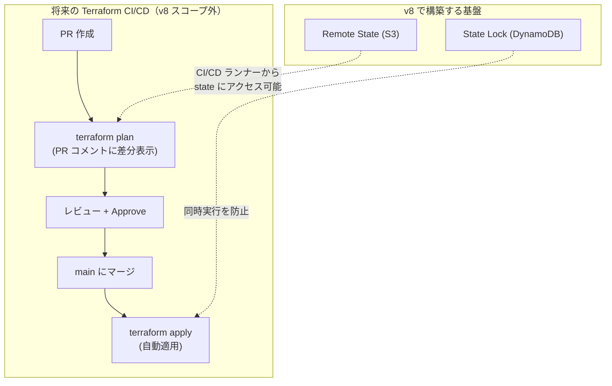

# CI/CD パイプライン設計書 (v8)

| 項目 | 内容 |
|------|------|
| プロジェクト名 | sample_cicd |
| 作成日 | 2026-04-07 |
| バージョン | 8.0 |
| 前バージョン | [cicd_v7.md](cicd_v7.md) (v7.0) |

## 変更概要

v8 の CI/CD パイプライン変更は**軽微**。CD ジョブの `config.js` 生成で API_URL をカスタムドメインに変更し、ECS の CORS 設定を更新する。

- **CI**: 変更なし（既存テスト 62 件が PASS すれば OK）
- **CD**: `config.js` の `API_URL` をカスタムドメインに更新、`CORS_ALLOWED_ORIGINS` の更新

## 1. パイプライン全体像（v8）

```mermaid
graph TB
    subgraph GHA["GitHub Actions Workflow<br>Trigger: push to main / Pull Request（変更なし）"]
        subgraph CI["CI Job（変更なし）"]
            A[Checkout] --> B[Lint]
            B --> C[Test]
            C --> D[Docker Build]
            D --> E[Node Setup]
            E --> F[npm Build]
        end

        F -->|main branch only| G

        subgraph CD["CD Job（config.js + CORS 変更）"]
            G[AWS Auth] --> H[ECR Push]
            H --> I[ECS Deploy]
            I --> J[Lambda Deploy]
            J --> K[Node Setup]
            K --> L[npm Build]
            L --> M["Configure App<br>(config.js の API_URL を<br>カスタムドメインに変更)"]
            M --> N[S3 sync]
            N --> O[CloudFront Invalidation]
        end
    end
```



## 2. 変更箇所一覧

| # | 変更箇所 | v7 | v8 | 理由 |
|---|---------|-----|-----|------|
| 1 | CD: config.js 生成 | `API_URL: CloudFront ドメイン` | `API_URL: カスタムドメイン` | カスタムドメインで API にアクセスするため |
| 2 | CD: ECS タスク定義 | `CORS_ALLOWED_ORIGINS: CloudFront URL` | `CORS_ALLOWED_ORIGINS: カスタムドメイン URL` | CORS 許可オリジンをカスタムドメインに変更 |

> v8 の変更は上記 2 箇所のみ。CI ジョブ、ECR Push、Lambda デプロイ、S3 sync、CloudFront invalidation は全て変更なし。

## 3. CD ジョブ変更詳細

### 3.1 Configure App ステップ（変更）

```yaml
# Before (v7):
- name: Configure App
  run: |
    WEBUI_CF_DOMAIN=$(aws cloudfront list-distributions \
      --query "DistributionList.Items[?Comment=='sample-cicd-${{ env.DEPLOY_ENV }} webui CDN'].DomainName" \
      --output text)
    COGNITO_POOL_ID=$(aws cognito-idp list-user-pools --max-results 10 \
      --query "UserPools[?Name=='sample-cicd-${{ env.DEPLOY_ENV }}-users'].Id" \
      --output text)
    COGNITO_CLIENT_ID=$(aws cognito-idp list-user-pool-clients \
      --user-pool-id ${COGNITO_POOL_ID} \
      --query "UserPoolClients[?ClientName=='sample-cicd-${{ env.DEPLOY_ENV }}-spa'].ClientId" \
      --output text)
    cat > frontend/dist/config.js << EOF
    window.APP_CONFIG = {
      API_URL: 'https://${WEBUI_CF_DOMAIN}',
      COGNITO_USER_POOL_ID: '${COGNITO_POOL_ID}',
      COGNITO_APP_CLIENT_ID: '${COGNITO_CLIENT_ID}'
    };
    EOF

# After (v8):
- name: Configure App
  run: |
    # カスタムドメインが設定されている場合はカスタムドメインを使用
    # 未設定の場合は CloudFront ドメインにフォールバック
    CUSTOM_DOMAIN="${{ vars.CUSTOM_DOMAIN_NAME }}"
    if [ -n "${CUSTOM_DOMAIN}" ]; then
      APP_DOMAIN="${CUSTOM_DOMAIN}"
    else
      APP_DOMAIN=$(aws cloudfront list-distributions \
        --query "DistributionList.Items[?Comment=='sample-cicd-${{ env.DEPLOY_ENV }} webui CDN'].DomainName" \
        --output text)
    fi
    COGNITO_POOL_ID=$(aws cognito-idp list-user-pools --max-results 10 \
      --query "UserPools[?Name=='sample-cicd-${{ env.DEPLOY_ENV }}-users'].Id" \
      --output text)
    COGNITO_CLIENT_ID=$(aws cognito-idp list-user-pool-clients \
      --user-pool-id ${COGNITO_POOL_ID} \
      --query "UserPoolClients[?ClientName=='sample-cicd-${{ env.DEPLOY_ENV }}-spa'].ClientId" \
      --output text)
    cat > frontend/dist/config.js << EOF
    window.APP_CONFIG = {
      API_URL: 'https://${APP_DOMAIN}',
      COGNITO_USER_POOL_ID: '${COGNITO_POOL_ID}',
      COGNITO_APP_CLIENT_ID: '${COGNITO_CLIENT_ID}'
    };
    EOF
```

> **設計判断 - GitHub Actions Variables を使用する理由:**
> カスタムドメイン名はシークレットではないため、GitHub Actions の Repository Variables
> (`vars.CUSTOM_DOMAIN_NAME`) で管理する。Secrets ではなく Variables を使うことで、
> ワークフローのログに値が表示され、デバッグが容易になる。
> 未設定時は CloudFront ドメインにフォールバックするため、下位互換性を維持する。

### 3.2 CORS_ALLOWED_ORIGINS の更新

ECS タスク定義の `CORS_ALLOWED_ORIGINS` 環境変数は Terraform の `ecs.tf` で管理されている。
v8 では `dev.tfvars` / `prod.tfvars` の `cors_allowed_origins` をカスタムドメインに更新するため、
CI/CD ワークフロー側の変更は不要（Terraform apply で反映）。

```hcl
# dev.tfvars (v8):
cors_allowed_origins = ["https://dev.sample-cicd.click"]

# prod.tfvars (v8):
cors_allowed_origins = ["https://sample-cicd.click"]
```

> **注意**: CORS は Terraform で ECS タスク定義に注入されるため、
> `terraform apply` 後の ECS サービス更新（ローリングデプロイ）で反映される。
> CI/CD の CD ジョブでの追加対応は不要。

## 4. GitHub Actions Variables 追加

| 変数名 | タイプ | 値（dev） | 説明 |
|--------|--------|----------|------|
| `CUSTOM_DOMAIN_NAME` | Repository Variable | `dev.sample-cicd.click` | カスタムドメイン名。未設定時は CloudFront ドメインにフォールバック |

> prod 環境デプロイ時は `DEPLOY_ENV` と合わせて Variables を切り替える。
> 将来的に GitHub Environments を使用して環境ごとの Variables を分離可能。

## 5. IAM 権限変更

v8 で追加が必要な IAM 権限はない。v7 の権限一覧をそのまま継続する。

### 5.1 IAM 権限一覧（累積、v7 と同一）

```
ECR:
  ecr:GetAuthorizationToken, ecr:BatchCheckLayerAvailability, ecr:PutImage, ...

ECS:
  ecs:RegisterTaskDefinition, ecs:DescribeServices, ecs:UpdateService, ...
  ecs:DescribeTaskDefinition

Lambda:
  lambda:UpdateFunctionCode（3 関数の ARN のみ）

S3:
  s3:PutObject, s3:DeleteObject   (arn:aws:s3:::sample-cicd-dev-webui/*)
  s3:ListBucket                    (arn:aws:s3:::sample-cicd-dev-webui)

CloudFront:
  cloudfront:CreateInvalidation
  cloudfront:ListDistributions

ELB:
  elasticloadbalancing:DescribeLoadBalancers

Cognito (v7):
  cognito-idp:ListUserPools
  cognito-idp:ListUserPoolClients
```

## 6. 将来の Terraform CI/CD 統合

v8 では Remote State（S3 + DynamoDB）を導入するが、`terraform plan` / `terraform apply` の
CI/CD 統合は**スコープ外**とする。以下は将来の拡張に向けた基盤説明。

### 6.1 想定される Terraform CI/CD フロー



### 6.2 v8 Remote State が CI/CD 統合を可能にする理由

| 課題（v7 以前） | 解決（v8） |
|----------------|----------|
| State がローカルファイル → CI/CD ランナーからアクセス不可 | S3 に保存 → IAM で CI/CD ランナーにアクセス許可可能 |
| 複数人が同時に apply → state 競合 | DynamoDB ロックで排他制御 |
| State がリポジトリにコミット → セキュリティリスク | S3 で管理 → `.gitignore` に `*.tfstate` 追加 |

### 6.3 CI/CD 統合に必要な追加 IAM 権限（将来）

```
# Terraform plan/apply 用（v8 スコープ外）
s3:GetObject, s3:PutObject       (arn:aws:s3:::sample-cicd-tfstate/*)
s3:ListBucket                     (arn:aws:s3:::sample-cicd-tfstate)
dynamodb:GetItem, dynamodb:PutItem, dynamodb:DeleteItem
                                  (arn:aws:dynamodb:*:*:table/sample-cicd-tflock)
# + Terraform が管理する全リソースの CRUD 権限
```

## 7. 変更なし項目

| 項目 | 説明 |
|------|------|
| トリガー条件 | push to main / PR to main |
| CI/CD ジョブ分離 | CI 成功 + main ブランチの場合のみ CD 実行 |
| デプロイ方式（ECS） | ローリングデプロイ（`wait-for-service-stability: true`） |
| イメージタグ戦略 | Git SHA (7文字) + latest |
| Actions バージョン管理 | SHA でピン留め |
| GitHub Secrets | `AWS_ACCESS_KEY_ID`, `AWS_SECRET_ACCESS_KEY`（変更なし） |
| Docker ビルドコンテキスト | `-f app/Dockerfile .`（プロジェクトルート） |
| テスト用 DB | SQLite インメモリ（`DATABASE_URL: "sqlite://"`） |
| Lint 対象 | `app/ tests/ lambda/`（変更なし） |
| テスト依存 | `moto[sqs,events,s3]`（変更なし） |
| Lambda デプロイ方式 | zip + `update-function-code` |
| 環境変数 `DEPLOY_ENV` | `dev` 固定 |
| フロントエンドデプロイ | npm build → S3 sync → CloudFront invalidation（変更なし） |
| テスト件数 | 62 件（変更なし、v8 でテスト追加は不要） |

## 8. config.js の v7 → v8 差分

```javascript
// v7:
window.APP_CONFIG = {
  API_URL: 'https://dXXXXXXXXXXXXX.cloudfront.net',
  COGNITO_USER_POOL_ID: 'ap-northeast-1_XXXXXXXXX',
  COGNITO_APP_CLIENT_ID: 'xxxxxxxxxxxxxxxxxxxxxxxxxx'
};

// v8:
window.APP_CONFIG = {
  API_URL: 'https://dev.sample-cicd.click',
  COGNITO_USER_POOL_ID: 'ap-northeast-1_XXXXXXXXX',
  COGNITO_APP_CLIENT_ID: 'xxxxxxxxxxxxxxxxxxxxxxxxxx'
};
```

> 変更は `API_URL` のみ。CloudFront ドメインからカスタムドメインに変更される。
> Cognito 設定は v7 から変更なし。
