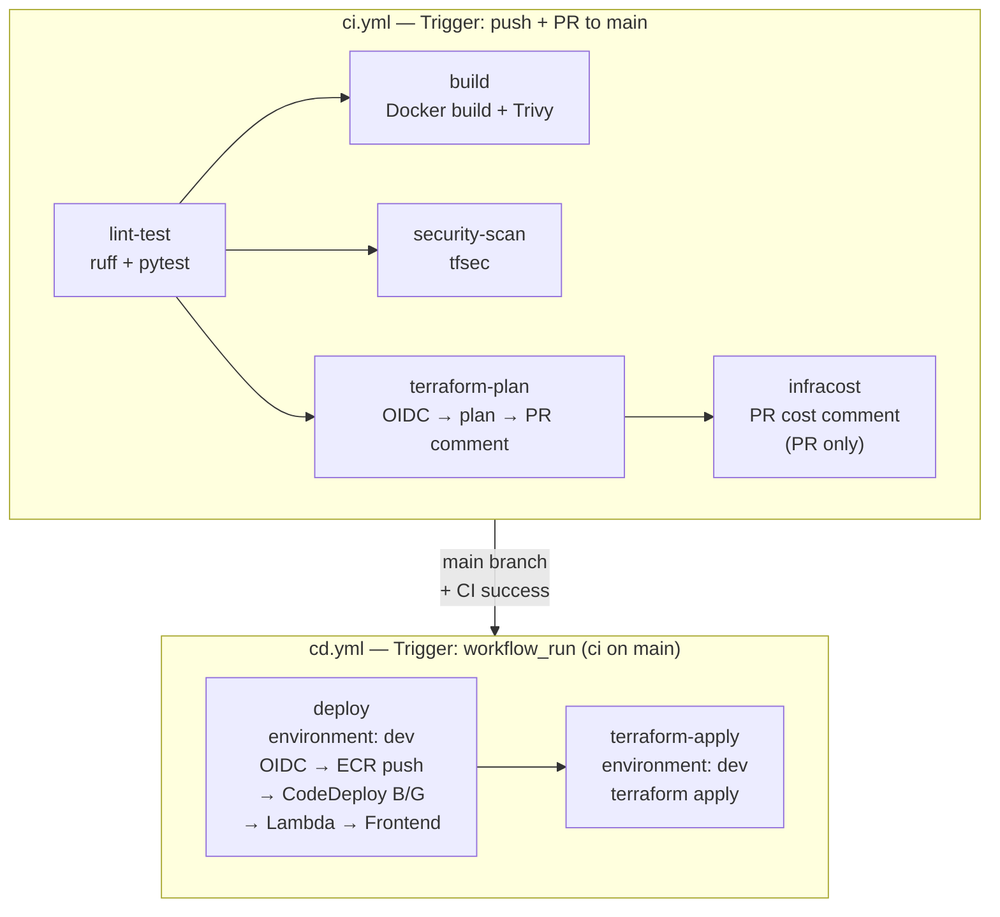

# CI/CD パイプライン設計書 (v9)

| 項目 | 内容 |
|------|------|
| プロジェクト名 | sample_cicd |
| 作成日 | 2026-04-08 |
| バージョン | 9.0 |
| 前バージョン | [cicd_v8.md](cicd_v8.md) (v8.0) |

## 変更概要

v9 の CI/CD パイプラインは**大幅変更**。既存の `ci-cd.yml` を `ci.yml` + `cd.yml` に分割し、セキュリティスキャン・Terraform CI/CD・OIDC 認証・CodeDeploy B/G デプロイを統合する。

- **CI**: lint + test + Docker build + **Trivy** + **tfsec** + **terraform plan** + **Infracost**
- **CD**: OIDC 認証 + ECR push + **CodeDeploy B/G** + Lambda + Frontend + **terraform apply**
- **認証**: Access Key → **OIDC** に移行
- **旧ファイル**: `ci-cd.yml` は削除

## 1. パイプライン全体像（v9）



## 2. ci.yml 詳細設計

### 2.1 ワークフロー定義

```yaml
name: CI

on:
  push:
    branches: [main]
  pull_request:
    branches: [main]

permissions:
  contents: read
  id-token: write          # OIDC token for terraform plan
  pull-requests: write     # PR comments (terraform plan, Infracost)
  security-events: write   # SARIF upload (Trivy)

concurrency:
  group: ci-${{ github.ref }}
  cancel-in-progress: true
```

### 2.2 lint-test ジョブ

```yaml
jobs:
  lint-test:
    runs-on: ubuntu-latest
    steps:
      - name: Checkout
        uses: actions/checkout@34e114876b0b11c390a56381ad16ebd13914f8d5 # v4

      - name: Setup Python
        uses: actions/setup-python@a26af69be951a213d495a4c3e4e4022e16d87065 # v5
        with:
          python-version: "3.12"

      - name: Install dependencies
        run: |
          pip install -r app/requirements.txt
          pip install ruff pytest httpx "moto[sqs,events,s3]"

      - name: Lint
        run: ruff check app/ tests/ lambda/

      - name: Test
        env:
          DATABASE_URL: "sqlite://"
        run: pytest tests/ -v
```

> 変更なし。v8 と同一。

### 2.3 build ジョブ（Trivy 追加）

```yaml
  build:
    needs: lint-test
    runs-on: ubuntu-latest
    steps:
      - name: Checkout
        uses: actions/checkout@34e114876b0b11c390a56381ad16ebd13914f8d5 # v4

      - name: Build Docker image
        run: docker build -t sample-cicd:ci -f app/Dockerfile .

      - name: Run Trivy vulnerability scanner
        uses: aquasecurity/trivy-action@COMMIT_SHA  # 実装時に最新 SHA を取得
        with:
          image-ref: "sample-cicd:ci"
          format: "table"
          exit-code: "1"
          severity: "HIGH,CRITICAL"

      - name: Run Trivy (SARIF output)
        if: always()
        uses: aquasecurity/trivy-action@COMMIT_SHA
        with:
          image-ref: "sample-cicd:ci"
          format: "sarif"
          output: "trivy-results.sarif"
          severity: "HIGH,CRITICAL"

      - name: Upload Trivy SARIF
        if: always()
        uses: github/codeql-action/upload-sarif@COMMIT_SHA
        with:
          sarif_file: "trivy-results.sarif"

      - name: Setup Node.js
        uses: actions/setup-node@49933ea5288caeca8642d1e84afbd3f7d6820020 # v4
        with:
          node-version: "20"

      - name: Build frontend
        run: cd frontend && npm ci && npm run build
```

> **設計判断 - Trivy を 2 回実行する理由:**
> 1 回目（table 形式）: コンソールに結果を表示 + `exit-code: 1` で CI を失敗させる
> 2 回目（SARIF 形式）: GitHub Security Tab に結果をアップロード（`if: always()` で常に実行）

### 2.4 security-scan ジョブ（tfsec）

```yaml
  security-scan:
    needs: lint-test
    runs-on: ubuntu-latest
    steps:
      - name: Checkout
        uses: actions/checkout@34e114876b0b11c390a56381ad16ebd13914f8d5 # v4

      - name: Run tfsec
        uses: aquasecurity/tfsec-action@COMMIT_SHA
        with:
          working_directory: infra
          soft_fail: false
          additional_args: "--minimum-severity HIGH"
```

> `soft_fail: false` で HIGH/CRITICAL 検出時に CI を失敗させる。
> WARNING 以下は無視する。

### 2.5 terraform-plan ジョブ

```yaml
  terraform-plan:
    needs: lint-test
    runs-on: ubuntu-latest
    env:
      DEPLOY_ENV: dev
    steps:
      - name: Checkout
        uses: actions/checkout@34e114876b0b11c390a56381ad16ebd13914f8d5 # v4

      - name: Configure AWS credentials (OIDC)
        uses: aws-actions/configure-aws-credentials@7474bc4690e29a8392af63c5b98e7449536d5c3a # v4
        with:
          role-to-assume: ${{ secrets.AWS_OIDC_ROLE_ARN }}
          aws-region: ap-northeast-1

      - name: Setup Terraform
        uses: hashicorp/setup-terraform@COMMIT_SHA
        with:
          terraform_version: "1.9"
          terraform_wrapper: false

      - name: Terraform Init
        working-directory: infra
        run: terraform init

      - name: Terraform Workspace
        working-directory: infra
        run: terraform workspace select ${{ env.DEPLOY_ENV }} || terraform workspace new ${{ env.DEPLOY_ENV }}

      - name: Terraform Plan
        id: plan
        working-directory: infra
        run: |
          terraform plan -var-file=${{ env.DEPLOY_ENV }}.tfvars -no-color -out=plan.bin 2>&1 | tee plan.txt
          terraform show -json plan.bin > plan.json

      - name: Post Plan to PR
        if: github.event_name == 'pull_request'
        uses: actions/github-script@COMMIT_SHA
        with:
          script: |
            const fs = require('fs');
            const plan = fs.readFileSync('infra/plan.txt', 'utf8');
            const truncated = plan.length > 60000 ? plan.substring(0, 60000) + '\n... (truncated)' : plan;
            const body = `### Terraform Plan (dev)
            \`\`\`
            ${truncated}
            \`\`\`
            `;
            github.rest.issues.createComment({
              issue_number: context.issue.number,
              owner: context.repo.owner,
              repo: context.repo.repo,
              body: body
            });

      - name: Upload plan artifact
        uses: actions/upload-artifact@COMMIT_SHA
        with:
          name: terraform-plan
          path: infra/plan.json
```

### 2.6 infracost ジョブ

```yaml
  infracost:
    needs: terraform-plan
    if: github.event_name == 'pull_request'
    runs-on: ubuntu-latest
    steps:
      - name: Checkout
        uses: actions/checkout@34e114876b0b11c390a56381ad16ebd13914f8d5 # v4

      - name: Setup Infracost
        uses: infracost/actions/setup@COMMIT_SHA
        with:
          api-key: ${{ secrets.INFRACOST_API_KEY }}

      - name: Download plan artifact
        uses: actions/download-artifact@COMMIT_SHA
        with:
          name: terraform-plan
          path: infra/

      - name: Generate Infracost diff
        run: |
          infracost diff \
            --path infra/plan.json \
            --format json \
            --out-file /tmp/infracost.json

      - name: Post Infracost comment
        uses: infracost/actions/comment@COMMIT_SHA
        with:
          path: /tmp/infracost.json
          behavior: update
```

## 3. cd.yml 詳細設計

### 3.1 ワークフロー定義

```yaml
name: CD

on:
  workflow_run:
    workflows: ["CI"]
    types: [completed]
    branches: [main]

permissions:
  contents: read
  id-token: write  # OIDC

concurrency:
  group: cd-${{ github.ref }}
  cancel-in-progress: false  # CD は途中キャンセルしない
```

> **設計判断 - `workflow_run` トリガーを使う理由:**
> `ci.yml` の成功をトリガーに `cd.yml` を実行する。`needs` キーワードは同一ワークフロー内
> でしか使えないため、ワークフロー間の依存関係は `workflow_run` で表現する。

### 3.2 deploy ジョブ

```yaml
jobs:
  deploy:
    if: ${{ github.event.workflow_run.conclusion == 'success' }}
    runs-on: ubuntu-latest
    environment: dev  # GitHub Environments
    env:
      DEPLOY_ENV: dev
      AWS_REGION: ap-northeast-1
    steps:
      - name: Checkout
        uses: actions/checkout@34e114876b0b11c390a56381ad16ebd13914f8d5 # v4

      - name: Configure AWS credentials (OIDC)
        uses: aws-actions/configure-aws-credentials@7474bc4690e29a8392af63c5b98e7449536d5c3a # v4
        with:
          role-to-assume: ${{ secrets.AWS_OIDC_ROLE_ARN }}
          aws-region: ${{ env.AWS_REGION }}

      - name: Login to Amazon ECR
        id: login-ecr
        uses: aws-actions/amazon-ecr-login@f2e9fc6c2b355c1890b65e6f6f0e2ac3e6e22f78 # v2

      - name: Build, tag, and push image to ECR
        id: build-image
        env:
          ECR_REGISTRY: ${{ steps.login-ecr.outputs.registry }}
          ECR_REPOSITORY: sample-cicd-${{ env.DEPLOY_ENV }}
          IMAGE_TAG: ${{ github.sha }}
        run: |
          SHORT_SHA=$(echo $IMAGE_TAG | cut -c1-7)
          docker build -t $ECR_REGISTRY/$ECR_REPOSITORY:$SHORT_SHA -f app/Dockerfile .
          docker tag $ECR_REGISTRY/$ECR_REPOSITORY:$SHORT_SHA $ECR_REGISTRY/$ECR_REPOSITORY:latest
          docker push $ECR_REGISTRY/$ECR_REPOSITORY:$SHORT_SHA
          docker push $ECR_REGISTRY/$ECR_REPOSITORY:latest
          echo "image=$ECR_REGISTRY/$ECR_REPOSITORY:$SHORT_SHA" >> $GITHUB_OUTPUT

      - name: Download current task definition
        run: |
          aws ecs describe-task-definition --task-definition sample-cicd-${{ env.DEPLOY_ENV }} \
            --query taskDefinition > task-definition.json

      - name: Render Amazon ECS task definition
        id: task-def
        uses: aws-actions/amazon-ecs-render-task-definition@77954e213ba1f9f9cb016b86a1d4f6fcdea0d57e # v1
        with:
          task-definition: task-definition.json
          container-name: app
          image: ${{ steps.build-image.outputs.image }}

      - name: Deploy Amazon ECS task definition (CodeDeploy B/G)
        uses: aws-actions/amazon-ecs-deploy-task-definition@fc8fc60f3a60ffd500fcb13b209c59d221ac8c8c # v2
        with:
          task-definition: ${{ steps.task-def.outputs.task-definition }}
          service: sample-cicd-${{ env.DEPLOY_ENV }}
          cluster: sample-cicd-${{ env.DEPLOY_ENV }}
          wait-for-service-stability: true
          codedeploy-appspec: |
            version: 0.0
            Resources:
              - TargetService:
                  Type: AWS::ECS::Service
                  Properties:
                    TaskDefinition: <TASK_DEFINITION>
                    LoadBalancerInfo:
                      ContainerName: "app"
                      ContainerPort: 8000
          codedeploy-application: sample-cicd-${{ env.DEPLOY_ENV }}
          codedeploy-deployment-group: sample-cicd-${{ env.DEPLOY_ENV }}-dg

      - name: Package and deploy Lambda functions
        run: |
          for func in task_created_handler task_completed_handler task_cleanup_handler; do
            zip -j "lambda/${func}.zip" "lambda/${func}.py"
            aws lambda update-function-code \
              --function-name "sample-cicd-${{ env.DEPLOY_ENV }}-${func//_/-}" \
              --zip-file "fileb://lambda/${func}.zip" \
              --region ${{ env.AWS_REGION }}
          done

      - name: Setup Node.js
        uses: actions/setup-node@49933ea5288caeca8642d1e84afbd3f7d6820020 # v4
        with:
          node-version: "20"

      - name: Build frontend
        run: cd frontend && npm ci && npm run build

      - name: Configure App
        run: |
          CUSTOM_DOMAIN="${{ vars.CUSTOM_DOMAIN_NAME }}"
          if [ -n "${CUSTOM_DOMAIN}" ]; then
            APP_DOMAIN="${CUSTOM_DOMAIN}"
          else
            APP_DOMAIN=$(aws cloudfront list-distributions \
              --query "DistributionList.Items[?Comment=='sample-cicd-${{ env.DEPLOY_ENV }} webui CDN'].DomainName" \
              --output text)
          fi
          COGNITO_POOL_ID=$(aws cognito-idp list-user-pools --max-results 10 \
            --query "UserPools[?Name=='sample-cicd-${{ env.DEPLOY_ENV }}-users'].Id" \
            --output text)
          COGNITO_CLIENT_ID=$(aws cognito-idp list-user-pool-clients \
            --user-pool-id ${COGNITO_POOL_ID} \
            --query "UserPoolClients[?ClientName=='sample-cicd-${{ env.DEPLOY_ENV }}-spa'].ClientId" \
            --output text)
          cat > frontend/dist/config.js << EOFCFG
          window.APP_CONFIG = {
            API_URL: 'https://${APP_DOMAIN}',
            COGNITO_USER_POOL_ID: '${COGNITO_POOL_ID}',
            COGNITO_APP_CLIENT_ID: '${COGNITO_CLIENT_ID}'
          };
          EOFCFG

      - name: Deploy frontend to S3
        run: |
          aws s3 sync frontend/dist/ \
            s3://sample-cicd-${{ env.DEPLOY_ENV }}-webui \
            --delete \
            --region ${{ env.AWS_REGION }}

      - name: Invalidate CloudFront cache
        run: |
          DIST_ID=$(aws cloudfront list-distributions \
            --query "DistributionList.Items[?Comment=='sample-cicd-${{ env.DEPLOY_ENV }} webui CDN'].Id" \
            --output text)
          aws cloudfront create-invalidation \
            --distribution-id $DIST_ID \
            --paths "/*"
```

> **v8 → v9 の主な変更:**
> 1. 認証: `aws-access-key-id` + `aws-secret-access-key` → `role-to-assume` (OIDC)
> 2. ECS デプロイ: `wait-for-service-stability` のみ → `codedeploy-appspec` + `codedeploy-application` + `codedeploy-deployment-group` を追加
> 3. `environment: dev` を追加（GitHub Environments 統合）

### 3.3 terraform-apply ジョブ

```yaml
  terraform-apply:
    needs: deploy
    runs-on: ubuntu-latest
    environment: dev
    env:
      DEPLOY_ENV: dev
    steps:
      - name: Checkout
        uses: actions/checkout@34e114876b0b11c390a56381ad16ebd13914f8d5 # v4

      - name: Configure AWS credentials (OIDC)
        uses: aws-actions/configure-aws-credentials@7474bc4690e29a8392af63c5b98e7449536d5c3a # v4
        with:
          role-to-assume: ${{ secrets.AWS_OIDC_ROLE_ARN }}
          aws-region: ap-northeast-1

      - name: Setup Terraform
        uses: hashicorp/setup-terraform@COMMIT_SHA
        with:
          terraform_version: "1.9"

      - name: Terraform Init
        working-directory: infra
        run: terraform init

      - name: Terraform Workspace
        working-directory: infra
        run: terraform workspace select ${{ env.DEPLOY_ENV }}

      - name: Terraform Apply
        working-directory: infra
        run: terraform apply -var-file=${{ env.DEPLOY_ENV }}.tfvars -auto-approve
```

## 4. v8 → v9 変更箇所一覧

| # | カテゴリ | 変更箇所 | v8 | v9 |
|---|---------|---------|-----|-----|
| 1 | ファイル | ワークフロー | `ci-cd.yml` | `ci.yml` + `cd.yml` |
| 2 | 認証 | AWS 認証方式 | Access Key (Secrets) | OIDC (`role-to-assume`) |
| 3 | CI | セキュリティスキャン | なし | Trivy + tfsec |
| 4 | CI | Terraform | なし | `terraform plan` + PR コメント |
| 5 | CI | コスト | なし | Infracost PR コメント |
| 6 | CD | ECS デプロイ | ローリング | CodeDeploy B/G |
| 7 | CD | Terraform | なし | `terraform apply -auto-approve` |
| 8 | CD | Environment | なし | `environment: dev` |
| 9 | 権限 | permissions | なし（デフォルト） | `id-token`, `pull-requests`, `security-events` |
| 10 | 制御 | concurrency | なし | CI: `cancel-in-progress: true`, CD: `false` |

## 5. IAM 権限変更

### 5.1 OIDC ロールに必要な権限（全体）

```
# 既存（v8 Access Key ユーザーと同等）
ECR:  GetAuthorizationToken, BatchCheckLayerAvailability, PutImage, ...
ECS:  RegisterTaskDefinition, DescribeServices, UpdateService, DescribeTaskDefinition
Lambda: UpdateFunctionCode
S3 (webui): PutObject, DeleteObject, ListBucket
CloudFront: CreateInvalidation, ListDistributions
ELB: DescribeLoadBalancers, DescribeTargetGroups
Cognito: ListUserPools, ListUserPoolClients
IAM: PassRole (ECS task execution/task roles)

# v9 追加
CodeDeploy: CreateDeployment, GetDeployment, GetDeploymentConfig, GetApplicationRevision, RegisterApplicationRevision
S3 (tfstate): GetObject, PutObject, ListBucket
DynamoDB (tflock): GetItem, PutItem, DeleteItem
Terraform apply: EC2, RDS, SQS, Events, SNS, CloudWatch, Logs, SecretsManager, Cognito, WAFv2, ACM, Route53, IAM, ApplicationAutoScaling (リージョン制限付き)
```

### 5.2 ワークフロー permissions

| Permission | CI | CD | 用途 |
|-----------|:--:|:--:|------|
| `contents: read` | ✅ | ✅ | リポジトリクローン |
| `id-token: write` | ✅ | ✅ | OIDC トークン取得 |
| `pull-requests: write` | ✅ | - | PR コメント（terraform plan、Infracost） |
| `security-events: write` | ✅ | - | SARIF アップロード（Trivy） |

## 6. GitHub Environments 設定

### 6.1 dev 環境

| 項目 | 値 |
|------|-----|
| 名前 | `dev` |
| Protection Rules | なし（自動デプロイ） |
| Secrets | `AWS_OIDC_ROLE_ARN` |
| Variables | （リポジトリレベルの Variables を継承） |

### 6.2 prod 環境（設定のみ）

| 項目 | 値 |
|------|-----|
| 名前 | `prod` |
| Protection Rules | Required Reviewers: 1名以上 |
| Secrets | `AWS_OIDC_ROLE_ARN` (prod 用ロール ARN) |
| Variables | `CUSTOM_DOMAIN_NAME: sample-cicd.click` |
| 備考 | v9 では実デプロイなし。設定のみ |

## 7. 変更なし項目

| 項目 | 説明 |
|------|------|
| Docker ビルドコンテキスト | `-f app/Dockerfile .`（プロジェクトルート） |
| テスト用 DB | SQLite インメモリ（`DATABASE_URL: "sqlite://"`） |
| Lint 対象 | `app/ tests/ lambda/`（変更なし） |
| テスト依存 | `moto[sqs,events,s3]`（変更なし） |
| Lambda デプロイ方式 | zip + `update-function-code` |
| フロントエンドデプロイ | npm build → config.js 生成 → S3 sync → CloudFront invalidation |
| テスト件数 | 62 件（変更なし、v9 でテスト追加は不要） |
| イメージタグ戦略 | Git SHA (7文字) + latest |

## 8. COMMIT_SHA プレースホルダー

以下のアクション SHA は実装時に GitHub API で最新版を取得する:

| アクション | プレースホルダー | 取得方法 |
|-----------|---------------|---------|
| `aquasecurity/trivy-action` | `COMMIT_SHA` | `gh api repos/aquasecurity/trivy-action/commits/main --jq .sha` |
| `aquasecurity/tfsec-action` | `COMMIT_SHA` | `gh api repos/aquasecurity/tfsec-action/commits/main --jq .sha` |
| `hashicorp/setup-terraform` | `COMMIT_SHA` | `gh api repos/hashicorp/setup-terraform/releases/latest --jq .tag_name` → SHA |
| `actions/github-script` | `COMMIT_SHA` | `gh api repos/actions/github-script/releases/latest --jq .tag_name` → SHA |
| `actions/upload-artifact` | `COMMIT_SHA` | `gh api repos/actions/upload-artifact/releases/latest --jq .tag_name` → SHA |
| `actions/download-artifact` | `COMMIT_SHA` | `gh api repos/actions/download-artifact/releases/latest --jq .tag_name` → SHA |
| `github/codeql-action` | `COMMIT_SHA` | `gh api repos/github/codeql-action/releases/latest --jq .tag_name` → SHA |
| `infracost/actions` | `COMMIT_SHA` | `gh api repos/infracost/actions/releases/latest --jq .tag_name` → SHA |

> **フィードバックメモリ準拠**: SHA は実装時に GitHub API で取得する。メモリから生成しない。
