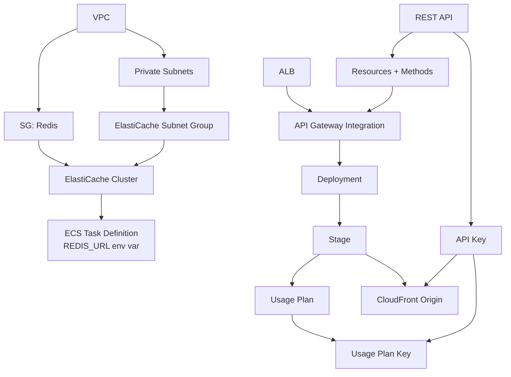

# Terraform リソース設計書 (v10)

| 項目 | 内容 |
|------|------|
| プロジェクト名 | sample_cicd |
| 作成日 | 2026-04-08 |
| バージョン | 10.0 |
| 前バージョン | [infrastructure_v9.md](infrastructure_v9.md) (v9.0) |

## 変更概要

v9 の約 102 アクティブリソース（dev 環境）に以下を変更・追加する:

- **新規ファイル**: `infra/apigateway.tf`（REST API + Usage Plan + API Key）、`infra/elasticache.tf`（Redis クラスタ + サブネットグループ）
- **変更ファイル**: `security_groups.tf`（Redis SG 追加）、`variables.tf`（v10 変数追加）、`dev.tfvars` / `prod.tfvars`（v10 値追加）、`ecs.tf`（Redis 環境変数追加）、`webui.tf`（Origin ALB → API Gateway）、`monitoring.tf`（Dashboard 2 行 + Alarm 4 件）、`outputs.tf`（API GW / Redis 出力追加）、`iam.tf`（API GW CloudWatch ロール追加）
- **追加リソース数**: 約 20 リソース
- **削除リソース数**: 0
- **主要変更**: API Gateway REST API 基盤、ElastiCache Redis キャッシュ基盤

デプロイ後のアクティブリソース: 102 + 20 = **約 122 リソース**（dev 環境）

## 1. Terraform リソース一覧

### v9 から継続（102 リソース）

（v9 の一覧と同一。詳細は [infrastructure_v9.md](infrastructure_v9.md) を参照）

> **重要変更**:
> - `webui.tf` の Origin 2 を ALB → API Gateway に変更
> - `ecs.tf` のコンテナ定義に `REDIS_URL`, `CACHE_TTL_LIST`, `CACHE_TTL_DETAIL` 環境変数を追加
> - `monitoring.tf` に Dashboard Row 6-7 + Alarm 4 件を追加

### v10 新規: apigateway.tf（約 13 リソース）

| # | リソースタイプ | リソース名 | 用途 |
|---|--------------|-----------|------|
| 1 | `aws_api_gateway_rest_api` | `main` | REST API 定義（REGIONAL） |
| 2 | `aws_api_gateway_resource` | `tasks` | `/tasks` リソース |
| 3 | `aws_api_gateway_resource` | `tasks_proxy` | `/tasks/{proxy+}` プロキシリソース |
| 4 | `aws_api_gateway_method` | `tasks` | `/tasks` ANY メソッド |
| 5 | `aws_api_gateway_method` | `tasks_proxy` | `/tasks/{proxy+}` ANY メソッド |
| 6 | `aws_api_gateway_integration` | `tasks` | `/tasks` HTTP_PROXY 統合 (→ ALB) |
| 7 | `aws_api_gateway_integration` | `tasks_proxy` | `/tasks/{proxy+}` HTTP_PROXY 統合 (→ ALB) |
| 8 | `aws_api_gateway_deployment` | `main` | API デプロイメント |
| 9 | `aws_api_gateway_stage` | `main` | ステージ（キャッシュ有効） |
| 10 | `aws_api_gateway_method_settings` | `all` | メソッド設定（スロットリング、キャッシュ） |
| 11 | `aws_api_gateway_usage_plan` | `main` | Usage Plan（レート制限 + クォータ） |
| 12 | `aws_api_gateway_api_key` | `main` | API キー |
| 13 | `aws_api_gateway_usage_plan_key` | `main` | API キーと Usage Plan の紐付け |

### v10 新規: elasticache.tf（2 リソース）

| # | リソースタイプ | リソース名 | 用途 |
|---|--------------|-----------|------|
| 14 | `aws_elasticache_subnet_group` | `main` | Redis サブネットグループ（private_1 + private_2） |
| 15 | `aws_elasticache_cluster` | `main` | Redis クラスタ（単一ノード、cache.t3.micro） |

### v10 変更: security_groups.tf（+1 リソース）

| # | リソースタイプ | リソース名 | 変更 |
|---|--------------|-----------|------|
| 16 | `aws_security_group` | `redis` | **新規**。ECS タスク SG からの 6379 ポートのみ許可 |

### v10 変更: iam.tf（+2 リソース）

| # | リソースタイプ | リソース名 | 用途 |
|---|--------------|-----------|------|
| 17 | `aws_iam_role` | `apigateway_cloudwatch` | API Gateway → CloudWatch Logs 出力用ロール |
| 18 | `aws_iam_role_policy_attachment` | `apigateway_cloudwatch` | CloudWatch Logs 権限アタッチ |

### v10 変更: monitoring.tf（+4 リソース）

| # | リソースタイプ | リソース名 | 用途 |
|---|--------------|-----------|------|
| 19 | `aws_cloudwatch_metric_alarm` | `apigw_5xx` | API Gateway 5xx エラーアラーム |
| 20 | `aws_cloudwatch_metric_alarm` | `apigw_latency` | API Gateway IntegrationLatency アラーム |
| 21 | `aws_cloudwatch_metric_alarm` | `redis_cpu` | Redis CPU 使用率アラーム |
| 22 | `aws_cloudwatch_metric_alarm` | `redis_evictions` | Redis Evictions アラーム |

### v10 変更: outputs.tf（+3 出力）

| # | 出力名 | 値 | 備考 |
|---|--------|-----|------|
| - | `api_gateway_invoke_url` | ステージの invoke URL | |
| - | `api_gateway_api_key` | API キー値 | `sensitive = true` |
| - | `redis_endpoint` | Redis エンドポイントアドレス | |

## 2. 新規リソース詳細

### 2.1 apigateway.tf

```hcl
# REST API
resource "aws_api_gateway_rest_api" "main" {
  name        = "${local.prefix}-api"
  description = "${local.prefix} REST API"

  endpoint_configuration {
    types = ["REGIONAL"]
  }
}

# /tasks リソース
resource "aws_api_gateway_resource" "tasks" {
  rest_api_id = aws_api_gateway_rest_api.main.id
  parent_id   = aws_api_gateway_rest_api.main.root_resource_id
  path_part   = "tasks"
}

# /tasks/{proxy+} プロキシリソース
resource "aws_api_gateway_resource" "tasks_proxy" {
  rest_api_id = aws_api_gateway_rest_api.main.id
  parent_id   = aws_api_gateway_resource.tasks.id
  path_part   = "{proxy+}"
}

# /tasks ANY メソッド
resource "aws_api_gateway_method" "tasks" {
  rest_api_id      = aws_api_gateway_rest_api.main.id
  resource_id      = aws_api_gateway_resource.tasks.id
  http_method      = "ANY"
  authorization    = "NONE"
  api_key_required = true
}

# /tasks HTTP_PROXY 統合
resource "aws_api_gateway_integration" "tasks" {
  rest_api_id             = aws_api_gateway_rest_api.main.id
  resource_id             = aws_api_gateway_resource.tasks.id
  http_method             = aws_api_gateway_method.tasks.http_method
  type                    = "HTTP_PROXY"
  integration_http_method = "ANY"
  uri                     = "http://${aws_lb.main.dns_name}/tasks"
}

# /tasks/{proxy+} ANY メソッド
resource "aws_api_gateway_method" "tasks_proxy" {
  rest_api_id      = aws_api_gateway_rest_api.main.id
  resource_id      = aws_api_gateway_resource.tasks_proxy.id
  http_method      = "ANY"
  authorization    = "NONE"
  api_key_required = true

  request_parameters = {
    "method.request.path.proxy" = true
  }
}

# /tasks/{proxy+} HTTP_PROXY 統合
resource "aws_api_gateway_integration" "tasks_proxy" {
  rest_api_id             = aws_api_gateway_rest_api.main.id
  resource_id             = aws_api_gateway_resource.tasks_proxy.id
  http_method             = aws_api_gateway_method.tasks_proxy.http_method
  type                    = "HTTP_PROXY"
  integration_http_method = "ANY"
  uri                     = "http://${aws_lb.main.dns_name}/tasks/{proxy}"

  request_parameters = {
    "integration.request.path.proxy" = "method.request.path.proxy"
  }
}

# デプロイメント
resource "aws_api_gateway_deployment" "main" {
  rest_api_id = aws_api_gateway_rest_api.main.id

  triggers = {
    redeployment = sha1(jsonencode([
      aws_api_gateway_resource.tasks.id,
      aws_api_gateway_resource.tasks_proxy.id,
      aws_api_gateway_method.tasks.id,
      aws_api_gateway_method.tasks_proxy.id,
      aws_api_gateway_integration.tasks.id,
      aws_api_gateway_integration.tasks_proxy.id,
    ]))
  }

  lifecycle {
    create_before_destroy = true
  }
}

# ステージ（キャッシュ有効）
resource "aws_api_gateway_stage" "main" {
  deployment_id        = aws_api_gateway_deployment.main.id
  rest_api_id          = aws_api_gateway_rest_api.main.id
  stage_name           = local.env
  cache_cluster_enabled = true
  cache_cluster_size    = "0.5"

  access_log_settings {
    destination_arn = aws_cloudwatch_log_group.apigw.arn
  }
}

# メソッド設定（GET のキャッシュ有効化 + スロットリング）
resource "aws_api_gateway_method_settings" "all" {
  rest_api_id = aws_api_gateway_rest_api.main.id
  stage_name  = aws_api_gateway_stage.main.stage_name
  method_path = "*/*"

  settings {
    caching_enabled      = true
    cache_ttl_in_seconds = var.apigw_cache_ttl
    throttling_rate_limit  = var.apigw_throttle_rate_limit
    throttling_burst_limit = var.apigw_throttle_burst_limit
    metrics_enabled      = true
    logging_level        = "INFO"
  }
}

# Usage Plan
resource "aws_api_gateway_usage_plan" "main" {
  name = "${local.prefix}-usage-plan"

  api_stages {
    api_id = aws_api_gateway_rest_api.main.id
    stage  = aws_api_gateway_stage.main.stage_name
  }

  throttle_settings {
    rate_limit  = var.apigw_throttle_rate_limit
    burst_limit = var.apigw_throttle_burst_limit
  }

  quota_settings {
    limit  = var.apigw_quota_limit
    period = var.apigw_quota_period
  }
}

# API Key
resource "aws_api_gateway_api_key" "main" {
  name    = "${local.prefix}-api-key"
  enabled = true
}

# API Key ↔ Usage Plan 紐付け
resource "aws_api_gateway_usage_plan_key" "main" {
  key_id        = aws_api_gateway_api_key.main.id
  key_type      = "API_KEY"
  usage_plan_id = aws_api_gateway_usage_plan.main.id
}

# API Gateway アカウント設定（CloudWatch ログ出力用）
resource "aws_api_gateway_account" "main" {
  cloudwatch_role_arn = aws_iam_role.apigateway_cloudwatch.arn
}

# CloudWatch Logs グループ
resource "aws_cloudwatch_log_group" "apigw" {
  name              = "/aws/apigateway/${local.prefix}-api"
  retention_in_days = 30
}
```

### 2.2 elasticache.tf

```hcl
# Redis サブネットグループ
resource "aws_elasticache_subnet_group" "main" {
  name       = "${local.prefix}-redis"
  subnet_ids = [aws_subnet.private_1.id, aws_subnet.private_2.id]

  tags = {
    Name        = "${local.prefix}-redis-subnet-group"
    Project     = var.project_name
    Environment = local.env
  }
}

# Redis クラスタ（単一ノード）
resource "aws_elasticache_cluster" "main" {
  cluster_id           = "${local.prefix}-redis"
  engine               = "redis"
  node_type            = var.redis_node_type
  num_cache_nodes      = 1
  parameter_group_name = "default.redis7"
  engine_version       = "7.0"
  port                 = var.redis_port
  security_group_ids   = [aws_security_group.redis.id]
  subnet_group_name    = aws_elasticache_subnet_group.main.name

  tags = {
    Name        = "${local.prefix}-redis"
    Project     = var.project_name
    Environment = local.env
  }
}
```

## 3. 変更リソース詳細

### 3.1 security_groups.tf — Redis SG 追加

```hcl
# Redis Security Group
resource "aws_security_group" "redis" {
  name        = "${local.prefix}-redis-sg"
  description = "Security group for ElastiCache Redis"
  vpc_id      = aws_vpc.main.id

  ingress {
    description     = "Redis from ECS tasks"
    from_port       = var.redis_port
    to_port         = var.redis_port
    protocol        = "tcp"
    security_groups = [aws_security_group.ecs_tasks.id]
  }

  egress {
    description = "Allow all outbound"
    from_port   = 0
    to_port     = 0
    protocol    = "-1"
    cidr_blocks = ["0.0.0.0/0"]
  }

  tags = {
    Name        = "${local.prefix}-redis-sg"
    Project     = var.project_name
    Environment = local.env
  }
}
```

### 3.2 ecs.tf — 環境変数追加

コンテナ定義の `environment` に以下を追加:

```json
{
  "name": "REDIS_URL",
  "value": "redis://${aws_elasticache_cluster.main.cache_nodes[0].address}:${aws_elasticache_cluster.main.cache_nodes[0].port}"
},
{
  "name": "CACHE_TTL_LIST",
  "value": "${var.app_cache_ttl_list}"
},
{
  "name": "CACHE_TTL_DETAIL",
  "value": "${var.app_cache_ttl_detail}"
}
```

### 3.3 webui.tf — Origin 変更

Origin 2 を ALB から API Gateway に変更:

```hcl
# Origin 2: API Gateway (API proxy) — v10 変更
origin {
  domain_name = "${aws_api_gateway_rest_api.main.id}.execute-api.${var.aws_region}.amazonaws.com"
  origin_id   = "apigw-api"
  origin_path = "/${aws_api_gateway_stage.main.stage_name}"

  custom_origin_config {
    http_port              = 80
    https_port             = 443
    origin_protocol_policy = "https-only"
    origin_ssl_protocols   = ["TLSv1.2"]
  }

  custom_header {
    name  = "x-api-key"
    value = aws_api_gateway_api_key.main.value
  }
}
```

`ordered_cache_behavior` の `target_origin_id` を `"alb-api"` → `"apigw-api"` に変更。

### 3.4 iam.tf — API Gateway CloudWatch ロール

```hcl
# API Gateway → CloudWatch Logs 用ロール
data "aws_iam_policy_document" "apigateway_assume_role" {
  statement {
    actions = ["sts:AssumeRole"]
    principals {
      type        = "Service"
      identifiers = ["apigateway.amazonaws.com"]
    }
  }
}

resource "aws_iam_role" "apigateway_cloudwatch" {
  name               = "${local.prefix}-apigw-cloudwatch"
  assume_role_policy = data.aws_iam_policy_document.apigateway_assume_role.json

  tags = {
    Name = "${local.prefix}-apigw-cloudwatch"
  }
}

resource "aws_iam_role_policy_attachment" "apigateway_cloudwatch" {
  role       = aws_iam_role.apigateway_cloudwatch.name
  policy_arn = "arn:aws:iam::aws:policy/service-role/AmazonAPIGatewayPushToCloudWatchLogs"
}
```

## 4. 変数追加

### 4.1 variables.tf

```hcl
# --- v10: API Gateway + ElastiCache ---

variable "redis_node_type" {
  description = "ElastiCache Redis node type"
  type        = string
  default     = "cache.t3.micro"
}

variable "redis_port" {
  description = "ElastiCache Redis port"
  type        = number
  default     = 6379
}

variable "apigw_cache_ttl" {
  description = "API Gateway cache TTL in seconds"
  type        = number
  default     = 300
}

variable "apigw_throttle_rate_limit" {
  description = "API Gateway steady-state request rate limit (requests/sec)"
  type        = number
  default     = 50
}

variable "apigw_throttle_burst_limit" {
  description = "API Gateway burst request limit"
  type        = number
  default     = 100
}

variable "apigw_quota_limit" {
  description = "API Gateway usage plan quota (requests per period)"
  type        = number
  default     = 10000
}

variable "apigw_quota_period" {
  description = "API Gateway usage plan quota period (DAY, WEEK, MONTH)"
  type        = string
  default     = "DAY"
}

variable "app_cache_ttl_list" {
  description = "Application-level Redis cache TTL for task list (seconds)"
  type        = number
  default     = 300
}

variable "app_cache_ttl_detail" {
  description = "Application-level Redis cache TTL for individual task (seconds)"
  type        = number
  default     = 600
}

variable "alarm_apigw_5xx_threshold" {
  description = "Threshold for API Gateway 5xx error count alarm"
  type        = number
  default     = 10
}

variable "alarm_redis_cpu_threshold" {
  description = "Threshold for ElastiCache Redis CPU utilization alarm (%)"
  type        = number
  default     = 90
}
```

### 4.2 dev.tfvars

```hcl
# v10: API Gateway + ElastiCache
redis_node_type            = "cache.t3.micro"
apigw_cache_ttl            = 300
apigw_throttle_rate_limit  = 50
apigw_throttle_burst_limit = 100
apigw_quota_limit          = 10000
apigw_quota_period         = "DAY"
app_cache_ttl_list         = 300
app_cache_ttl_detail       = 600
```

### 4.3 prod.tfvars

```hcl
# v10: API Gateway + ElastiCache
redis_node_type            = "cache.t3.micro"
apigw_cache_ttl            = 300
apigw_throttle_rate_limit  = 100
apigw_throttle_burst_limit = 200
apigw_quota_limit          = 50000
apigw_quota_period         = "DAY"
app_cache_ttl_list         = 300
app_cache_ttl_detail       = 600
```

## 5. リソース依存関係


