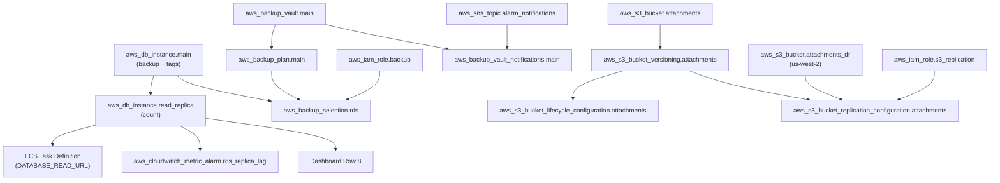

# Terraform リソース設計書 (v12)

| 項目 | 内容 |
|------|------|
| プロジェクト名 | sample_cicd |
| 作成日 | 2026-04-10 |
| バージョン | 12.0 |
| 前バージョン | [infrastructure_v10.md](infrastructure_v10.md) (v10.0) |

## 変更概要

v10 の約 122 アクティブリソース（dev 環境）に以下を変更・追加する:

- **新規ファイル**: `infra/backup.tf`（AWS Backup Vault + Plan + Selection）、`infra/s3_dr.tf`（DR リージョン S3 + CRR）
- **変更ファイル**: `rds.tf`（バックアップ設定 + Read Replica）、`s3.tf`（Lifecycle）、`variables.tf`（v12 変数追加）、`dev.tfvars` / `prod.tfvars`（v12 値追加）、`ecs.tf`（DATABASE_READ_URL 追加）、`monitoring.tf`（Row 8 + Alarm 1 件）、`iam.tf`（Backup + Replication ロール）、`outputs.tf`（Replica 出力追加）、`main.tf`（DR provider 追加）
- **追加リソース数**: dev 約 8、prod 約 16（Read Replica + CRR 有効時）
- **削除リソース数**: 0

デプロイ後のアクティブリソース: dev 約 130、prod 約 138

## 1. Terraform リソース一覧

### v10 から継続（122 リソース）

（v10 の一覧と同一。詳細は [infrastructure_v10.md](infrastructure_v10.md) を参照）

> **重要変更**:
> - `rds.tf` の `aws_db_instance.main` のバックアップ設定修正 + Read Replica 条件付き追加
> - `s3.tf` に Lifecycle Configuration 追加
> - `ecs.tf` のコンテナ定義に `DATABASE_READ_URL` 環境変数追加
> - `monitoring.tf` に Dashboard Row 8 + Alarm 1 件追加
> - `main.tf` に DR リージョン provider 追加

### v12 新規: backup.tf（約 5 リソース）

| # | リソースタイプ | リソース名 | 用途 |
|---|--------------|-----------|------|
| 1 | `aws_backup_vault` | `main` | バックアップ保管庫（AWS Managed Key） |
| 2 | `aws_backup_plan` | `main` | 日次 + 週次バックアップルール |
| 3 | `aws_backup_selection` | `rds` | タグベースで RDS を対象に選択 |
| 4 | `aws_iam_role` | `backup` | AWS Backup サービスロール |
| 5 | `aws_iam_role_policy_attachment` | `backup` | Backup マネージドポリシーアタッチ |
| 6 | `aws_backup_vault_notifications` | `main` | SNS 通知（成功/失敗） |

### v12 新規: s3_dr.tf（条件付き、prod 約 5 リソース）

| # | リソースタイプ | リソース名 | 用途 | 条件 |
|---|--------------|-----------|------|------|
| 7 | `aws_s3_bucket` | `attachments_dr` | DR バケット (us-west-2) | `enable_s3_replication` |
| 8 | `aws_s3_bucket_versioning` | `attachments_dr` | DR バケットバージョニング | `enable_s3_replication` |
| 9 | `aws_s3_bucket_server_side_encryption_configuration` | `attachments_dr` | DR バケット暗号化 | `enable_s3_replication` |
| 10 | `aws_s3_bucket_public_access_block` | `attachments_dr` | DR バケットパブリックブロック | `enable_s3_replication` |
| 11 | `aws_s3_bucket_replication_configuration` | `attachments` | CRR 設定 | `enable_s3_replication` |
| 12 | `aws_iam_role` | `s3_replication` | レプリケーション IAM ロール | `enable_s3_replication` |
| 13 | `aws_iam_policy` | `s3_replication` | レプリケーション IAM ポリシー | `enable_s3_replication` |
| 14 | `aws_iam_role_policy_attachment` | `s3_replication` | ポリシーアタッチ | `enable_s3_replication` |

### v12 変更: rds.tf（+1 条件付きリソース）

| # | リソースタイプ | リソース名 | 変更 |
|---|--------------|-----------|------|
| - | `aws_db_instance` | `main` | **変更**: backup_retention_period=7, skip_final_snapshot=false, tags に Backup=true |
| 15 | `aws_db_instance` | `read_replica` | **新規** (count): Read Replica。`enable_read_replica` で制御 |

### v12 変更: s3.tf（+1 リソース）

| # | リソースタイプ | リソース名 | 変更 |
|---|--------------|-----------|------|
| 16 | `aws_s3_bucket_lifecycle_configuration` | `attachments` | **新規**: Lifecycle ルール（IA 移行 + Glacier + 削除） |

### v12 変更: monitoring.tf（+1 条件付きリソース）

| # | リソースタイプ | リソース名 | 用途 |
|---|--------------|-----------|------|
| 17 | `aws_cloudwatch_metric_alarm` | `rds_replica_lag` | ReplicaLag アラーム（`enable_read_replica` 時のみ） |

### v12 変更: outputs.tf（+2 出力）

| # | 出力名 | 値 | 備考 |
|---|--------|-----|------|
| - | `rds_read_replica_endpoint` | Read Replica エンドポイント | `enable_read_replica` 時のみ |
| - | `backup_vault_arn` | Backup Vault ARN | |

## 2. 新規リソース詳細

### 2.1 backup.tf

```hcl
# Backup Vault
resource "aws_backup_vault" "main" {
  name = "${local.prefix}-backup-vault"

  tags = {
    Name        = "${local.prefix}-backup-vault"
    Project     = var.project_name
    Environment = local.env
  }
}

# Backup Vault Notifications
resource "aws_backup_vault_notifications" "main" {
  backup_vault_name   = aws_backup_vault.main.name
  sns_topic_arn       = aws_sns_topic.alarm_notifications.arn
  backup_vault_events = ["BACKUP_JOB_COMPLETED", "BACKUP_JOB_FAILED"]
}

# Backup Plan (daily + weekly)
resource "aws_backup_plan" "main" {
  name = "${local.prefix}-backup-plan"

  # Daily backup — UTC 18:00 (JST 3:00), retain 7 days
  rule {
    rule_name         = "daily-backup"
    target_vault_name = aws_backup_vault.main.name
    schedule          = "cron(0 18 * * ? *)"

    lifecycle {
      delete_after = var.backup_retention_daily
    }
  }

  # Weekly backup — Sunday UTC 18:00, retain 30 days
  rule {
    rule_name         = "weekly-backup"
    target_vault_name = aws_backup_vault.main.name
    schedule          = "cron(0 18 ? * 1 *)"

    lifecycle {
      delete_after = var.backup_retention_weekly
    }
  }

  tags = {
    Project     = var.project_name
    Environment = local.env
  }
}

# Backup Selection — tag-based
resource "aws_backup_selection" "rds" {
  iam_role_arn = aws_iam_role.backup.arn
  name         = "${local.prefix}-rds-selection"
  plan_id      = aws_backup_plan.main.id

  selection_tag {
    type  = "STRINGEQUALS"
    key   = "Backup"
    value = "true"
  }
}

# Backup IAM Role
resource "aws_iam_role" "backup" {
  name = "${local.prefix}-backup-role"

  assume_role_policy = jsonencode({
    Version = "2012-10-17"
    Statement = [
      {
        Action = "sts:AssumeRole"
        Effect = "Allow"
        Principal = {
          Service = "backup.amazonaws.com"
        }
      }
    ]
  })

  tags = {
    Name = "${local.prefix}-backup-role"
  }
}

resource "aws_iam_role_policy_attachment" "backup" {
  role       = aws_iam_role.backup.name
  policy_arn = "arn:aws:iam::aws:policy/service-role/AWSBackupServiceRolePolicyForBackup"
}

resource "aws_iam_role_policy_attachment" "backup_restores" {
  role       = aws_iam_role.backup.name
  policy_arn = "arn:aws:iam::aws:policy/service-role/AWSBackupServiceRolePolicyForRestores"
}
```

### 2.2 s3_dr.tf

```hcl
# DR Region Provider
# (main.tf に追加)
provider "aws" {
  alias  = "dr"
  region = var.dr_region

  default_tags {
    tags = {
      Project     = var.project_name
      Environment = local.env
    }
  }
}

# DR Bucket (us-west-2)
resource "aws_s3_bucket" "attachments_dr" {
  count    = var.enable_s3_replication ? 1 : 0
  provider = aws.dr
  bucket   = "${local.prefix}-attachments-dr"

  tags = {
    Name = "${local.prefix}-attachments-dr"
  }
}

resource "aws_s3_bucket_versioning" "attachments_dr" {
  count    = var.enable_s3_replication ? 1 : 0
  provider = aws.dr
  bucket   = aws_s3_bucket.attachments_dr[0].id

  versioning_configuration {
    status = "Enabled"
  }
}

resource "aws_s3_bucket_server_side_encryption_configuration" "attachments_dr" {
  count    = var.enable_s3_replication ? 1 : 0
  provider = aws.dr
  bucket   = aws_s3_bucket.attachments_dr[0].id

  rule {
    apply_server_side_encryption_by_default {
      sse_algorithm = "AES256"
    }
  }
}

resource "aws_s3_bucket_public_access_block" "attachments_dr" {
  count    = var.enable_s3_replication ? 1 : 0
  provider = aws.dr
  bucket   = aws_s3_bucket.attachments_dr[0].id

  block_public_acls       = true
  block_public_policy     = true
  ignore_public_acls      = true
  restrict_public_buckets = true
}

# Replication Configuration
resource "aws_s3_bucket_replication_configuration" "attachments" {
  count  = var.enable_s3_replication ? 1 : 0
  bucket = aws_s3_bucket.attachments.id
  role   = aws_iam_role.s3_replication[0].arn

  rule {
    id     = "replicate-all"
    status = "Enabled"

    destination {
      bucket        = aws_s3_bucket.attachments_dr[0].arn
      storage_class = "STANDARD"
    }
  }

  depends_on = [aws_s3_bucket_versioning.attachments]
}

# Replication IAM Role
resource "aws_iam_role" "s3_replication" {
  count = var.enable_s3_replication ? 1 : 0
  name  = "${local.prefix}-s3-replication-role"

  assume_role_policy = jsonencode({
    Version = "2012-10-17"
    Statement = [
      {
        Action = "sts:AssumeRole"
        Effect = "Allow"
        Principal = {
          Service = "s3.amazonaws.com"
        }
      }
    ]
  })
}

resource "aws_iam_policy" "s3_replication" {
  count = var.enable_s3_replication ? 1 : 0
  name  = "${local.prefix}-s3-replication-policy"

  policy = jsonencode({
    Version = "2012-10-17"
    Statement = [
      {
        Effect = "Allow"
        Action = [
          "s3:GetReplicationConfiguration",
          "s3:ListBucket"
        ]
        Resource = aws_s3_bucket.attachments.arn
      },
      {
        Effect = "Allow"
        Action = [
          "s3:GetObjectVersionForReplication",
          "s3:GetObjectVersionAcl",
          "s3:GetObjectVersionTagging"
        ]
        Resource = "${aws_s3_bucket.attachments.arn}/*"
      },
      {
        Effect = "Allow"
        Action = [
          "s3:ReplicateObject",
          "s3:ReplicateDelete",
          "s3:ReplicateTags"
        ]
        Resource = "${aws_s3_bucket.attachments_dr[0].arn}/*"
      }
    ]
  })
}

resource "aws_iam_role_policy_attachment" "s3_replication" {
  count      = var.enable_s3_replication ? 1 : 0
  role       = aws_iam_role.s3_replication[0].name
  policy_arn = aws_iam_policy.s3_replication[0].arn
}
```

## 3. 変更リソース詳細

### 3.1 rds.tf — バックアップ設定 + Read Replica

```hcl
# RDS PostgreSQL (変更)
resource "aws_db_instance" "main" {
  # ... (既存設定)

  skip_final_snapshot       = false                               # 変更: true → false
  final_snapshot_identifier = "${local.prefix}-final-snapshot"    # 追加
  backup_retention_period   = var.db_backup_retention_period      # 変更: 0 → 変数化
  deletion_protection       = var.db_deletion_protection          # 変更: false → 変数化

  tags = {
    Name   = "${local.prefix}-rds"
    Backup = "true"   # 追加: AWS Backup Selection 用タグ
  }
}

# Read Replica (新規、条件付き)
resource "aws_db_instance" "read_replica" {
  count = var.enable_read_replica ? 1 : 0

  identifier          = "${local.prefix}-read-replica"
  replicate_source_db = aws_db_instance.main.identifier
  instance_class      = var.db_instance_class

  vpc_security_group_ids = [aws_security_group.rds.id]

  publicly_accessible = false
  skip_final_snapshot = true       # Replica は final snapshot 不要
  deletion_protection = false      # Replica は削除保護不要

  tags = {
    Name        = "${local.prefix}-rds-read-replica"
    Project     = var.project_name
    Environment = local.env
  }
}
```

### 3.2 s3.tf — Lifecycle 追加

```hcl
# Lifecycle Rules (新規)
resource "aws_s3_bucket_lifecycle_configuration" "attachments" {
  bucket = aws_s3_bucket.attachments.id

  # Current versions → Standard-IA after N days
  rule {
    id     = "transition-to-ia"
    status = "Enabled"

    transition {
      days          = var.s3_lifecycle_ia_days
      storage_class = "STANDARD_IA"
    }
  }

  # Noncurrent versions → Glacier → Delete
  rule {
    id     = "noncurrent-lifecycle"
    status = "Enabled"

    noncurrent_version_transition {
      noncurrent_days = var.s3_lifecycle_glacier_days
      storage_class   = "GLACIER"
    }

    noncurrent_version_expiration {
      noncurrent_days = var.s3_lifecycle_expire_days
    }
  }

  depends_on = [aws_s3_bucket_versioning.attachments]
}
```

### 3.3 ecs.tf — 環境変数追加

コンテナ定義の `environment` に以下を追加:

```json
{
  "name": "DATABASE_READ_URL",
  "value": "${var.enable_read_replica ? "postgresql://${DB_USER}:${DB_PASS}@${replica_endpoint}:5432/${DB_NAME}" : ""}"
}
```

> 実装: Secrets Manager の値と Read Replica エンドポイントを組み合わせて URL を構築。`enable_read_replica = false` の場合は空文字列（アプリ側で Graceful degradation）。

### 3.4 main.tf — DR Provider 追加

```hcl
# DR Region Provider (v12)
provider "aws" {
  alias  = "dr"
  region = var.dr_region

  default_tags {
    tags = {
      Project     = var.project_name
      Environment = local.env
    }
  }
}
```

## 4. 変数追加

### 4.1 variables.tf

```hcl
# --- v12: Disaster Recovery + Data Protection ---

variable "db_backup_retention_period" {
  description = "RDS backup retention period in days"
  type        = number
  default     = 7
}

variable "db_deletion_protection" {
  description = "Enable RDS deletion protection"
  type        = bool
  default     = false
}

variable "enable_read_replica" {
  description = "Create RDS Read Replica for read scaling"
  type        = bool
  default     = false
}

variable "enable_s3_replication" {
  description = "Enable S3 Cross-Region Replication for DR"
  type        = bool
  default     = false
}

variable "dr_region" {
  description = "DR region for S3 Cross-Region Replication"
  type        = string
  default     = "us-west-2"
}

variable "backup_retention_daily" {
  description = "AWS Backup daily backup retention in days"
  type        = number
  default     = 7
}

variable "backup_retention_weekly" {
  description = "AWS Backup weekly backup retention in days"
  type        = number
  default     = 30
}

variable "s3_lifecycle_ia_days" {
  description = "Days before transitioning current S3 objects to Standard-IA"
  type        = number
  default     = 90
}

variable "s3_lifecycle_glacier_days" {
  description = "Days before transitioning noncurrent S3 versions to Glacier"
  type        = number
  default     = 30
}

variable "s3_lifecycle_expire_days" {
  description = "Days before deleting noncurrent S3 versions"
  type        = number
  default     = 90
}

variable "alarm_replica_lag_threshold" {
  description = "Threshold for RDS ReplicaLag alarm (seconds)"
  type        = number
  default     = 30
}
```

### 4.2 dev.tfvars

```hcl
# v12: Disaster Recovery + Data Protection
db_backup_retention_period = 7
db_deletion_protection     = false
enable_read_replica        = false    # dev: コスト節約
enable_s3_replication      = false    # dev: コスト節約
s3_versioning_enabled      = true     # 変更: false → true
```

### 4.3 prod.tfvars

```hcl
# v12: Disaster Recovery + Data Protection
db_backup_retention_period = 7
db_deletion_protection     = true
enable_read_replica        = true
enable_s3_replication      = true
s3_versioning_enabled      = true
```

## 5. リソース依存関係


