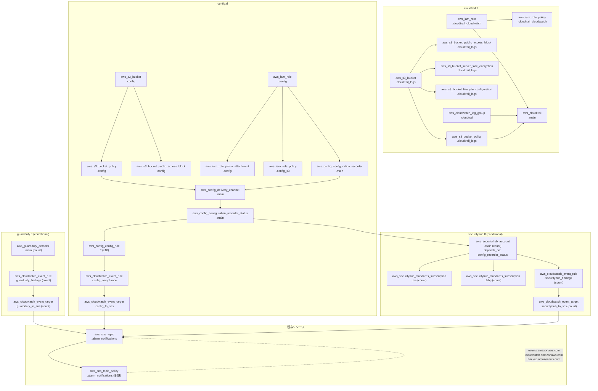

# Terraform リソース設計書 (v13)

| 項目 | 内容 |
|------|------|
| プロジェクト名 | sample_cicd |
| 作成日 | 2026-04-10 |
| バージョン | 13.0 |
| 前バージョン | [infrastructure_v12.md](infrastructure_v12.md) (v12.0) |

## 変更概要

v12 の約 130 アクティブリソース（dev 環境）に以下を変更・追加する:

- **新規ファイル**: `infra/cloudtrail.tf`（CloudTrail + S3 + CW Logs）、`infra/guardduty.tf`（GuardDuty + EventBridge→SNS）、`infra/config.tf`（AWS Config + マネージドルール 10 件 + EventBridge→SNS）、`infra/securityhub.tf`（Security Hub + CIS/FSBP 標準 + EventBridge→SNS）
- **変更ファイル**: `variables.tf`（v13 変数追加）、`dev.tfvars` / `prod.tfvars`（v13 値追加）、`oidc.tf`（セキュリティサービス権限追加）、`sns.tf`（SNS トピックポリシー追加）、`monitoring.tf`（Dashboard Row 9 セキュリティウィジェット追加）、`outputs.tf`（セキュリティサービス出力追加）
- **新規ファイル数**: 4
- **変更ファイル数**: 7
- **追加リソース数**: dev 約 31（GuardDuty/SecurityHub 無効時）、prod 約 39（全有効時）
- **削除リソース数**: 0

デプロイ後のアクティブリソース: dev 約 161、prod 約 169

## 1. テーマ: セキュリティモニタリング + コンプライアンス

v13 では AWS のセキュリティサービス 4 種を導入し、インフラのセキュリティ態勢を可視化・自動監視する:

| サービス | 役割 | 通知先 |
|---------|------|--------|
| **CloudTrail** | API 操作の監査ログ（全リージョン） | CloudWatch Logs |
| **GuardDuty** | 脅威検出（不正アクセス、暗号通貨マイニング等） | EventBridge → SNS |
| **AWS Config** | リソース構成のコンプライアンスチェック（10 ルール） | EventBridge → SNS |
| **Security Hub** | セキュリティ検出結果の集約 + ベンチマーク評価 | EventBridge → SNS |

すべての検出結果は既存の SNS トピック（`${local.prefix}-alarm-notifications`）へ通知し、統一的なアラート運用を実現する。

## 2. Terraform リソース一覧

### v12 から継続（約 130 リソース）

（v12 の一覧と同一。詳細は [infrastructure_v12.md](infrastructure_v12.md) を参照）

> **重要変更**:
> - `sns.tf` に SNS トピックポリシー追加（EventBridge / CloudWatch / Backup からの Publish 許可）
> - `monitoring.tf` に Dashboard Row 9（セキュリティウィジェット 2 件）追加
> - `oidc.tf` に `cloudtrail:*`, `guardduty:*`, `config:*`, `securityhub:*` 追加

### v13 新規: cloudtrail.tf（9 リソース）

| # | リソースタイプ | リソース名 | 用途 |
|---|--------------|-----------|------|
| 1 | `aws_cloudtrail` | `main` | マルチリージョン CloudTrail。`is_multi_region_trail=true`, `enable_logging=true`, `enable_log_file_validation=true` |
| 2 | `aws_s3_bucket` | `cloudtrail_logs` | CloudTrail ログ専用バケット |
| 3 | `aws_s3_bucket_policy` | `cloudtrail_logs` | `cloudtrail.amazonaws.com` に `s3:PutObject` + `s3:GetBucketAcl` を許可 |
| 4 | `aws_s3_bucket_public_access_block` | `cloudtrail_logs` | パブリックアクセス全ブロック |
| 5 | `aws_s3_bucket_server_side_encryption_configuration` | `cloudtrail_logs` | SSE-S3（AES256）暗号化 |
| 6 | `aws_s3_bucket_lifecycle_configuration` | `cloudtrail_logs` | `var.cloudtrail_log_retention_days` 日後に Expire |
| 7 | `aws_cloudwatch_log_group` | `cloudtrail` | CloudTrail → CloudWatch Logs 連携用ロググループ。保持期間: `var.cloudtrail_cw_log_retention_days` |
| 8 | `aws_iam_role` | `cloudtrail_cloudwatch` | CloudTrail が CloudWatch Logs に書き込むためのサービスロール |
| 9 | `aws_iam_role_policy` | `cloudtrail_cloudwatch` | `logs:CreateLogStream`, `logs:PutLogEvents` を許可 |

### v13 新規: guardduty.tf（3 リソース、条件付き）

| # | リソースタイプ | リソース名 | 用途 | 条件 |
|---|--------------|-----------|------|------|
| 10 | `aws_guardduty_detector` | `main` | GuardDuty 脅威検出（`enable=true`） | `enable_guardduty` |
| 11 | `aws_cloudwatch_event_rule` | `guardduty_findings` | DEFAULT バス。重大度 >= MEDIUM の検出結果をフィルタ | `enable_guardduty` |
| 12 | `aws_cloudwatch_event_target` | `guardduty_to_sns` | 検出結果を既存 SNS トピックへ通知 | `enable_guardduty` |

### v13 新規: config.tf（21 リソース）

| # | リソースタイプ | リソース名 | 用途 |
|---|--------------|-----------|------|
| 13 | `aws_config_configuration_recorder` | `main` | Config レコーダー（`all_supported=true`） |
| 14 | `aws_config_delivery_channel` | `main` | S3 バケットへの配信チャネル |
| 15 | `aws_config_configuration_recorder_status` | `main` | レコーダー有効化（`is_enabled=true`） |
| 16 | `aws_iam_role` | `config` | Config サービスロール |
| 17 | `aws_iam_role_policy_attachment` | `config` | `AWS_ConfigRole` マネージドポリシー |
| 18 | `aws_iam_role_policy` | `config_s3` | S3 配信用権限 |
| 19 | `aws_s3_bucket` | `config` | Config 配信ログ専用バケット |
| 20 | `aws_s3_bucket_policy` | `config` | `config.amazonaws.com` からの書き込みを許可 |
| 21 | `aws_s3_bucket_public_access_block` | `config` | パブリックアクセス全ブロック |
| 22 | `aws_config_config_rule` | `s3_bucket_public_read_prohibited` | S3 バケットのパブリック読み取り禁止 |
| 23 | `aws_config_config_rule` | `s3_bucket_server_side_encryption_enabled` | S3 バケットのサーバーサイド暗号化有効 |
| 24 | `aws_config_config_rule` | `s3_bucket_versioning_enabled` | S3 バケットのバージョニング有効 |
| 25 | `aws_config_config_rule` | `rds_instance_deletion_protection_enabled` | RDS の削除保護有効 |
| 26 | `aws_config_config_rule` | `rds_storage_encrypted` | RDS ストレージ暗号化 |
| 27 | `aws_config_config_rule` | `rds_multi_az_support` | RDS マルチ AZ 有効 |
| 28 | `aws_config_config_rule` | `restricted_ssh` | SSH ポートの制限 |
| 29 | `aws_config_config_rule` | `cloud_trail_enabled` | CloudTrail 有効確認 |
| 30 | `aws_config_config_rule` | `iam_root_access_key_check` | root アカウントのアクセスキー存在チェック |
| 31 | `aws_config_config_rule` | `lambda_function_public_access_prohibited` | Lambda パブリックアクセス禁止 |
| 32 | `aws_cloudwatch_event_rule` | `config_compliance` | DEFAULT バス。`NON_COMPLIANT` 評価結果をフィルタ |
| 33 | `aws_cloudwatch_event_target` | `config_to_sns` | 非準拠通知を既存 SNS トピックへ送信 |

### v13 新規: securityhub.tf（5 リソース、条件付き）

| # | リソースタイプ | リソース名 | 用途 | 条件 |
|---|--------------|-----------|------|------|
| 34 | `aws_securityhub_account` | `main` | Security Hub 有効化。`depends_on = [aws_config_configuration_recorder_status.main]` | `enable_securityhub` |
| 35 | `aws_securityhub_standards_subscription` | `cis` | CIS AWS Foundations Benchmark v1.4.0 | `enable_securityhub` |
| 36 | `aws_securityhub_standards_subscription` | `fsbp` | AWS Foundational Security Best Practices v1.0.0 | `enable_securityhub` |
| 37 | `aws_cloudwatch_event_rule` | `securityhub_findings` | DEFAULT バス。HIGH / CRITICAL 重大度の検出結果をフィルタ | `enable_securityhub` |
| 38 | `aws_cloudwatch_event_target` | `securityhub_to_sns` | 検出結果を既存 SNS トピックへ通知 | `enable_securityhub` |

## 3. 変更ファイル一覧

| # | ファイル | 変更内容 |
|---|---------|---------|
| 1 | `infra/variables.tf` | v13 セクション追加（6 変数: `enable_guardduty`, `enable_securityhub`, `cloudtrail_log_retention_days`, `cloudtrail_cw_log_retention_days`, `config_delivery_frequency`, `alarm_guardduty_severity_threshold`） |
| 2 | `infra/dev.tfvars` | v13 変数値追加（GuardDuty/SecurityHub 無効、CloudTrail 保持期間短め） |
| 3 | `infra/prod.tfvars` | v13 変数値追加（GuardDuty/SecurityHub 有効、CloudTrail 保持期間長め） |
| 4 | `infra/oidc.tf` | Terraform apply 権限ブロック（~行 208）に `cloudtrail:*`, `guardduty:*`, `config:*`, `securityhub:*` 追加 |
| 5 | `infra/sns.tf` | `aws_sns_topic_policy` リソース新規追加（`events.amazonaws.com`, `cloudwatch.amazonaws.com`, `backup.amazonaws.com` に `sns:Publish` 許可） |
| 6 | `infra/monitoring.tf` | Dashboard Row 9（y=48）にセキュリティウィジェット 2 件追加（CloudTrail イベント数、Config 非準拠ルール数） |
| 7 | `infra/outputs.tf` | `cloudtrail_s3_bucket`, `guardduty_detector_id`, `config_recorder_name` 出力追加 |

### 3.1 oidc.tf — OIDC IAM ポリシー変更

Terraform apply 用の broad permissions ブロックに以下を追加:

```hcl
# 変更前（v12）
Action = [
  # ... existing permissions ...
  "backup:*",
  "backup-storage:*",
  # ...
]

# 変更後（v13）
Action = [
  # ... existing permissions ...
  "backup:*",
  "backup-storage:*",
  "cloudtrail:*",
  "guardduty:*",
  "config:*",
  "securityhub:*",
  # ...
]
```

> **重要**: 過去バージョン（v12）で OIDC 権限不足によるデプロイ失敗が発生した。v13 でも新サービスの権限追加を忘れないこと。

### 3.2 sns.tf — SNS トピックポリシー追加

```hcl
resource "aws_sns_topic_policy" "alarm_notifications" {
  arn = aws_sns_topic.alarm_notifications.arn

  policy = jsonencode({
    Version = "2012-10-17"
    Statement = [
      {
        Sid    = "AllowEventBridgePublish"
        Effect = "Allow"
        Principal = {
          Service = "events.amazonaws.com"
        }
        Action   = "sns:Publish"
        Resource = aws_sns_topic.alarm_notifications.arn
      },
      {
        Sid    = "AllowCloudWatchPublish"
        Effect = "Allow"
        Principal = {
          Service = "cloudwatch.amazonaws.com"
        }
        Action   = "sns:Publish"
        Resource = aws_sns_topic.alarm_notifications.arn
      },
      {
        Sid    = "AllowBackupPublish"
        Effect = "Allow"
        Principal = {
          Service = "backup.amazonaws.com"
        }
        Action   = "sns:Publish"
        Resource = aws_sns_topic.alarm_notifications.arn
      }
    ]
  })
}
```

### 3.3 monitoring.tf — Dashboard Row 9 追加

```hcl
# Row 9: Security metrics (v13) — y=48
{
  type   = "metric"
  x      = 0
  y      = 48
  width  = 12
  height = 6
  properties = {
    title  = "CloudTrail Events"
    region = var.aws_region
    period = 3600
    stat   = "Sum"
    metrics = [
      ["AWS/CloudTrail", "EventCount"]
    ]
  }
},
{
  type   = "metric"
  x      = 12
  y      = 48
  width  = 12
  height = 6
  properties = {
    title  = "Config Non-Compliant Rules"
    region = var.aws_region
    period = 3600
    stat   = "Maximum"
    metrics = [
      ["AWS/Config", "NonCompliantRules"]
    ]
  }
}
```

### 3.4 outputs.tf — 出力追加

```hcl
# --- v13: Security Monitoring outputs ---

output "cloudtrail_s3_bucket" {
  description = "S3 bucket name for CloudTrail logs"
  value       = aws_s3_bucket.cloudtrail_logs.bucket
}

output "guardduty_detector_id" {
  description = "GuardDuty detector ID (empty if disabled)"
  value       = var.enable_guardduty ? aws_guardduty_detector.main[0].id : ""
}

output "config_recorder_name" {
  description = "AWS Config recorder name"
  value       = aws_config_configuration_recorder.main.name
}
```

## 4. 変数定義

### 4.1 variables.tf — v13 追加変数

```hcl
# --- v13: Security Monitoring + Compliance ---

variable "enable_guardduty" {
  description = "Enable GuardDuty threat detection"
  type        = bool
  default     = true
}

variable "enable_securityhub" {
  description = "Enable Security Hub with CIS and FSBP standards"
  type        = bool
  default     = true
}

variable "cloudtrail_log_retention_days" {
  description = "Days to retain CloudTrail logs in S3 before expiration"
  type        = number
  default     = 90
}

variable "cloudtrail_cw_log_retention_days" {
  description = "Days to retain CloudTrail CloudWatch Logs"
  type        = number
  default     = 30
}

variable "config_delivery_frequency" {
  description = "AWS Config delivery frequency (One_Hour, Three_Hours, Six_Hours, Twelve_Hours, TwentyFour_Hours)"
  type        = string
  default     = "TwentyFour_Hours"
}

variable "alarm_guardduty_severity_threshold" {
  description = "Minimum GuardDuty severity for EventBridge notification (MEDIUM=4.0, HIGH=7.0)"
  type        = number
  default     = 4.0
}
```

### 4.2 変数値一覧

| 変数名 | 型 | デフォルト | dev | prod |
|--------|-----|----------|-----|------|
| `enable_guardduty` | `bool` | `true` | `true` | `true` |
| `enable_securityhub` | `bool` | `true` | `true` | `true` |
| `cloudtrail_log_retention_days` | `number` | `90` | `90` | `365` |
| `cloudtrail_cw_log_retention_days` | `number` | `30` | `30` | `90` |
| `config_delivery_frequency` | `string` | `"TwentyFour_Hours"` | `"TwentyFour_Hours"` | `"Six_Hours"` |
| `alarm_guardduty_severity_threshold` | `number` | `4.0` | `4.0` | `4.0` |

### 4.3 dev.tfvars

```hcl
# v13: Security Monitoring + Compliance
enable_guardduty              = true    # 30日間無料枠あり
enable_securityhub            = true    # 30日間無料枠あり
cloudtrail_log_retention_days = 90
cloudtrail_cw_log_retention_days = 30
config_delivery_frequency     = "TwentyFour_Hours"
```

### 4.4 prod.tfvars

```hcl
# v13: Security Monitoring + Compliance
enable_guardduty              = true
enable_securityhub            = true
cloudtrail_log_retention_days = 365
cloudtrail_cw_log_retention_days = 90
config_delivery_frequency     = "Six_Hours"
```

## 5. リソース依存関係図



## 6. IAM 権限マトリクス

### 6.1 新規 IAM ロール

| ロール名 | 信頼ポリシー（Principal） | 許可アクション | 用途 |
|---------|--------------------------|--------------|------|
| `${local.prefix}-cloudtrail-cw-role` | `cloudtrail.amazonaws.com` | `logs:CreateLogStream`, `logs:PutLogEvents` | CloudTrail → CloudWatch Logs 書き込み |
| `${local.prefix}-config-role` | `config.amazonaws.com` | `AWS_ConfigRole` マネージドポリシー + S3 配信用カスタムポリシー | Config レコーダーの実行 + S3 への配信 |

### 6.2 Config サービスロール詳細

```hcl
# マネージドポリシー
arn:aws:iam::aws:policy/service-role/AWS_ConfigRole

# カスタム S3 配信ポリシー
{
  "Effect": "Allow",
  "Action": [
    "s3:PutObject",
    "s3:GetBucketAcl"
  ],
  "Resource": [
    "arn:aws:s3:::${local.prefix}-config/*",
    "arn:aws:s3:::${local.prefix}-config"
  ]
}
```

### 6.3 SNS トピックポリシー（リソースポリシー）

| Principal サービス | 許可アクション | 目的 |
|-------------------|--------------|------|
| `events.amazonaws.com` | `sns:Publish` | EventBridge ルール（GuardDuty / Config / Security Hub）からの通知 |
| `cloudwatch.amazonaws.com` | `sns:Publish` | CloudWatch Alarms からの通知（既存） |
| `backup.amazonaws.com` | `sns:Publish` | AWS Backup 通知（v12 から存在） |

### 6.4 OIDC (GitHub Actions) デプロイ権限追加

> **重要**: OIDC IAM ポリシーへの権限追加を忘れると `terraform apply` がデプロイ時に失敗する。v12 で `backup:*` / `backup-storage:*` の追加漏れにより失敗した前例あり。

| 追加権限 | 対象サービス | 必要な理由 |
|---------|-------------|-----------|
| `cloudtrail:*` | CloudTrail | Trail の作成・更新・削除 |
| `guardduty:*` | GuardDuty | Detector の作成・更新・削除 |
| `config:*` | AWS Config | Recorder / Rule の作成・更新・削除 |
| `securityhub:*` | Security Hub | Account / Standards Subscription の管理 |

**変更後の OIDC ポリシー Action リスト（v13 追加分のみ抜粋）:**

```hcl
Action = [
  # ... (v12 までの既存権限) ...
  "backup:*",
  "backup-storage:*",
  "cloudtrail:*",     # v13 追加
  "guardduty:*",      # v13 追加
  "config:*",         # v13 追加
  "securityhub:*",    # v13 追加
  "kms:CreateGrant",
  "kms:GenerateDataKey",
  "kms:Decrypt",
  "kms:RetireGrant",
  "kms:DescribeKey",
  "sts:GetCallerIdentity"
]
```

## 7. リソース数サマリー

| 項目 | 数量 |
|------|------|
| 新規 `.tf` ファイル | 4（`cloudtrail.tf`, `guardduty.tf`, `config.tf`, `securityhub.tf`） |
| 変更ファイル | 7（`variables.tf`, `dev.tfvars`, `prod.tfvars`, `oidc.tf`, `sns.tf`, `monitoring.tf`, `outputs.tf`） |
| 新規リソース合計 | 39（常時: 31、条件付き: 8） |
| 新規変数 | 6 |
| 新規出力 | 3 |

### 環境別リソース内訳

| 環境 | CloudTrail | GuardDuty | Config | Security Hub | SNS Policy | 合計追加 | デプロイ後総数 |
|------|-----------|-----------|--------|-------------|-----------|---------|-------------|
| dev | 9 | 0（無効） | 21 | 0（無効） | 1 | 31 | 約 161 |
| prod | 9 | 3 | 21 | 5 | 1 | 39 | 約 169 |

### コスト影響

| サービス | dev 環境 | prod 環境 | 備考 |
|---------|---------|----------|------|
| CloudTrail | 無料（管理イベント 1 Trail） | 無料（管理イベント 1 Trail） | データイベントは対象外 |
| GuardDuty | $0（無効） | 〜$4/月 | 30 日間無料トライアルあり |
| AWS Config | 〜$2/月 | 〜$2/月 | ルール評価回数に依存 |
| Security Hub | $0（無効） | 〜$1/月 | 30 日間無料トライアルあり |
| S3 (ログ) | 〜$0.05/月 | 〜$0.2/月 | CloudTrail + Config ログ保存 |
| **合計** | **〜$2/月** | **〜$7/月** | |
